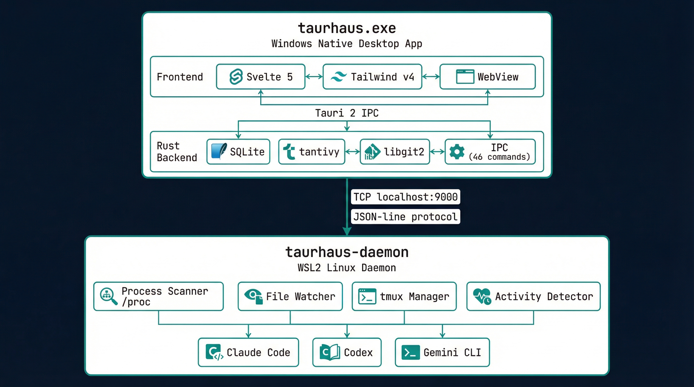

# Architecture

A condensed overview for contributors. For the full 22 Architecture Decision Records, see [docs/phase-4-architecture.md](docs/phase-4-architecture.md).

## System Overview

taurhaus is a dual-process desktop application — a native Windows GUI backed by a lightweight Linux daemon running inside WSL2.



**Why two processes?** The Windows exe provides the native GUI with embedded storage and git. The WSL2 daemon handles Linux-specific operations — process scanning via `/proc`, tmux control, and file watching inside WSL filesystems. They communicate over TCP on localhost using a JSON-line protocol.

## Frontend (Svelte 5 + Tailwind v4)

The frontend runs inside Tauri's embedded WebView — not a browser. All data comes through the Rust backend via IPC.

| Component | Purpose |
|-----------|---------|
| `App.svelte` | Entry point, splash screen gate |
| `Shell.svelte` | Main layout: titlebar, tab routing, theme, position memory |
| `Sidebar.svelte` | Project list, session indicators, context menu, hover cards |
| `OverviewTab.svelte` | Project summary, README, recent commits, sessions |
| `FilesTab.svelte` | File tree with syntax-highlighted code preview |
| `GitTab.svelte` | Commit history, diffs, blame, cross-tab navigation |
| `TaskBoard.svelte` | Kanban board aggregating tasks from Claude Code, Codex, Gemini |
| `TaskDetailPanel.svelte` | Task detail view with metadata and description |
| `SearchOverlay.svelte` | Full-text search across all projects (Ctrl+K) |
| `Settings.svelte` | App preferences and configuration |
| `FirstRunWizard.svelte` | Onboarding flow: project discovery and registration |
| `SplashScreen.svelte` | Startup splash with bootstrap chain progress |
| `SessionHistory.svelte` | Session timeline with handoff summaries |
| `MarkdownRenderer.svelte` | Markdown rendering with Shiki syntax highlighting |
| `CodeViewer.svelte` | Syntax-highlighted file preview with line numbers |
| `HoverCard.svelte` | Rich hover tooltips for session status |
| `ContextMenu.svelte` | Right-click context menus (per-tool launch/stop) |
| `AddProjectModal.svelte` | Manual project registration |
| `DirectoryBrowser.svelte` | Directory tree for project path selection |

**Key patterns:**
- **Svelte 5 runes** (`$state`, `$derived`, `$effect`, `$props`) — no legacy stores
- **Derived theme tokens** — all color switching via `$derived` variables, never inline ternaries
- **`$bindable` position memory** — each tab exposes view state, Shell saves/restores per project
- **IPC layer** (`src/lib/ipc.js`) — Tauri `invoke()` wrappers with dev-mode mock fallbacks

## Backend (Rust)

### Modules

| Module | Purpose |
|--------|---------|
| `commands/` | Tauri IPC handlers — thin wrappers over domain modules |
| `db/` | SQLite connection, migrations, typed query functions |
| `git/` | libgit2 wrappers for commits, diffs, blame, status |
| `fs/` | File tree, content reading, asset serving, file watching |
| `search/` | tantivy full-text search index (build, update, query) |
| `session/` | Session import, parsing, archival |
| `session_scanner/` | CLI tool detection (process scanning, idle detection) |
| `task_scanner/` | Task aggregation from Claude Code, Codex, Gemini |
| `daemon/` | TCP client, daemon lifecycle, health monitoring |
| `terminal/` | tmux session management, pane layout |
| `claude_code/` | Claude Code project resolution, memory, teams |
| `provider/` | CLI tool definitions and launch configuration |
| `services/` | Cross-cutting application services |
| `models/` | Shared data structures |
| `config/` | Application configuration |

### Storage

- **SQLite** (`rusqlite`): 6 tables — `projects`, `sessions`, `session_activity`, `relationships`, `tasks`, `settings`. Source of truth for structured data.
- **tantivy**: Full-text search index over files, commits, sessions. Rebuilt from filesystem on startup.
- **Filesystem**: Source of truth for content. SQLite stores metadata; files are always read fresh.

### IPC Commands (~46)

Fine-grained, one command per operation. Frontend calls in parallel for speed.

Grouped by domain:
- **Projects** (11): list, get, register, batch register, update, remove, activity, first-run check, readme, scan directory, system roots
- **Git** (7): all commits, recent commits, range commits, diff, commit files, status, blame
- **Files** (4): read file, list directory, read asset, file tree
- **Search** (3): search, rebuild index, index status
- **Sessions** (5): list, get latest, get archived, get detail, record activity
- **Relationships** (4): list, create, dismiss, remove
- **Command Center** (5): launch session, stop session, navigate to session, list sessions, project tasks
- **Daemon** (3): status, start, stop
- **Settings** (2): get, update
- **Logging** (1): frontend log forwarding

### Session Scanner

Detects running CLI tool sessions (Claude Code, Codex, Gemini CLI) via:

| Tool | Detection | Activity Signal |
|------|-----------|-----------------|
| Claude Code | Process name + cwd | `/proc/PID/io` read bytes (IO hysteresis) |
| Codex | Process name + session file cwd | Session file mtime (10s threshold) |
| Gemini CLI | Process name + SHA-256 path hash | TCP socket state to :443 |

All detection uses 2-poll bidirectional hysteresis to prevent flickering.

### Daemon Protocol

JSON-line protocol over TCP (localhost:9000).

**Events (daemon → app):**
- `file_changed` — watched file modified (triggers search re-index)
- `git_changed` — .git directory modified (triggers commit list refresh)
- `session_file_created` — new session handoff file detected

**Commands (app → daemon, 24 methods):**
- `ping`, `shutdown`, `watch`, `unwatch`, `scan_sessions`
- `git_status`, `git_log`, `git_latest_commit_time`, `git_commits_in_range`, `git_commit_files`, `git_commit_diff`
- `file_tree`, `read_file`, `read_readme`, `read_asset`, `list_directory`
- `list_claude_sessions`, `launch_session`, `stop_session`, `navigate_to_session`
- `get_project_tasks`

## Data Flow

```
User clicks project
  → Shell calls get_project, get_commits, get_file_tree (parallel IPC)
  → Rust reads SQLite (metadata) + libgit2 (commits) + filesystem (tree)
  → Frontend renders immediately

File changes in WSL
  → Daemon's file watcher detects change
  → Sends file_changed / git_changed event over TCP
  → App updates tantivy index + refreshes affected views
  → Changes reflected within seconds

CLI session detected
  → Daemon scans /proc, finds tool process for a project
  → Sends session_update to app
  → Sidebar shows tool indicator icon (active/idle)
  → HoverCard shows full session details on hover
```

## Build System

All builds use `just` recipes. The Windows exe is built **natively on Windows** via WSL2 interop — no cross-compilation.

```bash
just dev              # Tauri dev mode (hot-reload)
just build-windows    # Sync to D:\, npm install, cargo build natively
just check            # clippy + svelte-check + all tests
just test             # All tests (Rust + frontend)
```

## Key Decisions

| Decision | Choice | Rationale |
|----------|--------|-----------|
| Git | libgit2 (in-process) | No CLI dependency, fast, full control |
| Search | tantivy | Rust-native, fast indexing, BM25 ranking |
| DB | SQLite | Single-file, zero config, rusqlite is solid |
| File watch | notify + ignore | .gitignore-aware, cross-platform |
| Frontend | Svelte 5 | Runes are excellent, minimal boilerplate |
| Styling | Tailwind v4 | @theme tokens, no CSS-in-JS overhead |
| IPC | Tauri commands | Type-safe, async, built-in |
| Task aggregation | Per-tool adapters | Each CLI tool stores tasks differently |
| Daemon comms | JSON-line over TCP | Simple, debuggable, mirrored networking in WSL2 |
