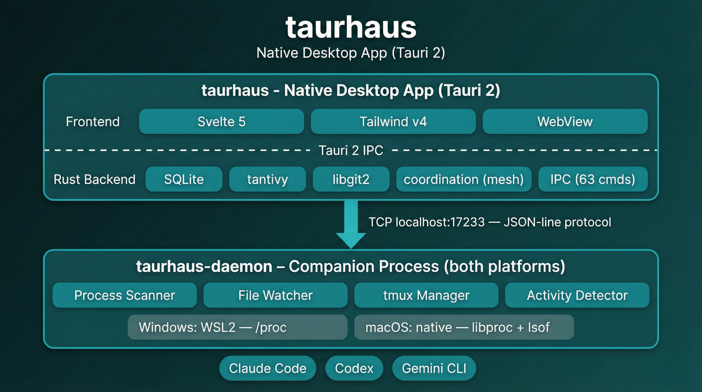
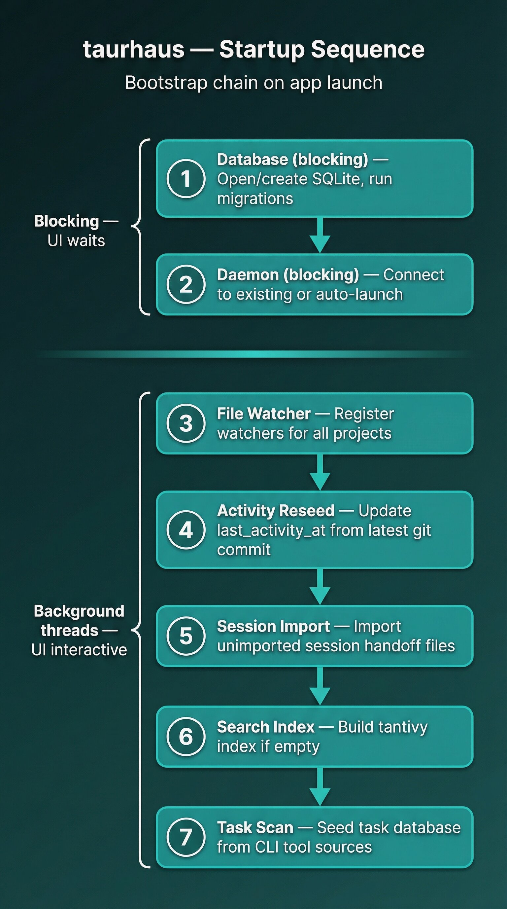
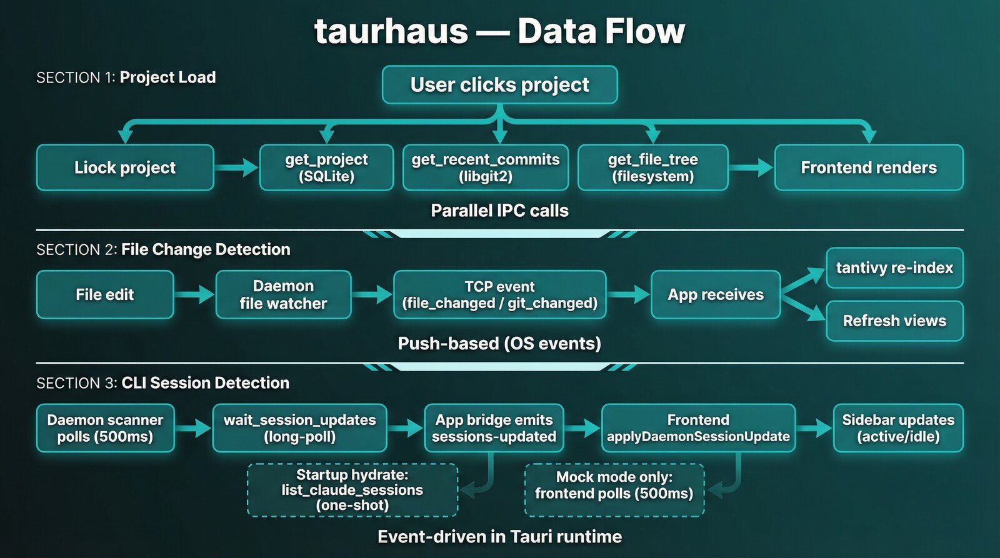

# Architecture

A condensed overview for contributors. For detailed references, see the [docs/ index](docs/README.md).

## System Overview

taurhaus is a cross-platform dual-process desktop application built with Tauri 2. The native GUI (Rust + Svelte 5) handles storage, git, and search. A lightweight companion daemon handles process scanning, file watching, and tmux session management, communicating with the app over TCP (JSON-line protocol on localhost:17233).

The daemon runs on both platforms — the only difference is where:

- **Windows**: The daemon runs inside WSL2 (launched via `wsl.exe`), where it has access to `/proc` for process inspection and the Linux filesystem where AI tools run.
- **macOS**: The daemon runs natively as a subprocess (launched from `~/.local/bin/taurhaus-daemon`), using `libproc` and `lsof` for process inspection instead of `/proc`.



## Platform Abstraction

The `platform/` module provides compile-time dispatch (`#[cfg(target_os)]`) between Linux and macOS implementations. Both platforms implement the same function signatures — the compiler enforces the API contract. The daemon binary is compiled per-platform with the correct implementation.

| Function | Linux (daemon in WSL2) | macOS (native daemon) |
|----------|--------------------|--------------------|
| `process_cwd(pid)` | `/proc/PID/cwd` readlink | `proc_pidinfo` (libproc) |
| `process_tty(pid)` | `/proc/PID/fd/0` readlink | `lsof -p PID -a -d 0` |
| `process_rchar(pid)` | `/proc/PID/io` rchar field | `proc_pid_rusage` (libproc) |
| `collect_socket_inodes(pid)` | `/proc/PID/fd` → socket inode extraction | `lsof -p PID -i TCP` |
| `has_established_443(pid)` | `/proc/PID/net/tcp` socket state parsing | `lsof` ESTABLISHED filter |

The session scanner (`session_scanner/`) and activity detector (`proc_io.rs`) are fully platform-agnostic — they call into the platform module and don't know which OS they're running on.

## Frontend (Svelte 5 + Tailwind v4)

The frontend runs inside Tauri's embedded WebView — not a browser. All data comes through the Rust backend via IPC.

| Component | Purpose |
|-----------|---------|
| `App.svelte` | Entry point, splash screen gate |
| `Shell.svelte` | Main layout: titlebar, tab routing, theme, position memory |
| `Sidebar.svelte` | Project list, session indicators, context menu, hover cards |
| `OverviewTab.svelte` | Project summary, README, recent commits, sessions |
| `FilesTab.svelte` | File tree with syntax-highlighted code preview |
| `GitTab.svelte` | Commit history, diffs, cross-tab navigation |
| `TaskBoard.svelte` | Kanban board aggregating tasks from Claude Code, Codex, Gemini |
| `TaskDetailPanel.svelte` | Task detail view with metadata and description |
| `SearchOverlay.svelte` | Full-text search across all projects (Ctrl+K) |
| `Settings.svelte` | App preferences and configuration |
| `FirstRunWizard.svelte` | Onboarding flow: project discovery and registration |
| `SplashScreen.svelte` | Startup splash with bootstrap chain progress |
| `SessionHistory.svelte` | Session timeline with handoff summaries |
| `components/MeshTab.svelte` | Mesh View orchestration surface (gate/setup/init/runtime states) |
| `components/MeshCanvas.svelte` | Node-canvas runtime graph for lead/agents and connection state |
| `components/MeshRuntimeBar.svelte` | Runtime status controls (add-agent/disband/summary pills) |

**Key patterns:**
- **Svelte 5 runes** (`$state`, `$derived`, `$effect`, `$props`) — no legacy stores
- **Derived theme tokens** — all color switching via `$derived` variables, never inline ternaries
- **`$bindable` position memory** — each tab exposes view state, Shell saves/restores per project
- **IPC layer** (`src/lib/ipc.js`) — Tauri `invoke()` wrappers with dev-mode mock fallbacks

## Backend (Rust)

### Modules

| Module | Purpose |
|--------|---------|
| `commands/` | Tauri IPC handlers — thin wrappers over domain modules |
| `platform/` | Compile-time OS dispatch (linux.rs / darwin.rs) |
| `db/` | SQLite connection, migrations, typed query functions |
| `git/` | libgit2 wrappers for commits, diffs, status |
| `fs/` | File tree, content reading, asset serving, file watching |
| `search/` | tantivy full-text search index (build, update, query) |
| `session/` | Session import, parsing, archival |
| `session_scanner/` | CLI tool detection (process scanning, idle detection) |
| `task_scanner/` | Task aggregation from Claude Code, Codex, Gemini (`claude_index.rs` maps source_key -> project for robust scans) |
| `daemon/` | TCP client + server, daemon lifecycle |
| `terminal/` | Terminal emulator management (Windows Terminal, iTerm2, etc.) |
| `claude_code/` | Claude Code project resolution, memory, teams |
| `provider/` | Provider routing — LocalProvider (direct) vs DaemonProvider (TCP) |
| `services/` | Cross-cutting services: relationships, scanner, project utilities, session import |
| `models/` | Shared data structures (Project, Session, ActivityState, etc.) |
| `config/` | Application configuration |
| `coordination/` | Multi-CLI team orchestration (behind `mesh-bridged-backend` feature flag) |
| `bootstrap.rs` | Startup sequence: DB init, daemon connect, watcher, index, activity reseed |
| `event_processor.rs` | File/git event batching (300ms quiet window, 2s ceiling) |
| `daemon_lifecycle.rs` | Daemon auto-launch, reconnection, shutdown |

The crate enforces `#![deny(unsafe_code)]` — the single exception (libgit2 init) uses a scoped `#[allow]`.

### Provider Routing

The `ProviderState` routes each IPC operation to the right backend based on project path:

- **LocalProvider** — direct filesystem/git/search access. Used for native projects (macOS, Linux).
- **DaemonProvider** — proxies operations over TCP to the daemon. Used for WSL projects on Windows.

Both implement the `ProjectProvider` trait. The routing is transparent to command handlers — they call `provider_state.resolve(path)` and get the right implementation.

### Storage

- **SQLite** (`rusqlite`): 6 tables — `projects`, `sessions`, `session_activity`, `relationships`, `tasks`, `settings`. Source of truth for structured data.
- **tantivy**: Full-text search index over files, commits, sessions. Rebuilt from filesystem on startup.
- **Filesystem**: Source of truth for content. SQLite stores metadata; files are always read fresh.
- **Path overrides**: `TAURHAUS_DATA_DIR` overrides Tauri `app_data_dir()` resolution; `TAURHAUS_CLAUDE_DIR` overrides Claude-derived roots used by task/coordination watchers.

See [data model reference](docs/architecture/data-model.md) for schema details.

### IPC Commands (86)

Fine-grained, one command per operation. Frontend calls in parallel for speed. See [IPC reference](docs/architecture/ipc-reference.md) for the full command catalog.

Grouped by command module:
- **Projects** (12): includes `create_project`, registration flows, path/directory helpers, and first-run checks
- **Git** (4): commit lists + status + remote URL
- **Files** (5): file tree/read/readme/asset/path-type
- **Search** (3): search, rebuild, index status
- **Sessions** (3): list/latest/detail
- **Relationships** (4): list/create/dismiss/remove
- **Command Center** (6): launch/stop/navigate/list/record activity
- **Tasks** (6): board data + detail + archive + commit context helpers
- **Daemon** (6): platform/status/start/stop/install checks
- **Mesh install** (2): check/install mesh binary
- **Settings** (2): get/update
- **Coordination** (13): team lifecycle + member lifecycle + live/preflight
- **Templates** (19): role/preset CRUD, composition, storage status, history/diff/revert/import/flush/apply
- **Logging** (1): frontend log forwarding — `console.log` in the frontend is monkey-patched (`logger.js`) to also call `frontend_log` IPC, writing to a unified `taurhaus.log` in the resolved app-data root (`app_data_dir()` by default, or `TAURHAUS_DATA_DIR` when set). Backend uses `tracing` crate. Single log file, truncated per launch.

### Coordination (Mesh View)

The `coordination/` subsystem powers multi-agent team orchestration and is gated by the `mesh-bridged-backend` Cargo feature (enabled by default).

- **State bootstrap**: `CoordinationState` is app-managed and lazily builds the orchestrator on first coordination IPC use (no startup hard dependency on mesh availability).
- **Persistence**: by default, team definitions are stored in `~/.claude/teams/<team>/config.json` (`TeamConfigStore`), while runtime attachment state lives in `~/.claude/teams/<team>/runtime/*.json` (`MemberRuntimeStore`). If `TAURHAUS_CLAUDE_DIR` is set, coordination uses `<TAURHAUS_CLAUDE_DIR>/teams/...` instead.
- **Pipelines**: `coordination/pipelines/` drives initialize, hot-add, and resume flows (validate -> create/resolve panes -> launch sessions -> mesh join -> daemon start -> onboarding delivery).
- **Resume lifecycle**: offline members are resumed via `coordination_resume_member` with mode-aware commands (`Continue` or `Fresh`) and step-level reporting.
- **Liveness reconciliation**: live-status reads call orchestrator write-on-drift reconciliation (missing pane, dead pane, or shell-returned pane via `pane_is_shell`) before returning UI status. Offline drift clears stale session IDs and cleans non-Claude daemon PIDs.
- **Runtime/disband behavior**: disband removes persisted team state and performs best-effort teardown of managed agent resources (mesh membership, daemon processes, panes for non-lead members).
- **Runtime UI architecture**: Mesh View uses a deterministic node canvas (`MeshCanvas`) instead of force-sim layouts. Lead/agent positions are computed from container size and roster cardinality (single-row up to medium teams, split rows for larger teams), with explicit state mapping for setup/initializing/runtime.
- **Runtime interactions**: node detail actions (`MeshNodeDetail`) and runtime controls (`MeshRuntimeBar`) operate on the same live-status pipeline (`coordination_get_live_team_status`, add/remove/resume/disband IPCs), so canvas state and control-bar state stay consistent without a separate client-side data model.

See [coordination architecture](docs/coordination-architecture.md) for deeper design details and decision history.

### Team Templates

The template system provides reusable role templates and team presets, with composition and history integrated into mesh setup.

- **Storage model**: built-in templates ship read-only from resources; user templates are YAML files in the app-managed templates directory (`roles/`, `presets/`, `_meta/`).
- **Storage roots**: template files live under the resolved app-data directory (`app_data_dir()/templates` by default, or `<TAURHAUS_DATA_DIR>/templates` when overridden).
- **Git-backed state**: template writes are committed through `TemplateStore`, enabling history (`templates_get_history`), diff (`templates_get_diff`), and forward revert (`templates_revert`).
- **Composition engine**: `templates::composition::compose_team` resolves lead and agent slots into a concrete roster, returning `warnings` and `validation_errors`.
- **Frontend pipeline**: `TemplateBrowserPanel` -> `TeamCustomizerPanel` -> `MeshSetupView` -> `coordination_initialize_team` (initialize payload shape remains unchanged).
- **Operational visibility**: storage mode, dirty state, and pending actions are exposed via `templates_get_storage_status`; manual flush is available via `templates_flush_pending`.

See [team templates guide](docs/team-templates.md) for user-facing workflows.

### Session Scanner

Detects running CLI tool sessions (Claude Code, Codex, Gemini CLI). The detection logic is platform-agnostic — it calls into the `platform/` module for OS-specific process inspection.

| Tool | Detection | Activity Signal |
|------|-----------|-----------------|
| Claude Code | Process name + cwd | IO read bytes — hysteresis (2 consecutive above-threshold polls) |
| Codex | Process name + session file cwd | Session file mtime (10s threshold) |
| Gemini CLI | Process name + SHA-256 path hash | TCP socket state to :443 (ESTABLISHED = active) |

All detection uses 2-poll bidirectional hysteresis to prevent flickering.

**Platform details:**
- **Linux**: reads `/proc/PID/io` for IO bytes, `/proc/PID/fd` + `/proc/PID/net/tcp` for socket state
- **macOS**: uses `proc_pid_rusage` (libproc) for IO bytes, `lsof` for socket state

### Terminal Management

The terminal module manages launching and focusing terminal emulators with the correct tmux session. Same decision tree on all platforms — only the emulator options differ.

| Platform | Emulators | Default |
|----------|-----------|---------|
| Windows | Windows Terminal | `wt.exe -w taurhaus` |
| macOS | iTerm2, Ghostty, Terminal.app | iTerm2 (auto-detect fallback) |

macOS uses event-driven AppleScript to handle click-to-activate focus transitions reliably.

### Event Processing

File system events from `notify` arrive in rapid bursts (5–8 events per file edit). The event processor (`event_processor.rs`) uses **batch-and-flush** to coalesce them:

- **Quiet window** (300ms): batch flushes after no new events for 300ms
- **Max-wait ceiling** (2s): batch flushes regardless after 2s, preventing starvation

Result: one `project-files-changed` Tauri event per edit instead of 5–8. The frontend listener in Shell.svelte dispatches to the active tab via reactive props.

### Recent Performance Improvements

- **Git range queries**: range traversal uses a single-pass algorithm in `git/commits.rs` (covered by `single_pass_range_matches_dual_pass_output`), reducing duplicated revwalk work.
- **Search indexing**: file updates are batch-committed in `search/indexer.rs` (`update_file_batch_commits_once_for_multiple_files`) to avoid per-file commit overhead.
- **Session scanner CPU**: activity detection uses hysteresis and cadence widening (`session_scanner/proc_io.rs`, `daemon/session_activity.rs`) to reduce false active spikes and idle-loop churn.

### Daemon Protocol

JSON-line protocol over TCP (localhost:17233). Same protocol on both platforms — only the daemon launch mechanism differs (WSL on Windows, native subprocess on macOS). See [daemon protocol reference](docs/architecture/daemon-protocol.md) for the full command catalog.

**Events (daemon → app):**
- `file_changed` — watched file modified (triggers search re-index)
- `git_changed` — .git directory modified (triggers commit list refresh)
- `session_file_created` — new session handoff file detected

**Commands (app → daemon, 21 methods):**
- `ping`, `shutdown`, `watch`, `unwatch`, `scan_sessions`
- `git_status`, `git_log`, `git_latest_commit_time`, `git_commits_in_range`, `git_commit_files`, `git_commit_diff`
- `file_tree`, `read_file`, `read_readme`, `read_asset`
- `list_claude_sessions`, `wait_session_updates`, `launch_session`, `stop_session`, `navigate_to_session`
- `get_project_tasks` (supports optional `scan_cycle_id` in protocol v6)

## Startup Sequence



The bootstrap chain runs on app launch (progress shown in `SplashScreen.svelte`):

1. **Database** — open/create SQLite, run migrations
2. **Daemon** — connect to existing daemon or auto-launch (platform-specific)
3. **File watcher** — register watchers for all projects (.gitignore-filtered)
4. **Activity reseed** — update `last_activity_at` from latest git commit per project
5. **Session import** — import any unimported session handoff files
6. **Search index** — build tantivy index from filesystem if empty
7. **Task scan** — seed task database from live CLI tool sources

Steps 3–7 run in background threads — the UI is interactive as soon as the database and daemon are ready. In Tauri runtime, session updates are event-driven (`sessions-updated`) with a one-time startup hydrate; frontend-only mock mode uses polling fallback.

Claude task-directory watching follows the same override rules: default `~/.claude/tasks`, or `<TAURHAUS_CLAUDE_DIR>/tasks` when `TAURHAUS_CLAUDE_DIR` is set.

## Data Flow



```
User clicks project
  → Shell calls get_project, get_commits, get_file_tree (parallel IPC)
  → Rust reads SQLite (metadata) + libgit2 (commits) + filesystem (tree)
  → Frontend renders immediately

File changes detected
  → Daemon's file watcher detects change
  → Sends file_changed / git_changed event over TCP to app
  → App updates tantivy index + refreshes affected views

CLI session state changes
  → Daemon bridge emits sessions-updated event to frontend
  → Frontend session store applies delta and refreshes indicators
  → Startup hydration uses list_claude_sessions once (mock mode uses polling fallback)
  → Backend scanner inspects /proc (Linux) or libproc (macOS)
  → Sidebar shows tool indicator (active/idle)
  → HoverCard shows full session details on hover
```

## Build System

All builds use `just` recipes. Both Windows and macOS builds happen natively on their target platforms — no cross-compilation.

```bash
just dev              # Tauri dev mode (hot-reload)
just build-windows    # Sync to D:\, npm install, cargo build natively via cmd.exe
just build-macos      # Sync to Mac Mini, build ARM DMG via SSH
just build-macos-intel # Build Intel (x86_64) DMG via SSH
just check            # Full gate: fmt + lint + typecheck + just test
just test             # All non-E2E tests (Rust + frontend)
just test-fast        # Fast lane: cargo check --tests + frontend tests
just metrics          # Quality KPI report snapshot
just test-macos       # Run Rust tests on Mac Mini via SSH
just agent-quality    # Rust implementation quality gate: fmt + clippy + check --tests
```

## Key Decisions

| Decision | Choice | Rationale |
|----------|--------|-----------|
| Git | libgit2 (in-process) | No CLI dependency, fast, full control |
| Search | tantivy | Rust-native, fast indexing, BM25 ranking |
| DB | SQLite | Single-file, zero config, rusqlite is solid |
| File watch | notify + ignore | .gitignore-aware, cross-platform |
| Frontend | Svelte 5 | Runes are excellent, minimal boilerplate |
| Styling | Tailwind v4 | @theme tokens, no CSS-in-JS overhead |
| IPC | Tauri commands | Type-safe, async, built-in |
| Task aggregation | Per-tool adapters | Each CLI tool stores tasks differently |
| Daemon comms | JSON-line over TCP | Simple, debuggable, mirrored networking in WSL2 |
| Platform dispatch | Compile-time `#[cfg]` | Zero runtime cost, compiler-enforced API contract |
| Terminal mgmt | Per-platform emulator enum | Same decision tree, platform-specific activation |
| Provider routing | Trait-based dispatch | Transparent local vs daemon routing |
| Unsafe code | `#![deny(unsafe_code)]` | One scoped exception for libgit2 init |

## Further Reading

- [Data model reference](docs/architecture/data-model.md) — SQLite schema, tantivy index, filesystem layout
- [IPC reference](docs/architecture/ipc-reference.md) — all Tauri IPC commands with parameters and types
- [Daemon protocol](docs/architecture/daemon-protocol.md) — TCP JSON-line protocol specification
- [Coordination architecture](docs/coordination-architecture.md) — mesh orchestration subsystem details
- [Team templates guide](docs/team-templates.md) — role templates, presets, composition, history, and revert workflow
- [Platform abstraction](docs/platform-abstraction.md) — Linux/macOS dispatch implementation details
- [File rendering pipeline](docs/file-rendering-pipeline.md) — classification, caching, and rendering
- [Feature documentation](docs/README.md#features) — per-feature guides
- [CLAUDE.md](CLAUDE.md) — code standards, build recipes, development workflow
