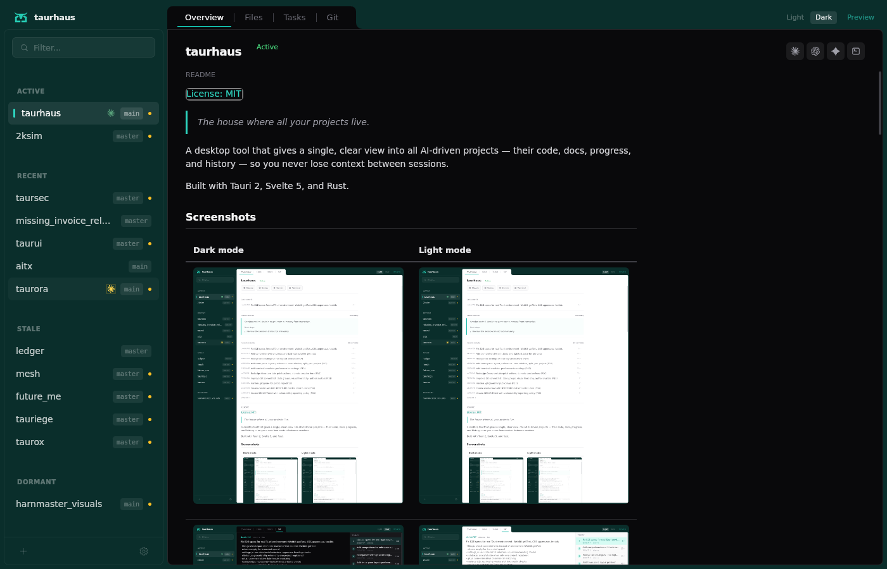
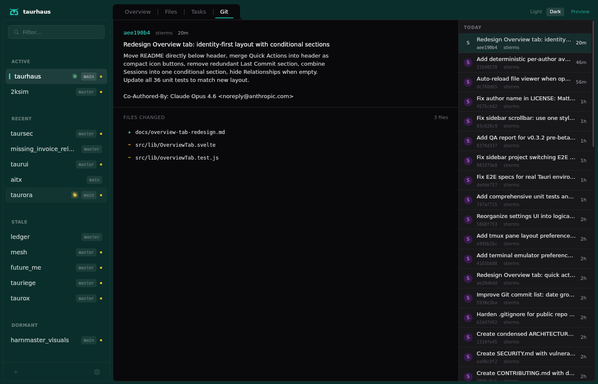
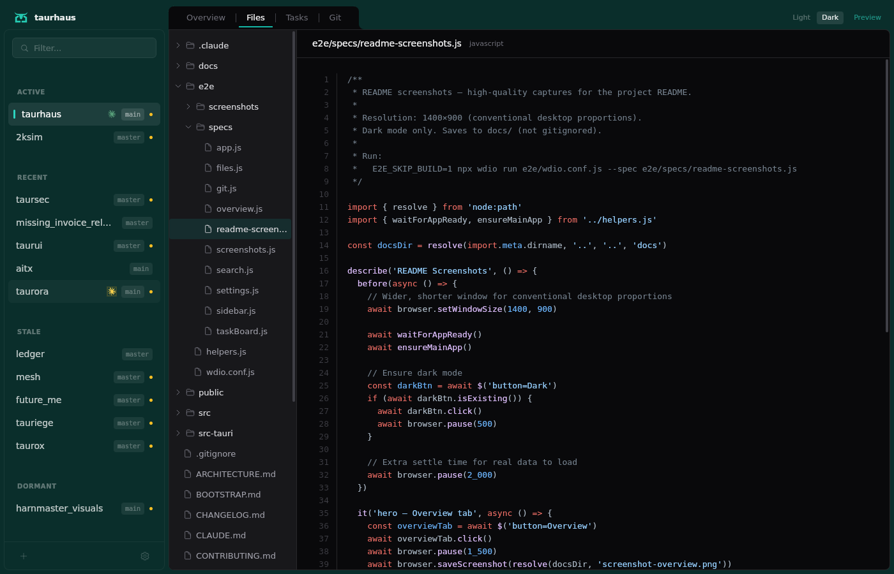

# taurhaus

> The house where all your projects live.

A desktop tool that gives a single, clear view into all your AI-driven projects — their code, docs, progress, and history — so you never lose context between sessions.



## Features

- **Project overview** — All projects at a glance, grouped by activity (Active / Recent / Stale / Dormant)
- **File browser** — Browse and preview files with VS Code-grade syntax highlighting (Shiki)
- **Git integration** — Commit history, inline diffs, blame — all in-app via libgit2, no CLI dependency
- **Task board** — Aggregated tasks from Claude Code, Codex, and Gemini CLI in one view
- **Multi-CLI session management** — Launch, stop, and jump to Claude Code, Codex, and Gemini CLI sessions from the sidebar
- **Live activity detection** — Real-time active/idle status for running CLI sessions
- **Full-text search** — Search across all project content with Ctrl+K (powered by tantivy)
- **Session handoffs** — Auto-imported session summaries so you can pick up where you left off
- **Relationship mapping** — Auto-detected cross-project dependencies from Cargo.toml, CLAUDE.md, and session mentions

| Git tab | Files tab |
|---------|-----------|
|  |  |

## Architecture

taurhaus is a dual-process desktop application — a native Windows GUI backed by a lightweight daemon inside WSL2.


The Windows exe runs the Tauri 2 shell (Svelte 5 frontend + Rust backend with SQLite, tantivy, and libgit2). The WSL2 daemon handles process scanning, file watching, tmux session management, and activity detection for Claude Code, Codex, and Gemini CLI.

See [ARCHITECTURE.md](ARCHITECTURE.md) for the full technical overview.

## Getting Started

### Requirements

| Requirement | Notes |
|-------------|-------|
| Windows 10/11 | Native desktop app |
| WSL2 | Any distribution (Ubuntu recommended) |
| Windows Terminal | Latest from Microsoft Store |
| tmux 3.0+ | Installed inside WSL |

**WSL2 networking**: Create or edit `%USERPROFILE%\.wslconfig` with `networkingMode=mirrored` under `[wsl2]`, then restart WSL (`wsl --shutdown`).

At least one AI CLI tool installed in WSL: [Claude Code](https://docs.anthropic.com/en/docs/claude-code), [Codex](https://github.com/openai/codex), or [Gemini CLI](https://github.com/google-gemini/gemini-cli).

### Install

1. Download the latest installer from [Releases](../../releases)
2. Run the installer — the app manages its own WSL daemon automatically
3. On first launch, the wizard scans your project directories and registers them

### Quick start

- **Browse** — Click any project in the sidebar to see its overview, files, tasks, and git history
- **Launch a session** — Right-click a project to start a CLI tool session
- **Navigate** — Click tool indicator icons next to a project name to jump to a running session
- **Search** — Press `Ctrl+K` to search across all projects

## Development

| Layer | Technology |
|-------|------------|
| Frontend | Svelte 5 + Tailwind v4 |
| Backend | Rust (Tauri 2) |
| Storage | SQLite + tantivy + filesystem |
| Git | libgit2 via `git2` crate |
| Tests | Vitest + Cargo test + WebdriverIO |

All builds use [`just`](https://github.com/casey/just) recipes:

```bash
just dev              # Full Tauri dev mode (hot-reload)
just build-windows    # Windows release build (NSIS installer)
just check            # Quality gate: clippy + svelte-check + all tests
just test             # All tests (Rust + frontend)
```

See [CONTRIBUTING.md](CONTRIBUTING.md) for development setup and guidelines.

## License

MIT — see [LICENSE](LICENSE) for details.
