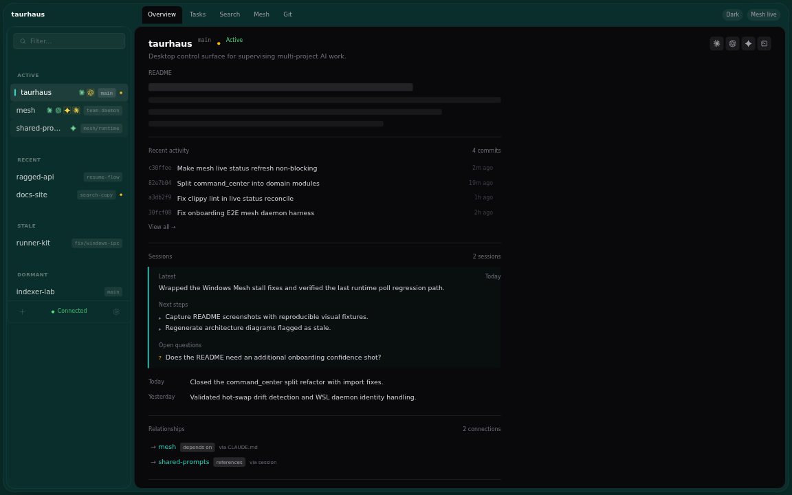
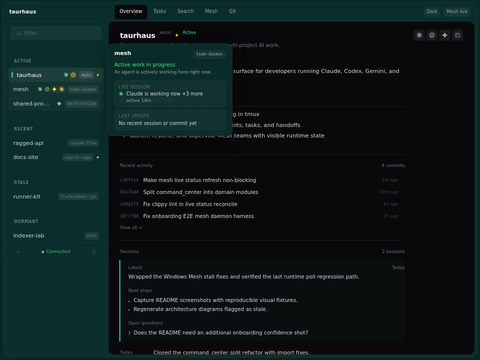
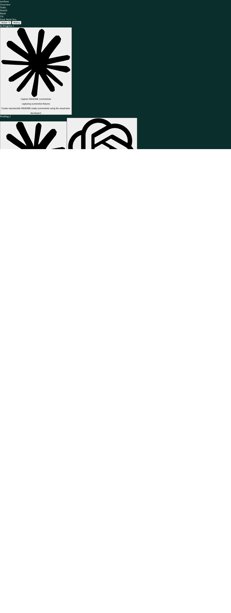
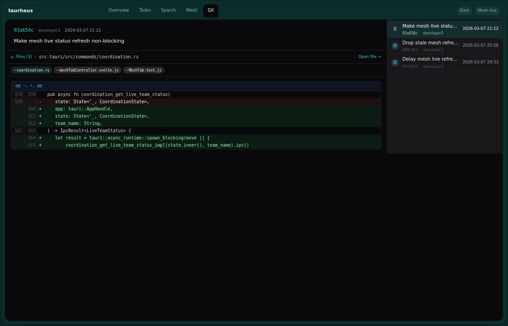
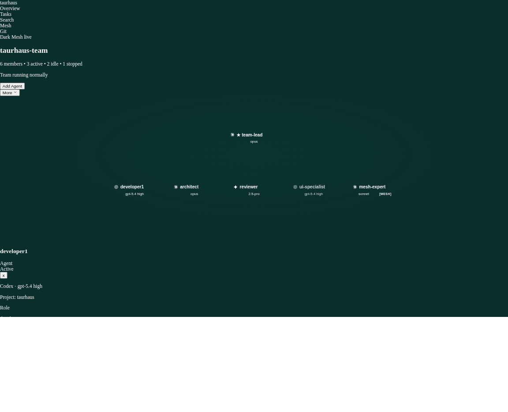
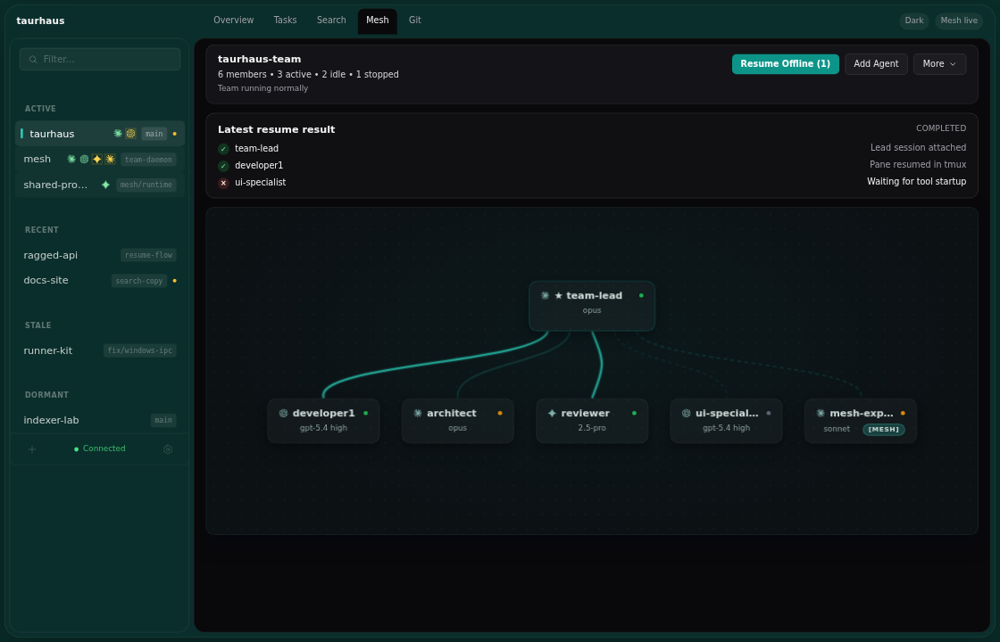

<p align="center">
  
</p>

# taurhaus

A desktop app for developers who run Claude Code, Codex, Gemini CLI, and multi-agent Mesh teams across several projects at once.

Instead of flipping between terminal tabs to check what's running, what changed, and what broke, taurhaus puts it all in one window — live sessions, project history, task boards, and team coordination.



## Why taurhaus

AI-assisted development gets messy fast. One project has a Codex session running, another has Claude mid-refactor, Gemini is cleaning up TODOs somewhere else, and a Mesh team is halfway through a coordinated change. The terminal can handle all of that, but it won't help you keep track of it.

taurhaus is built for exactly that situation:

- **See what's running** — live session status for every project, grouped by activity, with hover previews and quick actions.
- **Get back up to speed** — README previews, recent commits, task history, session handoffs, and full-text search across everything.
- **Run Mesh teams** — set up multi-agent teams, watch them work, add or remove members on the fly, and recover when things go sideways.
- **Tune discovery and launch behavior** — configure which directories to scan, what to ignore, and how terminals launch — your settings actually control how the app behaves, not just what it displays.

## Core workflows

### See what's running

The sidebar groups your projects by how active they are and shows which AI tools have sessions running. Hover over a project to see session details; click a tool icon to jump straight into its tmux pane.

You can also launch, resume, stop, and restart sessions from inside the app, see grouped Mesh team indicators in the sidebar, and spot which project currently owns foreground tmux focus.



### Get back up to speed

When you return to a project, taurhaus shows you what matters: the README, recent commits, open tasks, session handoffs, related projects, and full-text search across all of them.

This is useful even without a team running. It just makes the gap between "what was I doing?" and "okay, I'm caught up" a lot shorter.

| Task and history context | Cross-project search |
|---|---|
|  |  |

### Browse code and history

You can go from a session handoff or commit list straight into syntax-highlighted file browsing and diffs — without leaving the app or switching to another tool just to check what changed.



## Mesh teams

Most multi-agent setups today are fire-and-forget. You give a subagent a prompt, it does its work, and when it's done, it's done. You can't talk to it while it's running. Each agent is an isolated job.

Mesh works differently. It uses tmux sessions to keep full CLI tool instances — Claude Code, Codex, Gemini — alive as persistent team members that can send and receive messages while they work. A Claude lead can assign a task to a Codex agent, check on a Gemini reviewer, and coordinate across all of them in real time. The agents aren't disposable workers; they're a team with ongoing context.

Under the hood, Mesh builds on the same file structure that Claude Code already uses for its own task and team management (`~/.claude/tasks/`, `~/.claude/teams/`). That means Claude Code agents on a Mesh team don't need special adapters — they read and write to the same files they'd normally use. The team infrastructure is mostly invisible to each agent's native tooling, which is what makes cross-tool coordination possible without forcing every tool into a new protocol.

Mesh itself is the communication layer — file-based messaging, tmux pane orchestration, role definitions. taurhaus is where that becomes practical to use day-to-day. The Mesh tab handles the setup, gives you a live view of the team, and takes care of recovery when things go wrong.

What you can do:

- Pick roles and tools for each team member, then launch with one click
- See every member's status, what they're working on, and act on individual agents
- Add or remove members while the team is running
- Resume agents that went offline, or restart the whole team after a crash
- Shut down and clean up when you're done

### Compose and launch

The setup flow lets you define a lead plus agents across different tools and projects, instead of manually wiring up tmux panes and hoping everything stays in sync.


### Watch the team work

Once running, taurhaus shows each team member as a node on a canvas — their status, their tool, what they're focused on — with actions available on each one.

The runtime view also shows when agents lost context and had it restored, and tracks how team actions are progressing.



### Recover when things break

Restarts happen. Agents crash. taurhaus detects these situations and gives you clear options to resume individual members or restart the whole team, instead of leaving you to sort it out manually. Some edge cases in recovery are still being polished, but the core resume and recovery features are shipped and tested.



For more on Mesh:

- [Mesh view](docs/features/mesh.md)
- [Team templates](docs/team-templates.md)

## Install and prerequisites

For the full setup walkthrough and troubleshooting, see the [Getting Started guide](docs/getting-started.md).

### Supported platforms

- **Windows** — primary release target, with CLI tools running inside WSL2
- **macOS** — native app with a native daemon

### Required tools

Before installing taurhaus, you need:

1. **`tmux`** on the machine where your AI CLIs run
2. **At least one supported AI CLI**
   - [Claude Code](https://docs.anthropic.com/en/docs/claude-code)
   - [Codex CLI](https://github.com/openai/codex)
   - [Gemini CLI](https://github.com/google-gemini/gemini-cli)
3. **Mesh CLI** if you want multi-agent team orchestration
   - taurhaus can install or update the bundled Mesh binary when supported

### Windows prerequisites

On Windows, taurhaus expects the CLI tools to run inside **WSL2**.

1. Install WSL2:
   ```powershell
   wsl --install
   ```
2. Install `tmux` inside WSL:
   ```bash
   sudo apt update && sudo apt install -y tmux
   ```
3. Enable mirrored networking in `%USERPROFILE%\.wslconfig`:
   ```ini
   [wsl2]
   networkingMode=mirrored
   ```
4. Restart WSL:
   ```powershell
   wsl --shutdown
   ```

Mirrored networking is needed because the Windows app talks to a helper service running inside WSL over localhost.

### macOS prerequisites

On macOS:

1. Install Homebrew if needed:
   ```bash
   /bin/bash -c "$(curl -fsSL https://raw.githubusercontent.com/Homebrew/install/HEAD/install.sh)"
   ```
2. Install `tmux`:
   ```bash
   brew install tmux
   ```
3. Install whichever AI CLIs you use

### Install taurhaus

- **Windows**: download `taurhaus_x.x.x_x64-setup.exe` from [Releases](../../releases) and run the installer.
- **macOS**: download the DMG from [Releases](../../releases), move taurhaus to Applications, and launch it.

On first launch, taurhaus checks whether its helper service needs to be installed or updated, walks you through project discovery, and transitions you into the main app once registration finishes.

> macOS note: if Gatekeeper blocks the app on first launch, right-click it in Applications, choose **Open**, and confirm once.

### Shell environment note

If your shell startup scripts prompt for input, they can block automated session launches. The most common case is `oh-my-zsh` update prompts. If you use interactive shell plugins, configure them to run non-interactively for headless session starts.

### Linux/WSL file watcher note

taurhaus and its helper service use Linux file watchers (inotify) to detect project changes. Large Mesh teams may need a higher watcher limit than the default 128. Check with `sysctl fs.inotify.max_user_instances` and raise to 512 if needed. See the [Getting Started troubleshooting section](docs/getting-started.md#file-watcher-limits-on-linuxwsl) for details.

## First launch and quick start

### First launch

The first-run wizard walks through:

1. helper service install/update check
2. project discovery
3. project selection
4. registration progress
5. transition into the main app

Your scan and ignore settings from the Settings panel apply to the wizard too — the same directories and exclusions are used everywhere.

### Quick start

Once taurhaus is open:

1. Select a project in the sidebar to see its overview.
2. Launch or resume a CLI session from the project context menu.
3. Use the Tasks tab, README preview, and recent commits to catch up.
4. Press `Ctrl+K` / `Cmd+K` to search across projects.
5. Open the Mesh tab to set up a multi-agent team.

## Development

### Stack

| Layer | Technology |
|---|---|
| Desktop shell | Tauri 2 |
| Frontend | Svelte 5 + Tailwind v4 |
| Backend | Rust |
| Storage | SQLite + Tantivy + filesystem |
| Git integration | `git2` / libgit2 |
| Tests | Vitest + Cargo test + WebdriverIO |

### Workflow

Taurhaus uses **Bun-only** JavaScript workflows and `just` recipes for build, test, and release commands.

```bash
just dev              # full Tauri development mode
just check-quick      # fast implementation gate
just test-fast        # quick Rust compile + frontend unit lane
just test             # full non-E2E test lane
just test-visual      # browser-mode visual screenshot lane
just test-e2e         # Linux Tier 1 E2E lane
just test-e2e-full    # Linux Tier 1 + Tier 2 E2E lane
just build-daemon     # build the daemon binary only
just install-daemon   # install or update the daemon in ~/.local/bin
just build-mesh       # build the mesh CLI from the local mesh workspace
just install-mesh     # install or update mesh in ~/.local/bin
just build-windows    # native Windows installer build
just build-macos      # native macOS DMG build
just build-macos-universal # universal macOS DMG build
just capture-readme-screenshots # refresh README screenshot assets
just release          # create GitHub release from current version
```

Contributor notes:

- use `just check-quick` during implementation
- treat `just check` as the full gate for releases
- run Vitest from the project root, not `src-tauri/`
- use `just` recipes for daemon and mesh installs instead of ad hoc copy steps
- high-traffic E2E coverage now includes first-run wizard, command center real actions, session management, and mesh recovery

Further reading:

- [CONTRIBUTING.md](CONTRIBUTING.md)
- [ARCHITECTURE.md](ARCHITECTURE.md)
- [docs/README.md](docs/README.md)
- [Build and release](docs/operations/build-and-release.md)
- [Testing guide](docs/operations/testing-guide.md)
- [Visual testing guide](docs/operations/visual-testing-guide.md)

## Architecture at a glance

Taurhaus is a native desktop app with two parts:

- a **Tauri application** that handles the UI, storage, git, and search
- a **lightweight daemon** that scans for running processes, manages tmux sessions, bridges WSL-side watch/process work when needed, and maintains foreground/session activity state

On Windows, the daemon runs inside WSL2. On macOS, it runs as a native subprocess.

Native/local project file watching is app-owned. The daemon only takes the watch bridge role when taurhaus is supervising WSL-backed workspaces from Windows.

This keeps taurhaus plugged into your actual local dev environment instead of wrapping everything in a cloud layer.


For more detail:

- [ARCHITECTURE.md](ARCHITECTURE.md)
- [IPC reference](docs/architecture/ipc-reference.md)
- [Daemon protocol](docs/architecture/daemon-protocol.md)
- [Data model](docs/architecture/data-model.md)

## Documentation

- [Getting Started](docs/getting-started.md)
- [Project management](docs/features/project-management.md)
- [Session management](docs/features/session-management.md)
- [Task board](docs/features/task-board.md)
- [Command center](docs/features/command-center.md)
- [Search](docs/features/search.md)
- [Mesh view](docs/features/mesh.md)
- [Documentation index](docs/README.md)

## License

MIT. See [LICENSE](LICENSE) for details.
