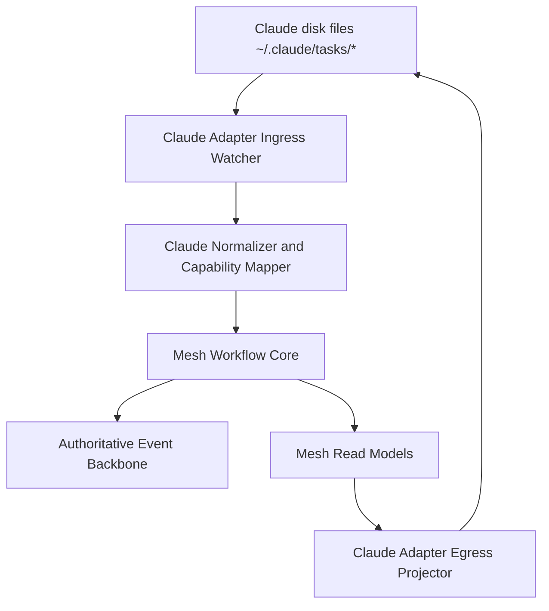

# Mesh Greenfield Claude Code Adapter - 2026-03-11

## Scope

This document extends the greenfield Mesh architecture with a concrete adapter layer for Claude Code disk files.

It answers:
- whether a Claude Code disk-file adapter is viable around the greenfield workflow-core architecture
- where Claude Code files sit relative to the workflow core, event backbone, and read models
- which Claude Code behaviors map cleanly and which do not
- how lifecycle operations should map through the adapter
- whether the same adapter boundary can support other CLI tools later

Inputs:
- [mesh-greenfield-functional-architecture-2026-03-11.md](/home/user/projects/taurhaus/docs/analysis/mesh-greenfield-functional-architecture-2026-03-11.md)
- observed Claude task files under `~/.claude/tasks/{source-key}/{id}.json`
- prior evidence from [task-system-unification.md](/home/user/projects/mesh/docs/architecture/task-system-unification.md)
- direct collaboration between `mesh-architect` and `architect-1`

## Executive Summary

A Claude Code disk-file adapter is viable around the greenfield Mesh architecture, but only as a capability-limited external adapter.

The right design is:
- Mesh greenfield workflow core remains canonical
- Claude Code disk files are treated as an external ingress/egress surface
- the adapter translates between Claude task files and Mesh workflow commands, events, and read models
- unsupported semantics remain canonical only inside Mesh

This means the adapter can cleanly support:
- task creation
- basic task updates
- task status changes
- dependency edges via `blocks` and `blockedBy`
- `activeForm`
- in some cases `owner`

But it cannot cleanly support native Claude-only semantics for:
- assignment identity
- read and ack state
- explicit acceptance vs start
- progress summaries as first-class workflow facts
- recovery bundles
- attention and escalation state
- task-linked messaging
- stable actor identity beyond coarse source attribution

Blunt viability statement:
- Claude disk files are a useful plug-and-play adapter target for task snapshot interoperability
- they are not a full-fidelity adapter target for the greenfield workflow-core model unless Mesh accepts reduced semantics or introduces additional sidecar metadata

So the answer is not “make Claude disk files the canonical workflow model.”
The answer is:
- keep workflow-core semantics canonical in Mesh
- expose a Claude-compatible adapter for the parts Claude files can represent
- record explicit provenance and capability limits for anything that enters from or is projected out to Claude disk state

## Observed Claude Code Disk Surface

From local disk inspection, Claude task persistence currently appears as:
- `~/.claude/tasks/{source-key}/{id}.json`
- `.lock` files in each source-key directory
- `.highwatermark` files in each source-key directory

Observed task JSON shape includes fields such as:
- `id`
- `subject`
- `description`
- `activeForm`
- `status`
- `blocks`
- `blockedBy`
- sometimes `owner`

Example consequence:
- Claude task files are a usable task snapshot surface
- they are not a complete workflow-semantic surface

Important observed limitation:
- I did not find a native Claude disk-file equivalent for inbox messages, ack state, recovery context, attention state, or task-linked message history

## Adapter Viability

### Viability verdict

Yes, the adapter is viable.

But it is viable only if the greenfield Mesh architecture keeps a strict boundary:
- Mesh workflow core stays canonical
- Claude disk files are one adapter surface among potentially many

### Why it is viable

Because Claude task files already provide a stable enough external task snapshot shape for:
- create
- update
- status transitions
- dependency edges
- partial owner mapping

That is enough to support a useful external tool adapter.

### Why it is not sufficient as the canonical workflow model

Because native Claude disk files do not appear to contain the workflow semantics we actually need most:
- exact assignment lifecycle
- explicit delivery/read/ack linkage
- compaction recovery state
- task-aware attention state
- task-linked messages and escalation history

If Mesh made Claude task files canonical, it would immediately reintroduce the exact ambiguity the greenfield architecture is trying to remove.

## Recommended Adapter Position In The Greenfield Architecture

Adapter boundary rule:
- Claude files are outside the workflow core
- the adapter converts Claude-compatible task state into canonical Mesh commands or external-observation events
- the adapter also projects selected Mesh state back into Claude-compatible task files when configured

## Recommended Adapter Architecture

## 1. Adapter ingress

Responsibilities:
- watch Claude task directories
- detect create/update/delete events on task JSON files
- parse Claude task snapshots
- normalize into Mesh-compatible external task observations
- map or synthesize identity and provenance

Recommended emitted Mesh-side command/event types:
- `external_task_observed`
- `external_task_created`
- `external_task_updated`
- `external_task_status_changed`
- `external_task_deleted`
- `external_mapping_conflict`

Important design choice:
- ingress should not pretend Claude emitted semantics it did not actually provide
- unsupported semantics must stay `unknown`, not be faked
- when Claude expresses only a lossy subset of Mesh state, the core preserves richer semantics internally and records the source capability as partial or degraded rather than collapsing internal state downward

## 2. Adapter egress

Responsibilities:
- project Mesh task state into Claude-compatible task JSON files
- write only the fields Claude tools are likely to tolerate and understand
- preserve source attribution and loop-prevention metadata where possible

Typical output fields:
- `id`
- `subject`
- `description`
- `activeForm`
- `status`
- `blocks`
- `blockedBy`
- `owner` when appropriate

Important design choice:
- do not try to serialize internal Mesh-only semantics into Claude task files unless they can be represented safely and compatibly
- richer Mesh semantics belong in Mesh projections, not in fragile overloaded Claude fields

## 3. Capability model

The adapter should advertise explicit capabilities.

For Claude disk files, likely capability set is:
- `task_snapshot_read`
- `task_snapshot_write`
- `status_sync`
- `dependency_sync`
- `best_effort_owner_sync`

Likely missing capabilities:
- `message_read_write`
- `ack_tracking`
- `assignment_semantics_full`
- `progress_semantics_full`
- `recovery_projection_native`
- `attention_projection_native`
- `review_handoff_semantics_native`

This matters because the core should know whether it is dealing with:
- a full workflow peer
- a partial task snapshot tool
- a read-only ingestion source

## 4. Provenance and loop prevention

The adapter must record:
- source tool identity, for example `claude_code`
- source scope, for example session directory vs team directory
- external object key, such as `source-key + task id`
- last adapter write marker or version
- provenance metadata sufficient to distinguish adapter egress from native external edits

Why:
- prevent echo loops where Mesh writes a Claude file and then re-ingests its own projection as a new foreign update
- allow conflict handling when both systems touch the same external object

## What Maps Cleanly From Claude Code

These Claude behaviors or fields map cleanly into the greenfield Mesh architecture.

### 1. Task snapshot creation

Claude task file creation can map to:
- create Mesh task
- initialize current task projection
- create external-object mapping record

### 2. Subject and description updates

Claude task snapshot text fields can map to:
- task title updates
- task description updates

### 3. Status updates

Claude `status` can map cleanly to coarse task workflow state when values are compatible.

Examples:
- `pending`
- `in_progress`
- `completed`
- `deleted`

### 4. Dependency edges

`blocks` and `blockedBy` can map to task dependency relationships.

### 5. `activeForm`

This can map to a best-effort current activity description.
It is useful, but it is not a substitute for true progress semantics.

### 6. Partial owner mapping

If Claude task files contain `owner`, the adapter can map it to current executor display identity.
But this remains weaker than explicit assignment semantics.

## What Does Not Map Cleanly Under Native Claude Code Usage

These gaps are the reason the adapter must be capability-limited.

### 1. Assignment identity and lifecycle

Claude task files do not natively express:
- assignment id
- who assigned
- first step
- deliverable
- completion signal
- seen
- accepted
- started
- superseded

At best, owner-like state can be inferred.
That is not enough for greenfield Mesh correctness.

### 2. Read and ack semantics

No native Claude task-file surface was found for:
- assignment delivered
- assignment read
- assignment acknowledged
- escalation acknowledged

These must remain Mesh-native semantics.

### 3. Progress as structured workflow evidence

Claude task files expose current task snapshot fields, not rich progress events.
There is no clean observed native field for:
- progress summary
- next step
- blocked reason
- review request
- handoff state

### 4. Recovery state

Claude task files do not expose a compaction-focused recovery bundle.
So the adapter cannot recover:
- exact next step
- exact current objective
- exact completion signal

unless Mesh maintains those semantics itself.

### 5. Attention and escalation semantics

Claude disk files do not natively represent:
- nudge state
- escalation state
- suppression reason
- cooldown windows

### 6. Stable actor identity

Claude task files do not appear to carry a Mesh-grade stable actor identity with assignment semantics.
Source attribution is possible.
Exact workflow identity is not.

## Two Adapter Seams, Not One

The greenfield architecture should treat Claude interoperability as two separate seams.

### 1. Task-file adapter seam

Surface:
- `~/.claude/tasks/{source-key}/{id}.json`

Assessment:
- viable
- useful
- capability-limited but clean enough for task snapshot interoperability

### 2. Communication adapter seam

Possible surfaces:
- Claude- or team-related inbox files
- other Claude-native communication artifacts if they exist in a stable form

Assessment:
- much less clearly viable
- should be designed separately from task-file adaptation
- should not block the task-file adapter design

Reason:
- task-file interoperability is materially cleaner than full communication parity
- forcing one adapter seam to cover both would blur capability boundaries and overstate what Claude-native disk state can actually support

## Missing Information Under Native Claude Code Usage

When Claude Code uses only its native task files, Mesh would still be missing:
- assignment lifecycle state beyond coarse ownership
- task-linked message history
- delivery/read/ack evidence
- structured progress evidence
- explicit blocked reason
- recovery bundle state
- attention and escalation history
- reviewer or handoff semantics
- stable actor identity and exact assigner attribution

That missing information should be modeled explicitly in the adapter document because it defines the ceiling of clean interoperability.

## Lifecycle Operation Mapping

## Task create

Recommended mapping:
- Claude ingress file create -> `CreateExternalTask` or equivalent workflow command
- Mesh egress task create -> Claude-compatible task JSON projection

This maps cleanly.

## Task update

Recommended mapping:
- subject, description, status, dependencies, `activeForm`, and best-effort owner sync through the adapter
- adapter emits canonical workflow events with `source=claude_code`

This mostly maps cleanly.

## Acknowledgment

Recommended mapping:
- no native Claude-file mapping
- remains Mesh-native only

Adapter behavior:
- mark capability unsupported
- do not synthesize ack semantics from unrelated file touches

## Progress

Recommended mapping:
- partial only

If Claude only updates task snapshot files:
- status and `activeForm` can be ingested
- structured progress summary and next-step semantics remain missing

Adapter behavior:
- ingest coarse progress hints where present
- leave rich progress semantics Mesh-native

## Completion

Recommended mapping:
- Claude `status=completed` maps cleanly to coarse completion
- completion signal satisfaction does not map cleanly unless Mesh already knows the assignment and completion requirements internally

Adapter behavior:
- map coarse completion from Claude
- keep exact completion semantics canonical in Mesh core

## Plug-And-Play Adapter Potential

Yes, the adapter boundary should be designed as a reusable external-tool interface.

Recommended abstraction:
- `ExternalWorkflowAdapter`

Suggested responsibilities:
- watch external source
- parse external objects
- declare capabilities
- map external state into canonical workflow commands or observations
- project selected Mesh read models back out
- record provenance and loop-prevention markers
- report conflicts and unsupported operations

Claude Code would be one implementation of that abstraction.
Other future implementations could target:
- other CLI task tools
- issue trackers
- local planner tools
- alternate agent runtimes

This is important because it keeps Mesh from hard-coding one external tool's limitations into the workflow core.

## Adapter Failure Modes

### 1. Semantic loss

The adapter may ingest a Claude task update that does not contain enough information to reconstruct exact workflow meaning.

Required behavior:
- preserve uncertainty explicitly
- do not silently invent missing assignment or ack semantics

### 2. Echo loops

Mesh writes Claude task file -> Claude adapter rereads it -> Mesh treats it as a new foreign update.

Required behavior:
- provenance markers
- write-version tracking
- origin filtering
- replay guards strong enough that adapter egress is not mistaken for fresh native user intent

### 3. Scope ambiguity

Claude task directories can be session-scoped or team-scoped.

Required behavior:
- explicit external scope tracking
- explicit project attribution
- no silent cross-project merging

### 4. Partial write or malformed file states

Required behavior:
- retry or debounce reads
- treat malformed external state as adapter errors, not canonical workflow truth

### 5. Conflict between Mesh semantics and Claude snapshot state

Example:
- Mesh knows assignment is accepted and blocked with reason
- Claude snapshot only says `in_progress`

Required behavior:
- Mesh core remains canonical
- adapter records projection conflict instead of downgrading Mesh semantics

## What Must Change In The Greenfield Architecture To Support This Cleanly

The adapter is viable, but the greenfield architecture should explicitly add these concepts.

### 1. External object mapping registry

Needed to relate:
- Mesh task or assignment ids
- external tool name
- external object key
- scope and provenance metadata

### 2. Adapter capability registry

Needed so the core knows which operations can round-trip through a given external tool.

### 3. External observation event types

Needed so Mesh can distinguish:
- canonical workflow actions generated inside Mesh
- observations imported from external tools
- projection writes emitted by adapters

### 4. Conflict reporting surface

Needed because external tools will only represent subsets of Mesh semantics.

These are additive changes to the greenfield design, not reasons to abandon it.

## Final Recommendation

The Claude Code disk-file adapter is viable and should be part of the greenfield Mesh architecture.

But it should be designed with the correct boundary:
- Mesh workflow core is canonical
- Claude disk files are an external task snapshot interface
- adapter ingress and egress are event-driven and provenance-aware
- unsupported semantics remain Mesh-native
- richer internal workflow state is preserved even when only a lossy Claude projection can be published

So the best greenfield design does support a Claude adapter cleanly.
It just must not collapse the workflow core down to Claude's file shape.

## Explicit Sign-Off

### mesh-architect

Status:
- approved

Rationale:
- the adapter is useful and viable, but only with a strict capability boundary and canonical Mesh workflow semantics inside the core
- the recommended abstraction keeps Claude interoperability without allowing Claude's weaker file semantics to define the whole system

### architect-1

Status:
- approved

Rationale:
- the viability boundary is stated clearly enough
- lossy and degraded-capability behavior is explicit enough
- provenance and replay-guard rules are explicit enough
- the task-file adapter seam is clearly separated from any future communication adapter seam
