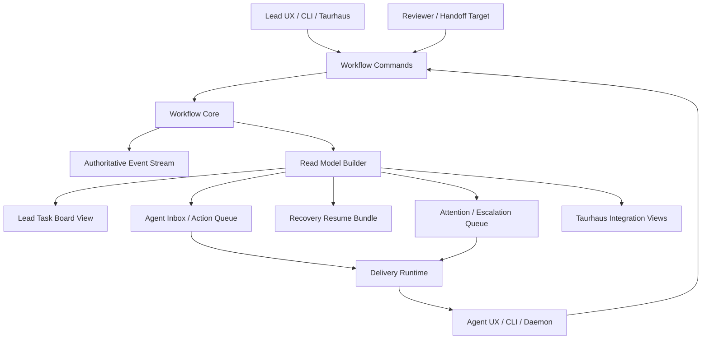

# Mesh Greenfield Functional Architecture - 2026-03-11

## Scope

This document answers a different question than the prior Mesh architecture documents.

It does not ask:
- what is easiest to migrate from current Mesh
- what best preserves current storage shape
- what is the lowest-risk next implementation step

It asks:
- if we started from a green field with the real workflow and product requirements of Taurhaus and our AI-only team operating model, what would the best Mesh architecture be?

Inputs:
- [mesh-joint-architecture-proposal-2026-03-11.md](/home/mstie/projects/taurhaus/docs/analysis/mesh-joint-architecture-proposal-2026-03-11.md)
- [mesh-architecture-tradeoff-analysis-2026-03-11.md](/home/mstie/projects/taurhaus/docs/analysis/mesh-architecture-tradeoff-analysis-2026-03-11.md)
- direct alignment between `mesh-architect` and `architect-1` on the actual functional requirements and failure modes

## Executive Summary

The best greenfield Mesh architecture is neither the current linked-journal design nor the earlier storage-heavy file model exactly as proposed.

The best greenfield design is:
- task-centered semantically
- event-backed operationally
- projection-driven for user experience

In practice that means:
- the core domain is explicit workflow state, not a loose combination of task files and inboxes
- the authoritative history is an append-only workflow event stream
- current state is maintained as explicit read models for the actual user surfaces we need:
  - assignee inbox
  - lead task board
  - recovery bundle
  - attention/escalation queue
  - Taurhaus integration view
- assignment, message linkage, ack state, recovery state, and attention state are first-class domain concepts
- delivery is a projection and runtime concern, not the primary source of truth

If Mesh were redesigned from requirements and functionality first, the architecture should resemble the storage-heavy model more than the linked-journal model in semantics.

But it should not copy the earlier storage-heavy draft literally.
The better greenfield version is a workflow-core architecture with one authoritative event backbone and purpose-built read models, rather than many semi-independent canonical files.

## Functional Requirements And User Goals

These are the first-order requirements the architecture must satisfy.

### 1. Exact assignment semantics

The system must distinguish:
- created
- assigned
- delivered
- seen
- accepted
- started
- blocked
- executing
- review-ready
- completed
- closed or canceled

The most important user question is not just “who owns this task?”
It is “what exactly is the current responsibility state of this work?”

### 2. Task-first compaction and recovery

An AI agent must be able to resume from durable workflow state, not from message archaeology.

Recovery must tell the agent:
- what task is active
- what assignment is current
- what the exact expected deliverable is
- what the completion signal is
- what the latest progress or blocked state is
- what next step should happen now

### 3. Task-linked communication

Communication is not a separate world.
The system must represent explicit relationships between:
- task
- assignment
- assignment delivery
- read state
- ack state
- progress report
- review request
- escalation
- completion signal

### 4. Lead visibility and control

The lead must be able to answer without reconstruction:
- what is unassigned?
- what is assigned but unseen?
- what is seen but not accepted?
- what is accepted but not started?
- what is executing?
- what is blocked and why?
- what is review-ready?
- what completed but lacks closure?
- what needs intervention now?

### 5. Low ambiguity about executor and ownership

The system must preserve both:
- stable internal identity
- human-usable operating identity

It must be obvious who is responsible now, not just who last touched a file.

### 6. Task-aware attention behavior

Nudges and escalation must reason over workflow facts:
- assignment state
- recent progress evidence
- blocked state
- last seen and last acknowledged signals
- suppression and cooldown state

### 7. Easy downstream consumption for Taurhaus

Taurhaus should be able to consume:
- current workflow state
- task history
- attention state
- recovery state
- message/task linkage

without reverse-engineering hidden semantics across unrelated stores.

### 8. AI-only ease of use

The architecture should optimize for AI agents operating via compact instructions and resumable workflow state.

That means:
- exact actionable prompts
- explicit next-step semantics
- durable recovery bundles
- low ambiguity about what counts as progress or completion

### 9. Local, inspectable, crash-tolerant operation

Even in a greenfield design, these remain intrinsically valuable.
The system should stay:
- local-first
- inspectable
- crash-tolerant
- usable without a remote coordination service

## Most Expensive Workflow Failures To Eliminate

The most expensive failures in the current model are:
- not knowing whether an assignment was merely delivered vs seen vs accepted vs started
- compaction recovery that restores commands but not exact working state
- progress and blocked state living outside the task itself
- the lead reconstructing workflow state across task snapshots, inboxes, and side signals
- idle or nudge behavior acting without enough canonical workflow evidence

The greenfield architecture should be optimized primarily to eliminate those failures.

## Proposed Greenfield Architecture

## Core principle

The system should be built around a workflow core, not around files.

That workflow core should own:
- task semantics
- assignment semantics
- communication linkage semantics
- recovery semantics
- attention semantics

Under that workflow core should sit an append-only event log.
Above it should sit explicit read models tailored to actual user surfaces.

## High-level shape

## System Boundaries

### 1. Workflow core

Owns the actual domain model.
It validates commands and emits events.

Examples of commands:
- create task
- assign task
- accept assignment
- start work
- report progress
- block task
- request review
- provide review feedback
- complete task
- close task
- send task-linked message
- acknowledge message
- nudge assignment
- escalate task

### 2. Authoritative event stream

This is the durable source of truth for workflow history.

Properties:
- append-only
- ordered
- durable
- replayable
- rich enough to reconstruct current workflow state

This is what the linked-journal design is approximating, but in greenfield form it should be first-class and central from the start.

### 3. Projection layer

Builds explicit current-state views from events.

These projections exist because different users and runtimes need different shapes:
- lead needs a board and filters
- assignee needs an actionable inbox or queue
- recovery needs a compact resume bundle
- idle-monitor needs an attention model
- Taurhaus needs integration-facing views

### 4. Delivery runtime

Responsible for:
- routing messages or wake events to agents
- surfacing assignment and escalation notifications
- retrying or reporting delivery failures

Delivery should not own workflow truth.
It should consume it.

## Core Data Model

In a greenfield design, these should be explicit domain concepts.

## `Actor`

Represents a team member or system actor.

Key fields:
- `actor_id`
- `display_name`
- `actor_type`
- `execution_endpoint`
- `project_scope`
- `active_state`

Why:
- stable identity matters for exact assignment and audit semantics
- human-readable identity still matters for operators and AI prompts

## `Task`

Represents the durable unit of work.

Key fields:
- `task_id`
- `title`
- `description`
- `workflow_state`
- `priority`
- `project_scope`
- `created_at`
- `updated_at`
- `closed_at`

Why:
- task is the anchor for assignment, progress, attention, review, and completion

## `Assignment`

Represents one concrete responsibility binding.

Key fields:
- `assignment_id`
- `task_id`
- `assigned_by_actor_id`
- `assigned_to_actor_id`
- `status`
- `first_step`
- `deliverable`
- `completion_signal`
- `assigned_at`
- `seen_at`
- `accepted_at`
- `started_at`
- `superseded_at`
- `satisfied_at`

Why:
- the biggest user-facing ambiguity today is assignment state
- this must be explicit in a true greenfield design

## `TaskMessage`

Represents workflow-relevant communication.

Key fields:
- `message_id`
- `task_id`
- optional `assignment_id`
- `sender_actor_id`
- `recipient_actor_id`
- `intent`
- `body`
- `priority`
- `delivery_state`
- `read_state`
- `ack_state`
- `sent_at`
- `read_at`
- `acked_at`

Why:
- task-linked communication is part of workflow state, not an unrelated side channel

## `RecoveryContext`

Represents the exact resumable state an agent needs.

Key fields:
- `task_id`
- `assignment_id`
- `objective`
- `current_step`
- `next_step`
- `deliverable`
- `completion_signal`
- `latest_progress_summary`
- `blocked_reason`
- `updated_at`

Why:
- this is the direct antidote to compaction archaeology

## `AttentionCase`

Represents attention, nudge, and escalation semantics.

Key fields:
- `task_id`
- `assignment_id`
- `status`
- `last_strong_signal_at`
- `last_seen_at`
- `last_progress_at`
- `last_nudge_at`
- `last_escalation_at`
- `suppression_reason`
- `cooldown_until`

Why:
- idle and escalation logic should operate over canonical workflow evidence

## `WorkflowEvent`

Represents authoritative immutable history.

Key fields:
- `event_id`
- `event_type`
- `task_id`
- optional `assignment_id`
- optional `message_id`
- `actor_id`
- `timestamp`
- `payload`

Examples:
- `task_created`
- `assignment_created`
- `assignment_delivered`
- `assignment_seen`
- `assignment_accepted`
- `work_started`
- `progress_reported`
- `task_blocked`
- `review_requested`
- `completion_reported`
- `task_closed`
- `nudge_sent`
- `escalation_sent`

## Workflow Model

## Flow 1: Lead assigns work

1. Lead issues `create task` or selects an existing task.
2. Lead issues `assign task` with exact first step, deliverable, and completion signal.
3. Workflow core emits:
- task event
- assignment event
- message delivery event
4. Projections update:
- lead task board
- assignee inbox/action queue
- recovery view
- attention view

Result:
- assignment is explicit
- the assignee gets a compact actionable instruction surface
- lead can later ask whether the assignment was delivered, seen, accepted, or started

## Flow 2: Assignee sees, accepts, and starts

1. Agent delivery runtime surfaces the assignment.
2. Agent reads it.
3. Agent explicitly accepts or begins work.
4. Workflow core records each state transition.
5. Read models refresh immediately.

Result:
- delivery, read, acceptance, and execution are distinct and queryable

## Flow 3: Assignee progresses or blocks

1. Assignee emits progress or blocked update.
2. Workflow core records a semantic event.
3. Recovery and attention views update.
4. Lead board reflects the new state directly.

Result:
- blocked state and progress state are part of the task, not loose side information

## Flow 4: Review or handoff

1. Assignee requests review or handoff.
2. Workflow core creates a review or handoff assignment/message relationship.
3. Reviewer sees explicit review-ready work.
4. Feedback or handoff completion becomes part of the same task history.

Result:
- review and handoff become first-class workflow, not improvised messaging

## Flow 5: Recovery after compaction

1. Agent wakes after context loss.
2. Recovery view is queried for the current assignment.
3. Agent receives a compact resume object containing exact working state.

Result:
- no archaeology across inboxes, tasks, and side markers

## Flow 6: Attention and escalation

1. Attention view evaluates current task evidence.
2. If thresholds are crossed, the runtime emits nudge or escalation.
3. Lead sees explicit attention-needed state.

Result:
- idle behavior becomes workflow-native, not heuristic glue

## Ease-Of-Use Implications For AI-Only Team Operation

This architecture is easier for AI-only operation because it aligns the system with how AI agents actually fail and recover.

### What becomes easier

- exact responsibility state is explicit
- assignment prompts are grounded in a real assignment object
- recovery has a dedicated resume model
- lead queries map directly to workflow facts
- progress and blocked state do not disappear into side channels
- attention logic is less noisy because it sees the workflow directly

### Why that matters for AI agents

AI agents are not good at reconstructing implicit workflow state from scattered clues under time pressure.
They perform better when the system can answer directly:
- what am I responsible for now?
- what step should I take next?
- what counts as done?
- what has already been seen, accepted, or escalated?

This greenfield architecture is optimized for that.

## What This Architecture Solves Very Well

It solves very well:
- assignment ambiguity
- compaction and wake recovery
- task-linked communication semantics
- lead visibility into responsibility state
- task-aware attention and escalation
- downstream clarity for Taurhaus
- future review and handoff workflows

## What It Still Solves Poorly Or Only Partially

Even the best greenfield design does not remove every problem.

### 1. Delivery remains operationally messy

Even with a clean workflow core, delivery to real agents can still fail:
- panes vanish
- processes die
- agents ignore prompts
- read state may lag real human or agent cognition

The architecture can model this clearly, but it cannot make runtime delivery perfect.

### 2. AI intent quality still matters

A richer workflow core does not guarantee that an agent writes a good progress summary or a truthful blocked reason.
It improves the structure of state, not the intrinsic quality of every update.

### 3. Greenfield purity costs more upfront

This is functionally the best design, but it is not the cheapest design to build.
It is a better product architecture than migration architecture.

## Relation To The Earlier Options

## How it relates to the linked-journal approach

It resembles the linked-journal approach in one important way:
- it still uses authoritative immutable history plus projections

But it differs in a major way:
- it does not start from current Mesh storage boundaries
- it does not treat current task snapshots and inboxes as central architectural anchors
- it treats them, or their successors, as read models generated from the workflow core

## How it relates to the storage-heavy task-centric approach

It resembles the storage-heavy approach more closely in semantics:
- task-centered workflow core
- explicit assignment objects
- explicit message linkage
- explicit recovery and attention concepts

But it improves on the earlier storage-heavy draft by not making every concept a separate equal-status file family.
Instead, it uses:
- one authoritative event backbone
- one coherent workflow core
- purpose-built read models for the actual user surfaces

So the best greenfield answer is not exactly “the storage-heavy draft.”
It is a more disciplined event-backed workflow-core architecture that leans storage-heavy in semantics and projection-driven in runtime shape.

## Final Recommendation

If Mesh were started fresh from the real functional requirements of Taurhaus and our AI-team operating model, the best architecture would be:
- workflow-core first
- event-backed history
- explicit domain objects for task, assignment, task-linked message, recovery, and attention
- purpose-built read models for lead workflow, agent inbox, recovery, attention, and Taurhaus integration

That means the best greenfield design looks closer to the storage-heavy task-centric approach than to the current linked-journal Mesh design.

However, it is not a literal endorsement of the earlier storage-heavy file model.
The better greenfield design is a third shape:
- semantically task-centered like the storage-heavy model
- operationally event-backed and projection-driven
- cleaner than a many-canonical-file design

## Explicit Sign-Off

### mesh-architect

Status:
- approved

Rationale:
- this is the best requirements-first architecture for the actual workflow problems we are trying to solve
- it is more ambitious than the linked-journal plan, but functionally more direct and less constrained by current storage accidents

### architect-1

Status:
- approved

Rationale:
- the document fairly reflects the jointly agreed first-order requirements and failure modes
- the final architecture is correctly framed as workflow-core plus one authoritative event backbone plus purpose-built read models
- it is not merely a restatement of the earlier storage-heavy file design; it keeps the semantically task-centered strengths while improving the runtime shape
