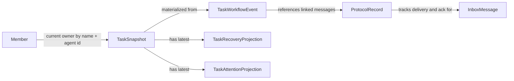

# Mesh Joint Architecture Proposal - 2026-03-11

## Scope

This document is the joint architecture proposal for Mesh task and communication workflow, produced for task `#944`.

Inputs:
- [mesh-task-communication-architecture-draft-2026-03-11.md](/home/mstie/projects/taurhaus/docs/analysis/mesh-task-communication-architecture-draft-2026-03-11.md)
- [mesh-native-architecture-viability-review-2026-03-11.md](/home/mstie/projects/taurhaus/docs/analysis/mesh-native-architecture-viability-review-2026-03-11.md)
- native Mesh runtime and CLI in `/home/mstie/projects/mesh`

This proposal is Mesh-first. Taurhaus remains a downstream consumer and orchestration layer, not the owner of Mesh workflow semantics.

## Executive Summary

Both prior perspectives agree on the core product need:
- Mesh is already being used as an AI-team workflow system, not just a task list plus inboxes.
- Assignment, progress, recovery, attention, and completion semantics need to become more explicit.
- The final design must remain local, file-backed, inspectable, crash-tolerant, and incrementally deployable.

The main disagreement was architectural shape.

The earlier draft proposed a task-centered model with several new canonical entities and stores.
The Mesh-native review argued that this was directionally right but too heavy for Mesh's existing runtime and migration path.

Final decision:
- keep the draft's workflow goals
- keep task snapshots and inboxes as operational read/write surfaces
- upgrade Mesh around two enriched canonical journals:
  - `state/task_mutations.jsonl` as the task workflow journal
  - `state/protocol_index.jsonl` as the message/task correlation journal
- add small per-task projections only where they solve a real operational problem:
  - recovery projection
  - attention projection

This gives Mesh stronger workflow semantics without turning it into a storage-heavy workflow database.

## Where The Two Prior Perspectives Agree

Both perspectives agree on these points.

### 1. Assignment needs stronger semantics

Current `task assign` is too weak if it remains only:
- owner mutation on the task snapshot
- generated assignment message

Mesh needs durable assignment semantics for:
- assignee
- assigner
- first step
- deliverable
- completion signal
- seen/started/superseded state

### 2. Recovery should be task-first

Compaction and wake-up recovery should not depend on message archaeology alone.
Mesh needs a durable resumable task view.

### 3. Idle-monitor should consume task-aware evidence

Nudges and escalation should reason over:
- current assignment state
- recent progress evidence
- blocked state
- read/ack state when relevant
- prior attention history

### 4. Taurhaus should consume clearer native Mesh semantics

Taurhaus should not have to reconstruct key workflow meaning from loosely related files forever.
Mesh should persist that meaning directly enough for downstream consumers to read it cleanly.

### 5. Migration must be incremental

The proposal must preserve:
- current task files
- current inboxes
- current CLI ergonomics where possible
- current daemon operating model

## Where The Two Prior Perspectives Disagreed

### 1. Canonical storage shape

Draft view:
- introduce separate canonical entities and stores for assignments, messages, recovery, attention, and events

Mesh-native view:
- that is too much new persistence surface at once
- Mesh should reuse and enrich existing journals before adding more stores

### 2. Meaning of first-class workflow semantics

Draft view:
- workflow concepts become first-class by becoming distinct stored entities

Mesh-native view:
- workflow concepts can be first-class semantically without each becoming its own top-level canonical file family

### 3. Identity migration aggressiveness

Draft view:
- move toward stable agent identity quickly

Mesh-native view:
- keep name-based CLI and routing as the user-facing control plane for now
- add agent-id linkage internally and incrementally

## Final Chosen Design

## Design Principle

Mesh should evolve as a linked-journal workflow system with materialized current-state projections.

Operational rule:
- journals are authoritative for workflow history and linkage
- snapshots and projections are authoritative for current read ergonomics
- inboxes remain the operational recipient queue
- daemons react to files and journals; they do not own the source of truth

## Canonical Layers

### 1. Team state

Path:
- `teams/{team}/config.json`

Responsibilities:
- member registry
- active/inactive state
- stable `agent_id`
- execution metadata such as panes and cwd
- explicit member status and recent activity

### 2. Task current-state snapshot

Path:
- `tasks/{team}/{id}.json`

Responsibilities:
- current status
- current owner
- dependency edges
- compatibility with current readers
- current assignment projection metadata

### 3. Task workflow journal

Path:
- `teams/{team}/state/task_mutations.jsonl`

Responsibilities:
- authoritative task workflow history
- assignment lifecycle
- progress/block/review/complete transitions
- durable linkage to messages where relevant

This is an evolution of the existing journal, not a replacement by a wholly separate event system.

### 4. Protocol correlation journal

Path:
- `teams/{team}/state/protocol_index.jsonl`

Responsibilities:
- message/task linkage
- delivery provenance
- assignment message correlation
- ack linkage
- nudge/escalation/completion correlation

This remains the authoritative cross-cutting communication audit journal.

### 5. Recovery projection

Path:
- `teams/{team}/state/recovery/{task_id}.json`

Responsibilities:
- compact resumable task bundle
- overwrite-friendly current recovery state
- compaction-safe resume input

### 6. Attention projection

Path:
- `teams/{team}/state/attention/{task_id}.json`

Responsibilities:
- inspectable nudge/escalation state
- suppression and cooldown state
- last strong signal tracking

### 7. Inbox delivery queue

Path:
- `teams/{team}/inboxes/{member}.json`

Responsibilities:
- recipient-facing queue
- read state
- ack state
- direct operator messaging
- delivery surface used by current member daemons and `mesh read`

The inbox remains operationally important and is not demoted to a meaningless cache. It stays the user-facing delivery surface while richer linkage is recorded in the protocol journal.

## Why This Design Wins

This design wins because it preserves the strongest parts of both prior proposals.

It keeps from the draft:
- explicit workflow semantics
- task-first recovery
- task-aware attention state
- better lead query surfaces
- downstream readability for Taurhaus

It keeps from the Mesh-native review:
- minimal new persistence surface
- compatibility with current runtime behavior
- additive migration path
- reuse of the journals Mesh already trusts
- clear separation between authoritative history and current-state projections

## Architecture Chart

```mermaid
flowchart TD
    Lead[Lead CLI] --> TaskCmds[task create/assign/update/start/progress/block/complete]
    Agent[Assignee CLI] --> TaskCmds
    Lead --> MsgCmds[send/read/ack]
    Agent --> MsgCmds

    TaskCmds --> TaskSnapshot[tasks/{team}/{id}.json]
    TaskCmds --> TaskJournal[state/task_mutations.jsonl]
    TaskCmds --> Recovery[state/recovery/{task}.json]
    TaskCmds --> Attention[state/attention/{task}.json]

    MsgCmds --> Inbox[inboxes/{member}.json]
    MsgCmds --> Protocol[state/protocol_index.jsonl]

    TaskJournal --> MemberDaemon[member daemon]
    TaskSnapshot --> MemberDaemon
    Inbox --> MemberDaemon

    TaskJournal --> TeamDaemon[team-daemon]
    TaskSnapshot --> TeamDaemon
    Attention --> TeamDaemon
    Recovery --> TeamDaemon
    Protocol --> TeamDaemon

    TaskSnapshot --> Taurhaus[Taurhaus]
    TaskJournal --> Taurhaus
    Protocol --> Taurhaus
    Recovery --> Taurhaus
    Attention --> Taurhaus
```

## Data Model And Relationships

## `Member`

Canonical source:
- `config.json`

Important fields:
- `agent_id`
- `name`
- `agent_type`
- `backend_type`
- `cwd`
- `tmux_pane_id`
- `is_active`
- activity and status fields

Decision:
- keep `name` as the current operator-facing routing key
- use `agent_id` as stable internal linkage where workflow correctness benefits from it
- do not make the CLI agent-id-native in the first rollout

## `TaskSnapshot`

Canonical path:
- `tasks/{team}/{id}.json`

Current fields to preserve:
- `id`
- `subject`
- `description`
- `status`
- `owner`
- `activeForm`
- `blocks`
- `blockedBy`
- `metadata`

Recommended additive fields, ideally under `metadata` first:
- `assignmentId`
- `ownerAgentId`
- `workflowState`
- `reviewState`
- `projectScope`
- `firstStep`
- `deliverable`
- `completionSignal`
- `lastProgressAt`
- `lastProgressSummary`
- `blockedReason`

Purpose:
- keep task files backward-compatible
- project the current workflow state without making the snapshot the only source of truth

## `TaskWorkflowEvent`

Canonical path:
- `state/task_mutations.jsonl`

Minimum fields:
- `taskId`
- `actor`
- `timestamp`
- `eventType`
- optional `fromStatus`
- optional `toStatus`
- optional `assignmentId`
- optional `assignee`
- optional `assigneeAgentId`
- optional `messageId`
- optional `changedFields`
- optional `payload`

First meaningful event types:
- `task_created`
- `task_updated`
- `task_assigned`
- `assignment_seen`
- `assignment_accepted`
- `task_started`
- `task_progressed`
- `task_blocked`
- `task_unblocked`
- `task_review_requested`
- `task_review_feedback`
- `task_completed`
- `task_closed`
- `task_canceled`
- `nudge_sent`
- `escalation_sent`

Decision:
- assignment is first-class semantically through workflow events plus snapshot projection
- a standalone assignment file family is not required in phase 1

## `ProtocolRecord`

Canonical path:
- `state/protocol_index.jsonl`

Existing strengths already present:
- `messageId`
- `taskId`
- `intent`
- `firstStep`
- `deliverable`
- `completionSignal`
- `taskOwner`
- `taskStatus`

Recommended additions:
- `assignmentId`
- `deliveryKind`
- `ackState`
- `ackedAt`
- `ackedBy`
- optional `bodyPreview` or content digest if needed

Purpose:
- keep message/task/ack linkage in the journal already used for protocol semantics
- avoid creating a third overlapping message truth surface before it is justified

## `TaskRecoveryProjection`

Canonical path:
- `state/recovery/{task_id}.json`

Fields:
- `taskId`
- `assignmentId`
- `updatedAt`
- `objective`
- `currentStep`
- `nextStep`
- `deliverable`
- `completionSignal`
- `blockedReason`
- `latestProgressSummary`
- `latestRelevantMessageIds`

Purpose:
- compact resumable context
- fast read path for compaction and wake recovery

## `TaskAttentionProjection`

Canonical path:
- `state/attention/{task_id}.json`

Fields:
- `taskId`
- `assignmentId`
- `status`
- `lastStrongSignalAt`
- `lastStrongSignalReason`
- `lastSeenAt`
- `lastProgressAt`
- `lastNudgeAt`
- `lastEscalationAt`
- `cooldownUntil`
- `suppressionReason`
- `updatedAt`

Purpose:
- inspectable task attention state
- direct input for team-daemon idle reasoning

## Relationship Summary



## User Flows For AI-Only Operation

## Flow 1: Lead assigns work

1. Lead creates a task or chooses an existing one.
2. Lead runs `mesh task assign` with structured assignment inputs.
3. Mesh:
- updates the task snapshot current assignment fields
- appends `task_assigned` event to the workflow journal
- sends the assignment message to the assignee inbox
- records message/task linkage in protocol index
- writes initial recovery projection

Outcome:
- the assignee receives the same direct actionable message style Mesh already uses
- assignment state becomes durable and queryable

## Flow 2: Assignee reads, accepts, and starts

1. Assignee receives the assignment through `mesh read` or daemon wake delivery.
2. Display of the assignment-linked message records `assignment_seen` when applicable.
3. Assignee can explicitly accept or start work.
4. Mesh records those semantics in the task workflow journal and refreshes the task snapshot and recovery projection.

Outcome:
- lead can distinguish delivered, seen, accepted, and actually started work

## Flow 3: Assignee reports progress or blocks

1. Assignee runs `mesh task progress` or `mesh task block`.
2. Mesh appends a workflow event.
3. Mesh updates current task metadata, recovery projection, and attention projection.
4. If configured, Mesh sends a linked lead notification and records it in protocol index.

Outcome:
- progress becomes durable evidence
- blocked state becomes task-native
- recovery quality improves immediately

## Flow 4: Team-daemon evaluates attention and sends nudges

1. Team-daemon evaluates active tasks using:
- task snapshot current state
- latest recovery projection
- latest attention projection
- recent activity signals
- workflow and protocol evidence when needed
2. If no strong suppressor applies, it sends a nudge or escalation.
3. Mesh records that in protocol index and attention projection, and optionally also as a task workflow event.

Outcome:
- nudge history is task-aware
- repeat suppression and escalation become inspectable

## Flow 5: Assignee completes and lead closes

1. Assignee runs `mesh task complete` with summary.
2. Mesh appends `task_completed` workflow event.
3. Mesh updates task snapshot, recovery projection, and linked protocol records.
4. Lead receives a linked completion message.
5. Lead closes the task or requests more work.

Outcome:
- completion semantics are explicit
- completion signal and task lifecycle remain correlated

## Flow 6: Compaction and resume

1. Agent loses local active context.
2. On wake or `mesh read`, Mesh checks unread inbox content first.
3. If more context is needed, Mesh reads the recovery projection and current task snapshot.
4. Mesh prints a compact resume bundle with current step, next step, deliverable, and completion expectations.

Outcome:
- recovery is task-first, not message-archaeology-first

## Storage And Journal Strategy

### Authoritative history

Use two authoritative journals:
- `state/task_mutations.jsonl`
- `state/protocol_index.jsonl`

Reason:
- one journal owns task workflow history
- one journal owns cross-cutting communication and linkage
- this is enough to model the needed workflow semantics without multiplying canonical stores

### Current-state surfaces

Use these as materialized current-state views:
- `tasks/{team}/{id}.json`
- `state/recovery/{task_id}.json`
- `state/attention/{task_id}.json`
- `inboxes/{member}.json`

Reason:
- they serve real operational read paths
- they are easy to overwrite atomically
- they keep CLI behavior simple and inspectable

### Rebuild philosophy

If projections drift or are lost:
- task snapshots can be refreshed from task workflow history plus current compatibility rules
- recovery and attention projections can be regenerated from workflow and protocol evidence
- inboxes remain operational queues, not the only audit surface

## Migration / Rollout Plan

## Phase 1: Enrich existing journals

Implement:
- semantic event types in `task_mutations.jsonl`
- richer linkage fields in `protocol_index.jsonl`
- additive task snapshot metadata for current assignment and workflow state

Do not yet implement:
- standalone assignment file store
- standalone canonical message journal

## Phase 2: Add new workflow commands

Implement:
- `task start`
- `task progress`
- `task block`
- `task complete`
- optional `task accept`
- optional `task close`

Compatibility:
- keep `task update` as a compatibility path
- map legacy writes into canonical workflow events

## Phase 3: Add recovery projection

Implement:
- `state/recovery/{task_id}.json`
- generation from assign/progress/block/complete paths
- read-path integration for compaction and resume

## Phase 4: Add attention projection and richer queries

Implement:
- `state/attention/{task_id}.json`
- lead-facing filters such as:
  - assigned but unseen
  - assigned not started
  - blocked
  - review-ready
  - recently nudged

## Phase 5: Tighten identity and lifecycle validation

Implement:
- optional `ownerAgentId` and `assigneeAgentId`
- stronger write-path lifecycle validation
- compatibility projection back to current `owner` and `status`

Only after these phases should Mesh consider whether any new dedicated canonical store is still necessary.

## Explicit Sign-Off

### mesh-architect

Status:
- approved

Rationale:
- the chosen design keeps the right workflow goals but fits Mesh's existing journal-and-projection architecture
- it is implementable incrementally without forcing a disruptive storage rewrite first

### architect-1

Status:
- approved

Rationale:
- the compromise preserves the original design intent around explicit assignment, task-centric workflow semantics, compaction-aware recovery, and clearer downstream semantics for Taurhaus
- phase 1 does not require a separate canonical assignment store beyond `assignmentId`, explicit workflow events, and current-assignment projection on `TaskSnapshot`

## Final Recommendation

Adopt this proposal as the implementation target for Mesh task and communication workflow.

The key decision is not whether Mesh should become more workflow-aware. It should.
The key decision is how.

The answer is:
- explicit workflow semantics
- enriched existing journals
- minimal new projection files where they solve real operational problems
- no unnecessary explosion of canonical stores in the first implementation wave
