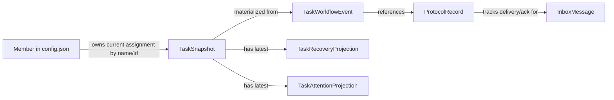

# Mesh-Native Architecture Viability Review - 2026-03-11

## Scope

This document reviews [mesh-task-communication-architecture-draft-2026-03-11.md](/home/user/projects/taurhaus/docs/analysis/mesh-task-communication-architecture-draft-2026-03-11.md) from the perspective of native Mesh architecture and runtime constraints.

Primary system under evaluation:
- `/home/user/projects/mesh`

Secondary consumer context:
- Taurhaus, as a downstream consumer and orchestration layer

This review is intentionally Mesh-first. When Taurhaus convenience conflicts with Mesh correctness, durability, operability, or rollout safety, Mesh wins.

## Executive Summary

The existing draft is directionally strong but over-centralized.

It is correct about the main problem:
- Mesh already operates as a workflow system, not just a loose bundle of messages and task snapshots.
- Important workflow semantics are still inferred too often.
- Assignment, recovery, progress evidence, and attention state need to become more explicit.

But the proposed solution is too heavy for the current Mesh architecture.

The draft introduces too many new canonical entities too early:
- `TaskAssignment`
- `TaskEvent`
- `MessageRecord`
- `TaskRecoveryContext`
- `TaskAttentionState`
- richer `TaskSnapshot`
- stable `MemberIdentity`

That design would work in a workflow engine built around a central event model from day one. Mesh is not that system today.

Mesh today is built around:
- stable file-backed snapshots
- append-only journals
- daemon-side projections and delivery
- compatibility-first CLI behavior
- small, explicit failure domains

The right next architecture for Mesh is not "replace the existing model with a task-centered workflow database."

It is:
- keep `tasks/{team}/{id}.json` as the current-state task snapshot
- keep inbox JSON as the recipient-facing delivery queue
- evolve `state/task_mutations.jsonl` into the authoritative task workflow journal
- evolve `state/protocol_index.jsonl` into the authoritative message/task correlation journal
- add small per-task projection files for recovery and attention where they materially improve behavior

In short:
- keep the draft's goals
- reject its store explosion
- implement a linked-journal architecture instead

## Viability Assessment

### Overall verdict

The draft is partially viable.

What is viable:
- making assignment semantics explicit
- treating progress/block/recovery as first-class workflow facts
- making idle-monitor consume task-aware evidence instead of only loose heuristics
- making compaction recovery task-first
- improving lead query surfaces

What is not viable as written:
- replacing the current task mutation journal with a wholly new canonical event layer in one step
- introducing a separate canonical `MessageRecord` store alongside inboxes and protocol index
- treating every workflow concept as a top-level persisted entity immediately
- forcing Mesh to revolve around a task-centric aggregate model before its existing journals and daemons are upgraded to support it incrementally

### Bottom-line assessment

The draft is a good product-direction document.
It is not yet a good Mesh implementation plan.

Its core weakness is architectural mismatch:
- the draft assumes Mesh should converge toward a central workflow object model
- the current Mesh runtime is already converging toward linked append-only journals plus materialized views

Those are not the same migration path.

## What To Keep

These parts of the draft are strong and should be preserved.

### 1. The problem statement

This is correct:
- Mesh workflow meaning is fragmented across task snapshots, inboxes, journals, daemon state, and derived correlation logic.
- Current state is usable, but too much important meaning is reconstructed after the fact.

That diagnosis lines up with the current codebase.

### 2. Assignment must become explicit

This is the single most important semantic upgrade.

Current `mesh task assign` still fundamentally does two things:
- mutate `owner` and `status` on the task snapshot
- send a generated assignment message

That is enough to function, but not enough to answer basic workflow questions precisely:
- when was this assignment created?
- was it seen?
- was it superseded?
- what exact deliverable and completion signal applied to this assignment instance?

The draft is right that assignment needs identity and lifecycle.

### 3. Recovery should be task-first

This is also correct.

Mesh already has task-fallback and compaction-aware read behavior, but recovery is still assembled from multiple weak signals:
- inbox content
- current task owner/status
- protocol correlation
- idle-monitor hints

A durable per-task recovery projection is a good addition.

### 4. Idle-monitor should consume workflow evidence

This is directionally correct and consistent with recent Mesh work.

Idle evaluation should continue moving away from simplistic owner-plus-heartbeat logic and toward:
- latest assignment state
- latest progress evidence
- blocked state
- recent activity snapshot strength
- prior nudge/escalation state

### 5. Taurhaus should remain downstream

The draft gets this boundary right.

Mesh should own Mesh workflow semantics.
Taurhaus should consume them.
It should not be forced to reverse-engineer them from ambiguous local state forever.

## What Is Weak Or Misaligned

### 1. Too many new canonical stores

The draft adds new durable stores for almost every concept:
- task events
- message records
- recovery context
- attention state
- explicit assignment records

That is overdesigned for Mesh's current architecture.

Mesh already has a pattern that works:
- append-only journals for authoritative evidence
- snapshots/projections for current state and CLI ergonomics

The proposal duplicates this pattern instead of extending it.

### 2. It underestimates how much value already exists in current journals

Current Mesh already has the beginnings of the correct architecture:
- `state/task_mutations.jsonl`
- `state/protocol_index.jsonl`

Those are not accidents or dead-end compatibility layers.
They are the natural backbone for the next version of Mesh semantics.

The draft treats them mostly as symptoms of a weak model.
That is only half true.

They are also the right implementation substrate.

### 3. Separate `MessageRecord` is not justified yet

Mesh already persists:
- recipient-facing durable message state in inbox JSON
- cross-cutting message/task correlation in protocol index

Adding a full canonical `MessageRecord` store now would create three overlapping message surfaces:
- inbox JSON
- protocol index
- message record journal

That increases complexity and drift risk without enough immediate operational benefit.

Unless Mesh decides it needs a true sent-message transcript or archival store, the right move is to extend `ProtocolRecord`, not add a parallel canonical message database.

### 4. The design confuses first-class semantics with first-class files

The draft assumes that if a concept matters, it should become its own top-level stored entity.

That is not necessarily true for Mesh.

For example:
- assignment can be first-class semantically while living as structured workflow events plus current assignment projection on the task snapshot
- message/task linkage can be first-class semantically while living in inbox metadata plus protocol index
- attention can be first-class semantically while living in a single per-task projection file and journaled nudge events

Mesh benefits from explicit semantics.
It does not automatically benefit from maximal storage normalization.

### 5. Stable identity migration is underspecified

The draft correctly wants stable member identity beyond owner-by-name, but the migration cost is understated.

Today the CLI and runtime are deeply name-oriented:
- inbox file routing is by name
- task ownership is by `owner: Option<String>`
- daemon targeting is by member name
- many command surfaces accept names directly

A hard pivot to `agent_id`-first write semantics would be disruptive if done too early.

Mesh should add stable identity as an internal linkage field first, not make it the only visible control surface immediately.

### 6. It risks turning Mesh into a workflow engine before it finishes being a reliable CLI

Mesh's strengths today are operational:
- inspectable files
- simple CLI commands
- crash-tolerant local behavior
- bounded daemon responsibilities
- explicit team/member ownership

The draft moves quickly toward richer workflow semantics, which is good, but it also risks creating a complex domain model that makes the CLI and local storage harder to reason about.

That trade only makes sense if each new layer is pulling its weight immediately.
In the draft, some layers are still speculative.

## Mesh-First Counterproposal

## Design Principle

Mesh should evolve as a linked-journal workflow system, not a task-centered entity database.

That means:
- authoritative history lives in append-only journals
- current state lives in snapshots/projections
- inboxes remain operational delivery queues
- daemons continue to project and react rather than own the source of truth
- downstream consumers read the same files Mesh itself trusts

## Proposed Architecture

### Canonical layers

1. Team state
- `teams/{team}/config.json`
- authoritative for member registry, activity, status, and execution metadata

2. Task current-state projection
- `tasks/{team}/{id}.json`
- authoritative current snapshot for task status, owner, dependency edges, and current assignment projection

3. Task workflow journal
- `teams/{team}/state/task_mutations.jsonl`
- evolved into the authoritative task workflow log
- no longer only field-delta evidence
- enriched with semantic event fields

4. Message/task correlation journal
- `teams/{team}/state/protocol_index.jsonl`
- authoritative cross-cutting journal for message/task linkage, ack linkage, delivery provenance, nudges, and completion correlation

5. Recovery projection
- `teams/{team}/state/recovery/{task_id}.json`
- latest resumable task bundle
- overwrite-friendly

6. Attention projection
- `teams/{team}/state/attention/{task_id}.json`
- latest inspectable idle/nudge/escalation state

7. Inbox delivery queue
- `teams/{team}/inboxes/{member}.json`
- recipient-facing operational queue
- not replaced in the first migration phase

## Architecture Chart

```mermaid
flowchart TD
    Lead[Lead CLI] --> TaskWrite[task create/assign/update commands]
    Agent[Assignee CLI] --> TaskWrite
    Agent --> MsgWrite[send/ack/read commands]
    Lead --> MsgWrite

    TaskWrite --> Snapshot[tasks/{team}/{id}.json]
    TaskWrite --> Workflow[state/task_mutations.jsonl]
    TaskWrite --> Context[state/recovery/{task}.json]
    TaskWrite --> Attention[state/attention/{task}.json]

    MsgWrite --> Inbox[inboxes/{member}.json]
    MsgWrite --> Protocol[state/protocol_index.jsonl]

    Workflow --> Daemon[member daemon]
    Inbox --> Daemon
    Snapshot --> Daemon

    Workflow --> TeamDaemon[team-daemon]
    Attention --> TeamDaemon
    Context --> TeamDaemon
    Snapshot --> TeamDaemon
    Protocol --> TeamDaemon

    Snapshot --> Taurhaus[Taurhaus]
    Workflow --> Taurhaus
    Protocol --> Taurhaus
    Context --> Taurhaus
    Attention --> Taurhaus
```

## Core Data Model From Native Mesh Perspective

The Mesh-native data model should be narrower than the draft's model.

### 1. `Member`

Keep current team member shape in `config.json`.

Add only what is needed:
- preserve `name` as the operator-facing key
- keep `agent_id` as stable identity
- if assignment semantics need stable linkage, record `assignee_agent_id` in workflow events and task projection metadata

Do not force the CLI to become agent-id-native immediately.

### 2. `TaskSnapshot`

Keep current file:
- `id`
- `subject`
- `description`
- `status`
- `owner`
- `activeForm`
- `blocks`
- `blockedBy`
- `metadata`

Extend it compatibly.

Recommended additive fields, preferably under `metadata` first:
- `assignmentId`
- `ownerAgentId`
- `workflowState`
- `reviewState`
- `projectScope`
- `lastProgressAt`
- `lastProgressSummary`
- `blockedReason`
- `completionSignal`
- `deliverable`

This lets Mesh gain richer semantics without breaking existing task readers.

### 3. `TaskWorkflowEvent`

This should be the evolved form of today's `TaskMutationEntry`.

Minimum shape:
- `taskId`
- `actor`
- `timestamp`
- `eventType`
- optional `fromStatus`
- optional `toStatus`
- optional `assignmentId`
- optional `assignee`
- optional `assigneeAgentId`
- optional `messageId`
- optional `changedFields`
- optional structured `payload`

Required event types in the first meaningful version:
- `task_created`
- `task_updated`
- `task_assigned`
- `assignment_seen`
- `task_started`
- `task_blocked`
- `task_unblocked`
- `task_progressed`
- `task_completed`
- `task_closed`
- `task_canceled`
- `task_review_requested`
- `task_review_feedback`

Important decision:
- this should extend the current task journal pattern
- it should not require a brand-new event system mindset for every caller before rollout starts

### 4. `ProtocolRecord`

Keep `state/protocol_index.jsonl` and expand it.

Today it already carries useful workflow fields such as:
- `messageId`
- `taskId`
- `intent`
- `firstStep`
- `deliverable`
- `completionSignal`
- `taskOwner`
- `taskStatus`
- `mutationActor`

Recommended additions:
- `assignmentId`
- `ackState`
- `ackedAt`
- `ackedBy`
- `deliveryKind` such as `direct`, `generated_assignment`, `nudge`, `escalation`
- optional `bodyHash` or `bodyPreview` if stronger auditability is needed

This keeps message/task linkage in the file Mesh already uses for cross-cutting protocol semantics.

### 5. `TaskRecoveryProjection`

One small JSON file per task.

Fields:
- `taskId`
- `assignmentId`
- `updatedAt`
- `objective`
- `currentStep`
- `nextStep`
- `deliverable`
- `completionSignal`
- `blockedReason`
- `latestProgressSummary`
- `latestRelevantMessageIds`

This is worth its own file because it serves a real operational need:
- compaction-safe resume
- cheap overwrite
- easy read path for `mesh read` fallback and future `mesh task resume`

### 6. `TaskAttentionProjection`

One small JSON file per task.

Fields:
- `taskId`
- `assignmentId`
- `status`
- `lastStrongSignalAt`
- `lastStrongSignalReason`
- `lastSeenAt`
- `lastProgressAt`
- `lastNudgeAt`
- `lastEscalationAt`
- `cooldownUntil`
- `suppressionReason`
- `updatedAt`

This should be a projection, not a separate canonical workflow store.
The canonical evidence for its changes still belongs in the journals.

## Relationships



Operational rule:
- journals are authoritative for history
- snapshots/projections are authoritative for current read ergonomics

## Why This Is Better Aligned With Mesh

### 1. It extends the architecture Mesh already has

Mesh already relies on:
- file-backed current state
- append-only journals
- daemon reactions based on filesystem change and incremental reads

The counterproposal keeps that mental model intact.

### 2. It minimizes duplicate truth surfaces

The draft introduces too many overlapping stores.
The counterproposal keeps only two canonical historical journals:
- task workflow journal
- protocol correlation journal

Everything else is a snapshot or projection.

That is much easier to operate and rebuild.

### 3. It matches current daemon responsibility boundaries

Member daemons do not need a whole new storage worldview.
They need better inputs.

They can continue to consume:
- inbox queue for recipient messages
- task snapshot for current ownership/status
- enriched workflow journal for assignment and lifecycle changes

Team-daemon can continue to consume:
- task snapshot
- attention projection
- recovery projection
- workflow/protocol journals when deeper evidence is needed

### 4. It makes rollout realistic

The biggest reason to prefer this design is migration safety.

Mesh can start projecting richer semantics from existing commands before introducing a large new CLI surface.

## AI-Only Team User Flows

## Flow 1: Lead creates and assigns work

1. Lead runs `mesh task create`.
2. Mesh writes task snapshot and `task_created` workflow event.
3. Lead runs `mesh task assign <id> --owner <name>` with optional structured assignment fields.
4. Mesh:
- updates task snapshot current assignment fields
- appends `task_assigned` workflow event
- sends generated inbox message
- upserts protocol index record with task/message linkage
- writes recovery projection

Result:
- assignee still gets the exact wake/read message flow Mesh already uses
- Mesh gains durable assignment semantics without abandoning current behavior

## Flow 2: Assignee reads and acknowledges

1. Assignee runs `mesh read --unread --mark-read`.
2. Inbox message is displayed from the current delivery queue.
3. If message is assignment-linked, Mesh records `assignment_seen` in workflow journal.
4. If assignee runs `mesh ack <message_id>`, Mesh updates inbox ack metadata and protocol index.

Result:
- message semantics stay message-native
- assignment semantics become workflow-visible

## Flow 3: Assignee starts, progresses, or blocks

Recommended new commands:
- `mesh task start <id>`
- `mesh task progress <id> --summary ... --next-step ...`
- `mesh task block <id> --reason ...`

Each command should:
- append one workflow event
- update task snapshot projection
- refresh recovery projection
- refresh attention projection when relevant
- optionally notify lead via existing inbox/protocol path

Result:
- progress is explicit
- compaction recovery improves immediately
- idle-monitor now has durable evidence to consume

## Flow 4: Idle-monitor nudges and escalates

1. Team-daemon evaluates active tasks.
2. It consults:
- task snapshot current assignment/state
- attention projection
- recovery projection
- recent activity snapshots
- latest workflow/protocol evidence
3. If a nudge is warranted, Mesh sends the same style of operational message it already knows how to deliver.
4. Mesh also records that action in:
- protocol index
- attention projection
- optional workflow event for task-linked attention changes

Result:
- nudges stay operationally simple
- state becomes inspectable and deduplicable

## Flow 5: Assignee completes and lead closes

1. Assignee runs `mesh task complete <id> --summary ...`.
2. Mesh appends `task_completed` event.
3. Mesh updates task snapshot, recovery projection, and protocol record for completion signal.
4. Lead receives linked completion message.
5. Lead runs `mesh task close <id>` or requests more work/review.

Result:
- completion semantics become explicit without replacing the current task file model

## Flow 6: Compaction and resume

1. Assignee compacts or loses active chat context.
2. On `mesh read`, inbox is still checked first.
3. If inbox is empty or insufficient, Mesh consults:
- active task snapshot
- recovery projection
- latest relevant protocol links
4. Mesh prints a compact resume bundle.

Result:
- recovery becomes task-first without requiring message archaeology

## Where Current Mesh Is Insufficient

Current Mesh is missing several capabilities the draft is correctly pushing toward.

### 1. Assignment semantics are still too weak

Current state:
- assign is owner/status mutation plus generated message

Needed:
- assignment identity
- durable first-step/deliverable/completion metadata
- seen/started/superseded semantics

### 2. Task history is too narrow

Current state:
- task journal tracks field changes, not rich workflow semantics

Needed:
- event types that capture actual workflow meaning

### 3. Ack is not yet fully workflow-aware

Current state:
- `mesh ack` is primarily message metadata

Needed:
- assignment-linked read/ack to feed workflow state when appropriate

### 4. Recovery is not yet a first-class projection

Current state:
- recovery is reconstructed from multiple signals

Needed:
- one cheap, durable per-task recovery file

### 5. Idle attention is not yet fully inspectable

Current state:
- recent work improved signal quality, but the state model is still not fully explicit and queryable

Needed:
- a per-task attention projection backed by journaled evidence

### 6. Lead query surfaces are still shallow

Current state:
- `mesh tasks` is still snapshot-oriented

Needed:
- filtered queries such as:
  - assigned but unseen
  - active but no progress
  - blocked
  - review-ready
  - recently nudged

## Rollout And Migration Plan

## Phase 1: Enrich existing journals, do not add a new storage worldview

Implement:
- enriched workflow event fields in `task_mutations.jsonl`
- enriched message/task linkage in `protocol_index.jsonl`
- task snapshot metadata extensions

Do not implement yet:
- separate `MessageRecord` journal
- full normalized assignment file store

Why:
- this yields the largest semantic gain with the least migration risk

## Phase 2: Add recovery projection

Implement:
- `state/recovery/{task_id}.json`
- write-path updates from assign/progress/block/complete
- read-path fallback integration

Why:
- immediate compaction and recovery value
- low operational risk

## Phase 3: Add explicit workflow commands

Implement:
- `task start`
- `task progress`
- `task block`
- `task complete`
- optional `task close`

Compatibility:
- keep `task update` as a thin compatibility path
- normalize legacy updates into canonical workflow events

## Phase 4: Add attention projection and stronger lead queries

Implement:
- `state/attention/{task_id}.json`
- `mesh tasks` filters for attention/workflow state
- optional `mesh task history <id>`

## Phase 5: Tighten identity and lifecycle validation

Implement:
- optional `ownerAgentId` and `assigneeAgentId`
- canonical lifecycle validation in the write path
- compatibility projection back to current status/owner fields

Only at this phase should Mesh seriously consider whether a new dedicated workflow journal filename is warranted.
Until then, extending the existing journals is the better move.

## Implementation Recommendations

## Priority 1

1. Enrich `task_mutations.jsonl` into a semantic workflow journal.
2. Extend `ProtocolRecord` with assignment and ack linkage.
3. Add current-assignment metadata to task snapshots.

## Priority 2

4. Add `task start`, `task progress`, `task block`, and `task complete`.
5. Add per-task recovery projection.
6. Make assignment read/ack update workflow evidence when linked.

## Priority 3

7. Add per-task attention projection.
8. Add richer lead query/report surfaces.
9. Add stable agent-id linkage fields where they materially improve correctness.

## Final Recommendation

Keep the draft's goals, but do not adopt its storage model literally.

Recommended decision:
- do not build Mesh as a six-entity task-centric persistence layer
- do build Mesh as a linked-journal workflow system with lightweight projections

The correct Mesh-native architecture is:
- task snapshot for current state
- enriched task journal for workflow history
- enriched protocol index for message/task correlation
- inbox as the operational delivery queue
- per-task recovery and attention projections where they add real value

That architecture is strong because it is:
- incremental
- file-backed
- daemon-friendly
- recoverable
- inspectable
- compatible with the Mesh CLI users already have

It also gives Taurhaus a cleaner downstream contract without forcing Mesh to become something less operationally simple than it needs to be.
