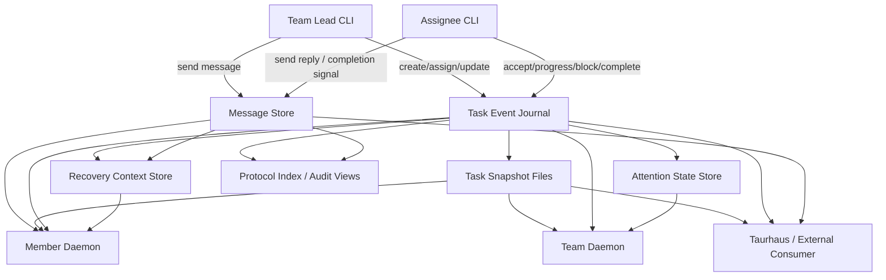
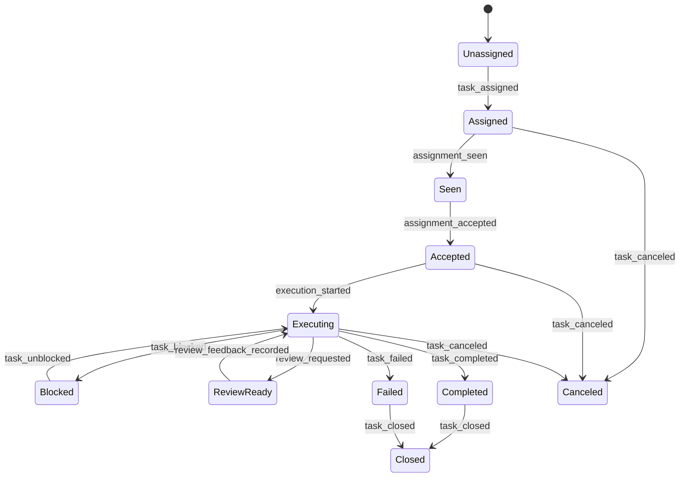

# Mesh Communication And Task-Management Architecture Draft — 2026-03-11

## Scope

This document is a forward-looking design draft for the native Mesh CLI communication and task-management system.

It is based on the findings from task `#938`, but it is not another review. It is an implementation-oriented proposal for how Mesh should evolve into a coherent AI-team workflow system.

Primary system under design:

- native Mesh CLI and runtime in `/home/user/projects/mesh`

Secondary integration consumer:

- Taurhaus, as a downstream reader/orchestrator layered on top of Mesh storage and runtime semantics

This draft treats communication and task management as one workflow system.

## Design Goal

Mesh should become the durable local workflow backbone for AI-only teams:

- task assignment
- operational messaging
- acknowledgments
- progress evidence
- idle nudges
- escalation
- compaction/recovery
- completion/handoff

The core design requirement is not “add more features.”

It is:

1. make the workflow state explicit
2. make message delivery derive from that state
3. preserve the local, file-backed, inspectable operating model

## Executive Summary

The current Mesh system already has the right primitives:

- team membership
- task snapshot files
- task mutation journal
- inbox messages with acknowledgment
- assignment delivery
- member daemons
- team-daemon idle monitoring
- protocol lint/correlation/drift analysis

But those primitives are split across too many side stores. The current `Task` object is too small for the workflow Mesh is already trying to run.

This draft proposes a task-centered architecture with six core entities:

- `TaskSnapshot`
- `TaskAssignment`
- `TaskEvent`
- `MessageRecord`
- `TaskRecoveryContext`
- `TaskAttentionState`

The high-level decision is:

- keep file-backed operation
- keep task snapshots as the fast current-state view
- add an authoritative workflow event stream
- make assignment, acknowledgment, progress, attention, and recovery first-class instead of inferred

That gives Mesh:

- stronger lead control
- better AI assignee recovery
- cleaner nudge/escalation logic
- better downstream consumption by Taurhaus or other tools

## Design Requirements

These requirements come from both the codebase and real usage friction during AI-team operation.

## Functional requirements

### R1. Task state must be richer than owner plus status

Mesh must distinguish:

- created
- assigned
- seen
- accepted
- executing
- blocked
- review-ready
- completed
- failed
- closed
- canceled

### R2. Assignment must be first-class

Assignment must not be only “owner field changed.”

Mesh must persist:

- who assigned
- who was assigned
- when
- what the assignee is expected to do first
- what deliverable is expected
- what completion signal satisfies the assignment
- whether the assignment has been seen and accepted

### R3. Messages and acks must be linked to task workflow

The system must answer:

- was the assignment message seen?
- was the nudge seen?
- did the completion message satisfy the assignment?
- is there unresolved escalation on this task?

### R4. Recovery must be task-first

After compaction or wake-up, an agent should be able to recover from task state directly, not from message archaeology across multiple stores.

### R5. Idle-monitor must operate on workflow evidence

Idle-monitor should not only ask “does this member own a task?”

It should ask:

- is there an active assignment?
- was it seen?
- what is the latest strong progress evidence?
- is the task blocked?
- has the same assignment already been nudged recently?

### R6. Lead query surfaces must be task-centric

The lead must be able to ask:

- what is unassigned?
- what is assigned but unseen?
- what is assigned but not started?
- what is blocked?
- what is executing?
- what is attention-needed?
- what completed without a proper completion signal?

### R7. The design must remain local, inspectable, and lock-safe

No network service or opaque embedded database is required for Mesh itself.

The system should remain:

- file-backed
- append-friendly
- recoverable after crashes
- usable by direct CLI commands

## Operational requirements

### R8. AI agents must receive compact, exact, resumable instructions

The current generated assignment messages are directionally correct. The architecture must preserve that quality.

### R9. The system must tolerate compaction and partial runtime failure

If an agent daemon dies, an inbox remains.
If an inbox is empty, an active task still exists.
If a message is lost from active context, recovery context still exists.

### R10. The design must support gradual rollout

Current Mesh users and current task files must continue to work during migration.

## Non-goals

- Human PM features such as estimates, story points, or sprints
- Multi-user remote sync service
- Replacing Taurhaus UI behavior
- Replacing tmux- or CLI-based operation with a GUI requirement

## Current-System Diagnosis

The core problem today is not absence of capability. It is fragmentation of workflow meaning.

### Current stores

- `config.json` contains members, activity, and explicit status
- `tasks/{team}/{id}.json` contains current task snapshot
- `state/task_mutations.jsonl` contains field-delta evidence
- `inboxes/{member}.json` contains operator messages and ack state
- `state/protocol_index.jsonl` contains reconstructed canonical message/task records
- marker and runtime files contain attention and health hints

### Resulting weakness

Important relations are not first-class:

- task -> assignment
- assignment -> message
- message ack -> task workflow progress
- task -> recovery context
- task -> attention history

That is why current Mesh needs:

- `correlation.rs`
- `lint.rs`
- `transition_drift.rs`

Those modules are useful, but they are also evidence that the core domain model is too weak.

## Proposed Architecture

## Overview

Mesh should be restructured around one canonical workflow concept:

- a task is not just a todo snapshot
- a task is the durable workflow anchor for communication, execution, attention, and recovery

### Architectural principle

Use two layers:

1. Snapshot layer
   - fast current-state files for direct CLI reads and compatibility
2. Event layer
   - authoritative append-only workflow records

The event layer becomes the source of truth for lifecycle and relationships.
The snapshot layer becomes the fast materialized view.

## Proposed system chart

## Architectural layers

### 1. Team state layer

Still stored in team config and related team files.

Responsibilities:

- stable team identity
- stable member identity
- active/inactive membership
- execution endpoint metadata
- team-level defaults

### 2. Task workflow layer

New canonical layer.

Responsibilities:

- lifecycle transitions
- assignment history
- progress evidence
- block/unblock
- completion / closure
- authoritative workflow auditing

### 3. Communication layer

Current inbox model, made more structured.

Responsibilities:

- directed messages
- delivery metadata
- acknowledgment
- task linkage
- wake notifications derived from workflow state

### 4. Attention and recovery layer

Currently spread across markers and message fallbacks.

Responsibilities:

- nudge/escalation eligibility
- repeat suppression
- compaction-safe recovery bundle
- strong last-progress evidence

## Data Model

## Entity 1: `MemberIdentity`

Stable team member record.

Required fields:

- `agent_id`
- `team_id`
- `name`
- `agent_type`
- `model`
- `backend_type`
- `project_scope` or `project_path`
- optional `tmux_pane_id`
- `active`
- `joined_at`
- `reactivated_at`

Why:

- current owner-by-name is too weak
- stable assignment needs stable target identity

## Entity 2: `TaskSnapshot`

Current materialized state of one task.

Required fields:

- `task_id`
- `team_id`
- optional `project_scope`
- `title`
- optional `description`
- `state`
- optional `priority`
- optional `active_form`
- optional `current_assignment_id`
- optional `current_executor_agent_id`
- optional `current_executor_name`
- `dependency_ids`
- `dependent_ids`
- optional `latest_recovery_context_id`
- optional `latest_attention_state_id`
- `created_at`
- `updated_at`
- optional `completed_at`
- optional `closed_at`

Compatibility fields to preserve:

- `subject`
- `owner`
- `blocks`
- `blockedBy`

Those can remain as compatibility aliases/materialized mirrors during migration.

## Entity 3: `TaskAssignment`

First-class assignment record.

Required fields:

- `assignment_id`
- `task_id`
- `assigned_by_agent_id`
- `assigned_by_name`
- `assigned_to_agent_id`
- `assigned_to_name`
- `assigned_at`
- optional `seen_at`
- optional `accepted_at`
- optional `started_at`
- optional `superseded_at`
- optional `canceled_at`
- `first_step`
- optional `deliverable`
- optional `completion_signal`
- optional `review_target`
- optional `handoff_target`
- `status`

Assignment statuses:

- `open`
- `seen`
- `accepted`
- `started`
- `superseded`
- `canceled`
- `satisfied`

## Entity 4: `TaskEvent`

Authoritative append-only workflow event.

Required fields:

- `event_id`
- `team_id`
- `task_id`
- optional `assignment_id`
- optional `message_id`
- `event_type`
- `actor_agent_id`
- `actor_name`
- `timestamp`
- optional `payload`

Required event types:

- `task_created`
- `task_updated`
- `task_assigned`
- `assignment_seen`
- `assignment_accepted`
- `execution_started`
- `progress_reported`
- `task_blocked`
- `task_unblocked`
- `review_requested`
- `review_feedback_recorded`
- `handoff_requested`
- `task_completed`
- `task_failed`
- `task_closed`
- `task_canceled`
- `nudge_sent`
- `nudge_acked`
- `escalation_sent`
- `escalation_acked`
- `recovery_context_updated`

### Design note

This event journal should replace the current narrow mutation journal as the canonical semantic store.

Field-delta journaling can still exist, but as a derived compatibility view, not the only durable event stream.

## Entity 5: `MessageRecord`

Canonical communication record.

Required fields:

- `message_id`
- `team_id`
- `sender_agent_id`
- `sender_name`
- `recipient_agent_id`
- `recipient_name`
- optional `task_id`
- optional `assignment_id`
- `intent`
- `message_type`
- `body`
- optional `summary`
- `priority`
- `ack_required`
- `sent_at`
- optional `delivered_at`
- optional `read_at`
- optional `acked_at`
- optional `acked_by_agent_id`
- optional `acked_by_name`

Message intents:

- `assign`
- `nudge`
- `escalate`
- `info`
- `progress`
- `review_request`
- `review_feedback`
- `handoff`
- `completion_signal`
- `close`

### Design note

The current inbox file can remain the user-facing delivery queue.
`MessageRecord` is the canonical durable record; inbox content becomes a delivery projection.

## Entity 6: `TaskRecoveryContext`

Compaction-safe resumable working state.

Required fields:

- `recovery_context_id`
- `task_id`
- optional `assignment_id`
- `updated_by_agent_id`
- `updated_by_name`
- `updated_at`
- `objective`
- `current_step`
- optional `next_step`
- optional `deliverable`
- optional `completion_signal`
- optional `blocked_reason`
- optional `latest_progress_summary`
- optional `latest_relevant_message_ids`

### Design note

This should be cheap to overwrite.
It is not a full transcript replacement. It is the minimal durable recovery bundle.

## Entity 7: `TaskAttentionState`

Canonical attention/nudge/escalation state.

Required fields:

- `attention_state_id`
- `task_id`
- optional `assignment_id`
- `status`
- optional `last_progress_at`
- optional `last_seen_at`
- optional `last_nudge_at`
- optional `last_escalation_at`
- optional `last_strong_signal_reason`
- optional `suppression_reason`
- optional `cooldown_until`
- `updated_at`

Attention statuses:

- `none`
- `watching`
- `deferred`
- `nudged`
- `escalated`
- `snoozed`

## Relation summary

### Required relations

- member owns stable identity
- task has many assignments
- task has many events
- task has many linked messages
- task has one latest recovery context
- task has one latest attention state
- assignment can have one or more linked messages
- message ack can satisfy assignment or escalation semantics

## Lifecycle Semantics

## Task state machine

## Semantics of key transitions

### `Assigned`

- lead has created an assignment record
- assignee target is explicit
- assignment instructions are durable

### `Seen`

- assignee has read or acknowledged the assignment-linked message
- this is a workflow fact, not only message metadata

### `Accepted`

- assignee explicitly confirms the task is understood and intended to be worked
- can be manual or derived from a command such as `mesh task accept`

### `Executing`

- assignee has started work
- should be represented by explicit event, not only by status text mutation

### `Blocked`

- task itself is blocked
- blocked reason belongs to the task workflow, not only to member status

### `ReviewReady`

- assignee believes the task is complete enough for lead/reviewer action
- distinct from final closure

### `Completed`

- assignee has satisfied the completion signal
- if explicit review is required, task may still remain open at assignment layer until accepted

### `Closed`

- workflow is complete from the lead/system point of view

## CLI Surface Proposal

The CLI should remain simple, but map onto stronger semantics.

## Task commands

### `mesh task create`

New fields:

- `--project-scope`
- `--priority`
- `--first-step`
- `--deliverable`
- `--completion-signal`

### `mesh task assign`

Should create a real `TaskAssignment`, not only mutate owner.

New behavior:

- resolve assignee by stable `agent_id` behind the scenes
- write assignment event
- create assignment-linked message
- populate recovery context

### New command: `mesh task accept <id>`

Why:

- acknowledgment of message is not the same as acceptance of responsibility

### New command: `mesh task start <id>`

Why:

- explicit start event is cleaner than inferred `in_progress`

### New command: `mesh task block <id> --reason ...`

Why:

- makes blockage task-native

### New command: `mesh task progress <id> --summary ... --next-step ...`

Why:

- updates recovery context and emits `progress_reported`

### New command: `mesh task complete <id> --summary ...`

Why:

- emits completion event
- can optionally emit completion-signal message

### New command: `mesh task history <id>`

Why:

- exposes the event stream rather than hiding it behind internals

## Message commands

### `mesh send`

Should gain explicit task linkage:

- `--task <id>`
- `--assignment <id>`
- `--intent <intent>`
- optional `--ack-required`

Plain text still matters, but the linkage should be explicit whenever the message is workflow-relevant.

### `mesh ack`

Should remain message-level, but record linked task effects when relevant:

- assignment message ack -> `assignment_seen`
- escalation ack -> `escalation_acked`

## Query commands

### `mesh tasks`

Add native filters:

- `--owner`
- `--unassigned`
- `--blocked`
- `--attention-needed`
- `--state`
- `--project-scope`
- `--assigned-but-unseen`
- `--assigned-not-started`

### New command: `mesh task attention`

Purpose:

- expose task attention state for lead/debugging

### New command: `mesh message history --task <id>`

Purpose:

- task-centric communication audit

## Core User Flows

## Flow 1: Lead assigns work to an assignee

1. Lead creates or selects a task.
2. Lead assigns task with:
   - assignee
   - first step
   - deliverable
   - completion signal
3. Mesh writes:
   - `task_assigned` event
   - `TaskAssignment`
   - updated `TaskSnapshot`
   - initial `TaskRecoveryContext`
   - assignment `MessageRecord`
4. Inbox projection is updated.
5. Member daemon delivers a wake notification if needed.

Properties:

- exact instructions are durable
- assignment has stable identity
- lead can query if it was seen/accepted

## Flow 2: Assignee sees, accepts, and starts

1. Assignee receives assignment message.
2. `mesh read` or daemon wake exposes the assignment.
3. Assignee acks the message or runs `mesh task accept`.
4. Mesh records `assignment_seen` and optionally `assignment_accepted`.
5. Assignee starts with `mesh task start`.
6. Mesh records `execution_started` and moves task to `Executing`.

Properties:

- “seen” and “started” are distinct
- lead can tell whether the task is merely delivered or actually active

## Flow 3: Assignee reports progress or blocks

1. Assignee runs `mesh task progress <id> --summary ... --next-step ...`
2. Mesh updates recovery context and emits `progress_reported`.
3. If blocked, assignee runs `mesh task block <id> --reason ...`
4. Mesh records blockage in task workflow and can optionally notify lead.

Properties:

- progress becomes durable evidence
- recovery context improves after every meaningful update

## Flow 4: Idle monitor nudges or escalates

1. Team daemon evaluates active assignments and task attention state.
2. If task is blocked or recently progressed, suppress nudge.
3. If assignment is unseen or stale without progress, emit `nudge_sent`.
4. Mesh writes:
   - attention-state update
   - nudge-linked message
   - optional escalation if thresholds exceeded

Properties:

- nudge history is task-linked
- repeated nudges can be reasoned about from canonical state

## Flow 5: Assignee completes and signals completion

1. Assignee runs `mesh task complete <id> --summary ...`
2. Mesh writes:
   - `task_completed`
   - recovery context update
   - optional completion-signal message to lead/reviewer
3. Lead sees a linked completion message.
4. Lead may run `mesh task close <id>` or request review feedback.

Properties:

- completion is no longer only “status changed”
- completion message and task transition are explicitly linked

## Flow 6: Compaction and recovery

1. Agent loses active context.
2. On wake or `mesh read`, Mesh consults:
   - unread workflow-linked messages
   - latest active assignment
   - latest recovery context
3. Mesh generates a compact recovery bundle:
   - identity
   - active task
   - current step
   - next step
   - deliverable
   - completion signal
   - last blocked/progress note

Properties:

- recovery is task-first
- no need to reconstruct from multiple unrelated files manually

## Flow 7: Review and handoff

1. Assignee marks task `ReviewReady` or `HandoffRequested`.
2. Mesh emits linked message to reviewer/lead.
3. Reviewer can respond with structured review feedback message linked to the same task.
4. Task either returns to `Executing` or moves to `Closed`.

Properties:

- review/handoff becomes part of the same task workflow, not free-form side messaging

## Gaps Mapping: Current Weakness To Proposed Fix

| Current weakness | Proposed fix |
|---|---|
| `Task` is only a snapshot | Add `TaskAssignment`, `TaskEvent`, `TaskRecoveryContext`, `TaskAttentionState` |
| Owner is only a name string | Assign to stable `agent_id` and materialize display name separately |
| Ack is message-only | Make ack generate workflow events such as `assignment_seen` |
| `task update` accepts arbitrary statuses | Enforce canonical lifecycle in write path |
| Blocked is member status, not task state | Add `task_blocked` / `task_unblocked` semantics |
| Recovery is generic | Persist explicit recovery context and generate recovery bundle from it |
| Idle-monitor uses scattered markers | Persist canonical task attention state |
| Lead task query is minimal | Add task-centric filters and history/attention queries |
| Completion drift detected after the fact | Make completion signal and completion transition explicitly linked |
| Project meaning inferred downstream | Add optional native `project_scope` field |

## Storage Layout Proposal

Mesh should preserve simple paths while making roles explicit.

## Proposed durable files

- `teams/{team}/config.json`
- `tasks/{team}/{id}.json`
- `teams/{team}/state/task_events.jsonl`
- `teams/{team}/state/message_records.jsonl`
- `teams/{team}/state/recovery/{task_id}.json`
- `teams/{team}/state/attention/{task_id}.json`
- `teams/{team}/inboxes/{agent}.json`

## Role of each file

### `tasks/{team}/{id}.json`

- fast current-state projection
- compatibility with existing readers

### `state/task_events.jsonl`

- authoritative workflow/event journal

### `state/message_records.jsonl`

- authoritative communication log
- inboxes are delivery projections, not the only message store

### `state/recovery/{task_id}.json`

- cheap overwrite current recovery bundle

### `state/attention/{task_id}.json`

- current nudge/escalation state

## Rollout And Migration

## Phase 1: Add canonical event layer without breaking current commands

Implement:

- `TaskEvent` journal
- `MessageRecord` journal
- projections into current task and inbox files

Compatibility:

- old `mesh task get`, `mesh tasks`, `mesh read`, and `mesh ack` still work

## Phase 2: Introduce explicit assignment and workflow commands

Implement:

- `task accept`
- `task start`
- `task block`
- `task progress`
- `task complete`
- new structured fields on create/assign

Compatibility:

- `task update` still works, but becomes a thinner compatibility path

## Phase 3: Enforce canonical lifecycle and stable identity

Implement:

- write-path transition validation
- owner-by-agent-id
- compatibility projection back to owner name in snapshot

## Phase 4: Move idle-monitor to task-attention state

Implement:

- attention-state projection
- task-aware nudge/escalation dedupe
- stronger lead visibility

## Phase 5: Expose task-centric lead/reporting surfaces

Implement:

- richer `mesh tasks` filters
- task history
- attention inspection
- task-message history

## Phase 6: Add project scope if needed

Implement:

- optional task `project_scope`
- single canonical project reference for downstream consumers like Taurhaus

## Migration strategy details

### Snapshot-first compatibility

The current task JSON files remain readable throughout migration.

### Append-only bias

New canonical stores should be append-friendly, with snapshot projections rewritten atomically.

### Inference bridge for old tasks

For old tasks without assignment records:

- synthesize one compatibility assignment from `owner` + current status when needed
- mark it as inferred, not authored

## Highest-Priority Implementation Tasks

## Priority 1

### 1. Add canonical `TaskEvent` journal and projection layer

Why:

- this is the foundation for every other fix

### 2. Add first-class `TaskAssignment`

Why:

- current assignment is the biggest semantic gap

### 3. Enforce canonical task lifecycle on write path

Why:

- prevents the domain from drifting further

## Priority 2

### 4. Add explicit progress/block/complete commands with recovery-context updates

Why:

- directly improves AI recoverability and lead visibility

### 5. Add `MessageRecord` linkage and ack-to-workflow propagation

Why:

- converts acknowledgment from passive metadata into useful workflow state

### 6. Add task-attention state and move idle-monitor onto it

Why:

- simplifies nudge/escalation logic and makes it inspectable

## Priority 3

### 7. Add task-centric lead query/reporting commands

### 8. Add optional `project_scope`

### 9. Update Taurhaus to consume canonical events where useful

This remains secondary to native Mesh design.

## Taurhaus Integration Boundary

Taurhaus should remain a downstream consumer, not the owner of Mesh task semantics.

Taurhaus can consume:

- task snapshots for current task board
- task events for richer history and workflow views
- message records for communication audit
- recovery/attention state for operator UX

But Taurhaus should not be forced to reconstruct semantics that Mesh itself could persist natively.

That is the central boundary decision:

- Mesh owns native workflow semantics
- Taurhaus owns orchestration UI, project normalization, and cross-tool integration

## Design Risks And Tradeoffs

## Risk 1: More entities increases complexity

True, but the complexity already exists. It is currently hidden in inference logic and side files.

This proposal makes it explicit and therefore implementable.

## Risk 2: Event plus snapshot duality can drift

Mitigation:

- event journal is authoritative
- snapshots are projections
- rebuild tools can regenerate snapshots from events

## Risk 3: CLI surface can become too large

Mitigation:

- keep a small ergonomic top-level surface
- relegate rich audit/report queries to optional subcommands

## Risk 4: Backward compatibility with existing tasks

Mitigation:

- keep current task JSON shape readable
- introduce inferred compatibility assignment records for legacy tasks

## Final Recommendation

Mesh should not be redesigned as “messages on one side, tasks on the other.”

It should be redesigned as one workflow engine with these rules:

- tasks anchor the workflow
- assignments are explicit
- messages are linked workflow records
- acknowledgments affect task semantics
- progress and blocked state are durable
- nudges and escalation are task-attention events
- compaction recovery reads recovery context, not only inbox prose

The current Mesh system is already close enough to this shape that an incremental rollout is practical.

The highest-value architectural move is to add the canonical event and assignment layers first. Everything else becomes cleaner once those two pieces exist.
