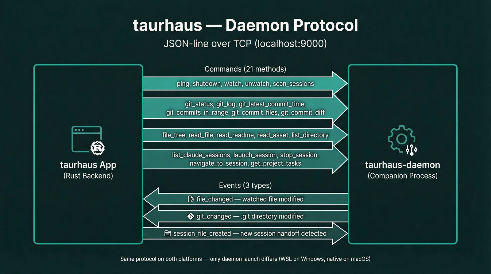

# Daemon protocol

The daemon is a companion process that handles filesystem access, process scanning, and tmux session management. It communicates with the Tauri app over a TCP connection using a JSON-line (NDJSON) protocol.



## Why a daemon

The app and the daemon exist as separate processes because of platform boundaries:

- **Windows**: The GUI runs as a native Windows app, but AI CLI tools (Claude Code, Codex, Gemini CLI) run inside WSL2. The daemon runs inside WSL2 where it has access to `/proc` and the Linux filesystem.
- **macOS**: The daemon runs natively as a subprocess. No platform boundary — but the same protocol keeps the architecture consistent.

## Connection

| Property | Value |
|----------|-------|
| Transport | TCP |
| Default address | `127.0.0.1:17233` ([authoritative source](../../src-tauri/src/daemon/server.rs)) |
| Format | NDJSON — one JSON object per line |
| Protocol version | 8 (current) |
| Authentication | Shared token (32-byte hex, file-based) |

### Authentication

On startup, the daemon generates a random 32-byte token, writes it to a well-known path with `0600` permissions, and validates it on every request:

| Platform | Token path |
|----------|-----------|
| Linux | `~/.local/share/taurhaus/daemon.token` |
| macOS | `~/Library/Application Support/taurhaus/daemon.token` |
| Windows | `{FOLDERID_LocalAppData}/taurhaus/daemon.token` |

The app reads this token on connect and includes it in the `auth` field of every request. A normal daemon run rejects missing or incorrect tokens. Authentication can be disabled only with a debug-build flag or in an explicitly unauthenticated test configuration.

On Windows the token file lives inside the WSL distro the daemon runs in, so every app-side connection reads it for that distro (`read_auth_token_for_distro`), never for whichever distro happens to be default. That includes both connections the focus bridge opens — the long-poll session listener and its direct seed fetch — because since v8 they carry tmux focus and nothing else does.

### Connection lifecycle

1. **Startup**: App tries to connect to an already-running daemon.
2. **Current-binary validation**: after connect, startup validates that the serving daemon matches the currently installed binary; stale/deleted inodes are evicted and restarted before the app keeps using the connection.
3. **Auto-launch**: if connection fails, the app starts the daemon and retries.
4. **Health check**: periodic `ping` requests verify the connection is alive and protocol-compatible.
5. **Reconnect**: on connection loss, the app retries connection/restart and re-registers daemon watches.
6. **Disconnect detection**: failed sends mark the provider as disconnected; IPC commands fall back to `LocalProvider`.

### Timeouts

| Operation | Timeout |
|-----------|---------|
| Ping | 5s |
| File operations | 10s |
| Git operations | 30s |

## Wire format

### Request (app → daemon)

```json
{
  "id": "r1",
  "method": "git_status",
  "params": { "path": "/home/user/project" },
  "auth": "a1b2c3..."
}
```

| Field | Type | Required | Description |
|-------|------|----------|-------------|
| `id` | string | Yes | Unique request ID for response matching |
| `method` | string | Yes | Method name (see command catalog below) |
| `params` | object | Yes | Method-specific parameters (may be `null`) |
| `auth` | string | Yes in normal runs | Shared auth token; the wire type remains optional for debug/test configurations |

### Response (daemon → app)

**Success:**
```json
{
  "id": "r1",
  "result": { "branch": "main", "is_dirty": false, "ahead": 0, "behind": 0 }
}
```

**Error:**
```json
{
  "id": "r1",
  "error": { "code": "NOT_FOUND", "message": "Path does not exist" }
}
```

| Field | Type | Description |
|-------|------|-------------|
| `id` | string | Matches the request ID |
| `result` | any | Method-specific result (present on success) |
| `error` | object | Error with `code` and `message` (present on failure) |

Only one of `result` or `error` is present in each response.

### Event (daemon → app, push-only)

```json
{
  "event": "git_changed",
  "data": { "path": "/home/user/project" }
}
```

Events have no `id` field — this is how the client distinguishes them from responses. Events are fire-and-forget; no acknowledgment is expected.

### Message disambiguation

The client deserializes each line as a `DaemonMessage` enum using serde's `#[serde(untagged)]`:
- Has `id` field → `Response`
- Has `event` field → `Event`

## Events

| Event | Data | Trigger |
|-------|------|---------|
| `file_changed` | `{ path, files[] }` | Watched file modified (triggers search re-index + UI refresh) |
| `git_changed` | `{ path }` | `.git` directory modified (triggers commit list refresh, debounced 2s) |
| `session_file_created` | `{ path, file }` | New session handoff file detected |

## Command catalog

### Infrastructure

| Method | Params | Result | Description |
|--------|--------|--------|-------------|
| `ping` | — | `{ version, protocol_version, uptime_secs }` | Health check. App checks `protocol_version` compatibility; startup separately validates serving-binary currentity. |
| `shutdown` | — | — | Graceful daemon shutdown |
| `watch` | `{ path }` | `{ ok }` | Start watching a project directory for file/git changes |
| `unwatch` | `{ path }` | `{ ok }` | Stop watching a project directory |

### Git

| Method | Params | Result | Description |
|--------|--------|--------|-------------|
| `git_status` | `{ path }` | `{ branch, is_dirty, ahead, behind }` | Branch name, dirty flag, ahead/behind remote |
| `git_log` | `{ path, limit?, offset? }` | `Commit[]` | Paginated commit history (default limit=50, offset=0) |
| `git_latest_commit_time` | `{ path }` | `{ timestamp }` | RFC 3339 timestamp of most recent commit (or null) |
| `git_commits_in_range` | `{ path, after, before }` | `{ commits[], files[] }` | Commits between two RFC 3339 timestamps |
| `git_commit_files` | `{ path, hash }` | `{ files[] }` | Files changed in a specific commit (with status) |
| `git_commit_diff` | `{ path, hash, file_path }` | `{ hunks[] }` | Diff hunks for a specific file in a commit |

### Files

| Method | Params | Result | Description |
|--------|--------|--------|-------------|
| `file_tree` | `{ path }` | `FileTreeNode[]` | Recursive directory tree (.gitignore-filtered) |
| `read_file` | `{ path, relative }` | `{ content, language }` | File content with detected language |
| `read_readme` | `{ path }` | `{ content }` or null | README content if present |
| `read_asset` | `{ path, relative }` | `{ data }` | Binary file as base64-encoded string |

### Sessions

| Method | Params | Result | Description |
|--------|--------|--------|-------------|
| `scan_sessions` | `{ path }` | `{ paths[] }` | Scan for session handoff files |
| `list_display_sessions` | — | `DisplaySession[]` | UI-safe session list for sidebar/session surfaces. |
| `list_runtime_sessions` | — | `RuntimeSession[]` | Runtime-authoritative session list including transcript/session metadata for coordination and compaction logic. |
| `wait_session_updates` | `{ since_version, timeout_ms }` | `{ version, changed, sessions[] }` | Long-poll for a newer session snapshot version |
| `launch_session` | `{ project_path, mode, cli_tool?, tmux_layout?, command_override? }` | `{ tmux_session?, tmux_window, tmux_pane }` | Launch a CLI tool in a tmux pane |
| `stop_session` | `{ tmux_pane, cli_tool? }` | — | Stop a running CLI tool session |
| `navigate_to_session` | `{ tmux_session, tmux_window, tmux_pane }` | — | Focus a tmux pane |

**Launch modes** (`mode` field):
- `continue` — resume the last session (e.g., `claude --continue`)
- `fresh` — start a new session
- `resume` — tool-specific resume (e.g., `codex resume --last`)

**CLI tools** (`cli_tool` field, defaults to `claude`):
- `claude`, `codex`, `gemini`

### Session activity stream (app bridge)

The daemon itself does not push `session_changed` TCP events. Instead, session activity uses versioned long-poll:
1. App backend opens a dedicated daemon connection (`DaemonSessionListener`).
2. App sends `wait_session_updates(since_version, timeout_ms)` repeatedly.
3. Daemon responds immediately on newer snapshot version, or at timeout with `changed=false`.
4. App emits a frontend Tauri event `sessions-updated` when `changed=true`.

This keeps polling encapsulated inside daemon + app backend while the frontend stays event-driven.

### Tasks

| Method | Params | Result | Description |
|--------|--------|--------|-------------|
| `get_project_tasks` | `{ path, scan_cycle_id? }` | `TaskResult` (`{ tasks, errors, source_outcomes }`) | Aggregated tasks from all CLI tools for a project. `scan_cycle_id` is optional. |

### Per-cycle task scan caching (v6+)

`get_project_tasks` supports an optional `scan_cycle_id` (added in protocol v6 and still present in v8):

- When present, the daemon reuses cached `scan_sessions()` + `ClaudeSourceIndex` inputs for repeated project scans in the same cycle.
- When absent, the daemon performs a fresh input scan (backward compatible behavior).
- The daemon still accepts legacy params shaped as `{ path }`.

This reduces duplicated session/index work during one frontend task-scan pass while preserving compatibility with older clients.

## Platform launch

### Windows

The daemon runs inside WSL2, launched via `wsl.exe`:

```
wsl.exe -d <DISTRO> -- ~/.local/bin/taurhaus-daemon --port 17233
```

- `CREATE_NO_WINDOW` flag prevents console flash
- WSL distro name is validated (alphanumeric, hyphens, underscores, dots only)
- WSL2 mirrored networking makes `localhost:17233` accessible from Windows

### macOS

The daemon runs natively as a subprocess:

```
~/.local/bin/taurhaus-daemon --port 17233
```

- Binary must be re-signed after copying (`codesign --force --sign -`) due to macOS Sequoia linker-signature rejection
- Uses `libproc` and `lsof` instead of `/proc` for process inspection

### Protocol version check

On connect, the app sends `ping` and checks `protocol_version` in the response. If the daemon's version is lower than the app expects (current: v8), it warns the user to rebuild the daemon (`just install-daemon`). Old daemons without the field deserialize as version 0.

The same check runs for the rest of the app's life, not only at startup: the health monitor pings for the protocol version rather than liveness (`daemon_lifecycle.rs`), and every reconnect confirms it before the daemon counts as connected — `DaemonProvider::reconnect_checked` is the gate the inline and manual paths use (runtime-snapshot IPC, task sync, the Start Daemon button), so reachability alone never adopts a daemon. A mismatched daemon is disconnected so the restart path can replace it — since v8 the hub snapshot is the only live tmux-focus transport, so a daemon that merely answers TCP is not a daemon the app can use.

Separately, startup now validates that the connected daemon is serving from the current installed binary. A daemon still running from a replaced or deleted inode is terminated and restarted before Taurhaus keeps the connection.

## Key files

| File | Purpose |
|------|---------|
| `src-tauri/src/daemon/protocol.rs` | Wire format types, method constants, param/result structs |
| `src-tauri/src/daemon/server.rs` | TCP server (daemon-side request handling) |
| `src-tauri/src/daemon/handlers.rs` | Per-method handler dispatch |
| `src-tauri/src/daemon/session_activity.rs` | Daemon-owned versioned session snapshot hub |
| `src-tauri/src/daemon/session_listener.rs` | App-side long-poll client for session updates |
| `src-tauri/src/daemon/event_listener.rs` | Event listener thread (app-side) |
| `src-tauri/src/daemon/launcher.rs` | Connection + auto-start logic |
| `src-tauri/src/daemon/auth.rs` | Token generation, reading, validation |
| `src-tauri/src/daemon/watch.rs` | File watcher management within daemon |
| `src-tauri/src/provider/daemon_client.rs` | DaemonProvider — TCP client implementing ProjectProvider trait |
| `src-tauri/src/daemon_lifecycle.rs` | Health check, reconnect, shutdown orchestration |

## Related documents

- [ARCHITECTURE.md](../../ARCHITECTURE.md) — system overview
- [Platform abstraction](../platform-abstraction.md) — Linux/macOS dispatch details
- [IPC reference](ipc-reference.md) — Tauri IPC commands that proxy through the daemon
