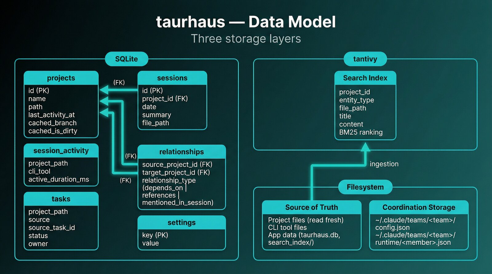

# Data model

This document covers the detailed SQLite schema, search index, and content-storage model.

For the full current storage architecture, including live coordination state under `~/.claude/teams/`, runtime attachment records, operational snapshots, compaction signal logs, and ownership boundaries, see [data-architecture.md](./data-architecture.md).

Three core app storage layers serve different purposes: SQLite for structured app metadata, tantivy for full-text search, and the filesystem as the source of truth for content.

That summary is intentionally scoped to the app data plane. It does not describe the separate coordination/runtime state plane under `~/.claude/teams/`; that is covered in [data-architecture.md](./data-architecture.md).

## SQLite

Single-file database stored in Tauri's `app_data_dir()`. Uses WAL mode for concurrent read performance and enforces foreign key constraints. Migrations are applied automatically on startup.

### projects

Registered projects. The `path` column is the canonical identifier for filesystem operations.

| Column | Type | Constraints | Purpose |
|--------|------|-------------|---------|
| `id` | TEXT | PK | UUID v4 |
| `name` | TEXT | NOT NULL | Display name |
| `path` | TEXT | NOT NULL, UNIQUE | Absolute filesystem path |
| `description` | TEXT | | Optional project description |
| `last_activity_at` | TEXT | | ISO 8601 timestamp, reseeded from git on startup |
| `hero_preference` | TEXT | | User-selected hero image preference |
| `cached_branch` | TEXT | | Git branch name (cached, may be NULL if not yet scanned) |
| `cached_is_dirty` | INTEGER | | Git dirty flag (0/1, cached) |
| `created_at` | TEXT | NOT NULL | Registration timestamp |
| `updated_at` | TEXT | NOT NULL | Last metadata update |

**Activity state** is computed at read time from `last_activity_at` using configurable thresholds (default: Active < 7d, Recent < 30d, Stale < 90d, Dormant >= 90d). Never stored in the database — see `ActivityState::compute()` in `models/mod.rs`.

**Indexes**: `last_activity_at` (sidebar ordering).

### sessions

Imported session handoff files. Each row represents one AI tool session.

| Column | Type | Constraints | Purpose |
|--------|------|-------------|---------|
| `id` | TEXT | PK | UUID from session file |
| `project_id` | TEXT | NOT NULL, FK → projects | Owning project |
| `date` | TEXT | NOT NULL | Session date |
| `summary` | TEXT | NOT NULL | Session summary from handoff |
| `next_steps` | TEXT | | Planned follow-up work |
| `open_questions` | TEXT | | Unresolved questions |
| `metadata` | TEXT | | JSON blob from sidecar file |
| `file_path` | TEXT | NOT NULL, UNIQUE | Source file path (dedup key) |
| `created_at` | TEXT | NOT NULL | Import timestamp |

**Cascade**: Deleting a project cascades to its sessions.

**Indexes**: `project_id` (per-project listing), `date` (chronological sort), `file_path` (unique, dedup during import).

### session_activity

Activity statistics recorded by the session scanner. One row per detected CLI session interval.

| Column | Type | Constraints | Purpose |
|--------|------|-------------|---------|
| `id` | INTEGER | PK AUTOINCREMENT | Row ID |
| `project_path` | TEXT | NOT NULL | Project path (not FK — works even for unregistered projects) |
| `cli_tool` | TEXT | NOT NULL | Tool name: `claude`, `codex`, `gemini` |
| `started_at` | TEXT | NOT NULL | Session start timestamp |
| `ended_at` | TEXT | NOT NULL | Session end timestamp |
| `active_duration_ms` | INTEGER | NOT NULL, default 0 | Time tool was actively working (IO/TCP active) |
| `total_duration_ms` | INTEGER | NOT NULL, default 0 | Total elapsed session time |

**Indexes**: `project_path` (per-project activity lookup).

### relationships

Auto-detected and manual project dependencies.

| Column | Type | Constraints | Purpose |
|--------|------|-------------|---------|
| `id` | TEXT | PK | UUID v4 |
| `source_project_id` | TEXT | NOT NULL, FK → projects | Dependent project |
| `target_project_id` | TEXT | NOT NULL, FK → projects | Dependency |
| `relationship_type` | TEXT | NOT NULL | Type: `depends_on`, `references`, `mentioned_in_session` |
| `detection_source` | TEXT | NOT NULL | How detected: `cargo_toml`, `claude_md`, `session`, `manual` |
| `dismissed` | INTEGER | NOT NULL, default 0 | User dismissed this relationship (opt-out model) |
| `first_detected_at` | TEXT | NOT NULL | First seen timestamp |
| `last_seen_at` | TEXT | NOT NULL | Most recent detection |

**Cascade**: Deleting either project cascades.

**Indexes**: `source_project_id`, `target_project_id` (bidirectional lookup), unique on `(source, target, type)` (upsert safety).

### tasks

Aggregated tasks from multiple CLI tools. Uses `source_key`-scoped identity for active rows while retaining archived history rows.

| Column | Type | Constraints | Purpose |
|--------|------|-------------|---------|
| `row_id` | INTEGER | PK AUTOINCREMENT | Stable row identity for archived history rows |
| `project_path` | TEXT | NOT NULL | Project path |
| `source` | TEXT | NOT NULL | Tool: `claude`, `codex`, `gemini` |
| `source_key` | TEXT | NOT NULL | Source namespace key (session/team/source bucket) |
| `source_task_id` | TEXT | NOT NULL | Original ID within the tool |
| `subject` | TEXT | NOT NULL | Task title |
| `description` | TEXT | | Detailed description |
| `active_form` | TEXT | | Present-continuous label (e.g., "Running tests") |
| `status` | TEXT | NOT NULL, default `pending` | `pending`, `in_progress`, `completed` |
| `blocks` | TEXT | NOT NULL, default `[]` | JSON array of task IDs this blocks |
| `blocked_by` | TEXT | NOT NULL, default `[]` | JSON array of blocking task IDs |
| `owner` | TEXT | | Assigned agent/user |
| `session_id` | TEXT | | Source session identifier |
| `first_seen_at` | TEXT | NOT NULL | First import timestamp |
| `state_changed_at` | TEXT | | Last status-transition timestamp |
| `updated_at` | TEXT | NOT NULL | Last update timestamp |
| `archived_at` | TEXT | | Set when completed task goes stale (not hard-deleted) |
| `last_status` | TEXT | | Last persisted status before archival |
| `archived_reason` | TEXT | | Archive reason code (`completed_and_removed`, etc.) |

**Active-task identity**: unique partial index on `(project_path, source, source_key, source_task_id) WHERE archived_at IS NULL`.

**Indexes**: `project_path`, `(project_path, source)`, `(project_path, source, source_key)`, active-identity unique index above, and archived timeline index `(project_path, archived_at DESC, session_id, source, source_key, source_task_id)`.

**Archival**: When a scan no longer includes a previously-completed task, `archived_at` is set instead of deleting the row and `last_status`/`archived_reason` are preserved. Non-completed stale tasks are hard-deleted.

### settings

Key-value store for application preferences.

| Column | Type | Constraints | Purpose |
|--------|------|-------------|---------|
| `key` | TEXT | PK | Setting name |
| `value` | TEXT | NOT NULL | JSON-encoded value |

## Migrations

Migrations live in `src-tauri/src/db/migrations/` as numbered SQL files. Applied automatically on startup via `run_migrations()`. The `_migrations` table tracks which have been applied.

| Migration | What it does |
|-----------|-------------|
| 001 | Initial schema (projects, sessions, relationships, settings) + indexes |
| 002 | Unique index on `sessions.file_path` for dedup safety |
| 003 | Unique index on relationships (source, target, type) for upsert safety |
| 004 | Add `cached_branch` and `cached_is_dirty` columns to projects |
| 005 | Create `session_activity` table |
| 006 | Create `tasks` table with composite primary key |
| 007 | Add `archived_at` column to tasks |
| 008 | Add task archive metadata columns: `state_changed_at`, `last_status`, `archived_reason` (with backfill) |
| 009 | Rebuild tasks schema with `source_key` identity dimension + active-task unique index |

## tantivy (full-text search)

Persistent MmapDirectory-backed index stored in `app_data_dir()/search_index/`. Uses BM25 ranking.

### Schema

| Field | Type | Stored | Purpose |
|-------|------|--------|---------|
| `project_id` | STRING | Yes | Project UUID for result grouping |
| `entity_type` | STRING | Yes | Content type: `document`, `commit`, `session` |
| `file_path` | STRING | Yes | Source file path or commit hash |
| `title` | TEXT | Yes | File name, commit subject, or session title |
| `content` | TEXT | Yes | Full searchable text content |

### Indexing lifecycle

- **Startup**: Rebuilds only when the index is empty (`doc_count == 0`) — walks all registered project trees, indexes file content and recent commits. If the persisted index already has documents, startup skips the rebuild entirely.
- **Incremental**: File watcher events trigger per-file re-indexing (delete old doc → add new doc). Protected against symlink escape attacks.
- **Manual rebuild**: `rebuild_index` IPC command triggers a full re-index from scratch.

### Configuration

- Writer heap size: 50 MB
- Index directory: `app_data_dir()/search_index/`
- Writer is held as managed Tauri state (`SearchState`) behind a `Mutex`

## Coordination storage

Multi-agent team state is stored on the filesystem, not in SQLite.

This document only keeps the short reminder here:

| Path family | Purpose |
|------|---------|
| `~/.claude/teams/<team>/config.json` | Authoritative logical team roster |
| `~/.claude/teams/<team>/runtime/<member>.json` | Authoritative current member attachment |
| `~/.claude/teams/<team>/inboxes/` | Shared file-based delivery queue |
| `~/.claude/teams/<team>/state/operational/` | Derived per-member operational context snapshots |
| `~/.claude/teams/<team>/state/compaction/` | Derived compaction idempotency, signal, and watcher state |

For the full ownership model, lifecycle, and data-flow explanation, see [data-architecture.md](./data-architecture.md).

## Filesystem

The filesystem is the source of truth for content. SQLite stores metadata pointers; actual content is always read fresh from disk.

### Project files

Read directly via `LocalProvider` (native) or `DaemonProvider` (TCP proxy to WSL daemon). Never cached in the database.

### CLI tool files

Each tool stores session and task data differently:

| Tool | Session detection files | Task files |
|------|----------------------|------------|
| Claude Code | `~/.claude/projects/<slug>/*.jsonl` | `~/.claude/tasks/{session-id}/*.json` |
| Codex | `~/.codex/sessions/YYYY/MM/DD/*.jsonl` | `update_plan` entries within session JSONL |
| Gemini CLI | `~/.gemini/tmp/<dir-or-hash>/chats/*.json` | `TODO.md` in project root |

### Application data

| Path | Purpose |
|------|---------|
| `app_data_dir()/taurhaus.db` | SQLite database |
| `app_data_dir()/search_index/` | tantivy index directory |
| `app_data_dir()/taurhaus.log.jsonl` | Unified structured JSONL log file (append-only with rotation) |

`app_data_dir()` resolves to the platform-appropriate location via Tauri's path API.

## Key files

| File | Purpose |
|------|---------|
| `src-tauri/src/db/mod.rs` | Database initialization (WAL mode, FK enforcement, migrations) |
| `src-tauri/src/db/queries.rs` | Project CRUD queries |
| `src-tauri/src/db/session_queries.rs` | Session import and listing queries |
| `src-tauri/src/db/relationship_queries.rs` | Relationship upsert and lookup |
| `src-tauri/src/db/task_queries.rs` | Task upsert, archival, listing |
| `src-tauri/src/db/settings_queries.rs` | Settings get/set |
| `src-tauri/src/db/activity_queries.rs` | Session activity recording |
| `src-tauri/src/db/migrations/` | Numbered SQL migration files |
| `src-tauri/src/search/indexer.rs` | tantivy index creation, document add/remove |
| `src-tauri/src/search/query.rs` | Search query execution |
| `src-tauri/src/models/mod.rs` | Shared data structures (Project, ActivityState, etc.) |

## Related documents

- [ARCHITECTURE.md](../../ARCHITECTURE.md) — system overview
- [IPC reference](ipc-reference.md) — commands that read/write this data
- [Daemon protocol](daemon-protocol.md) — how data flows over TCP
