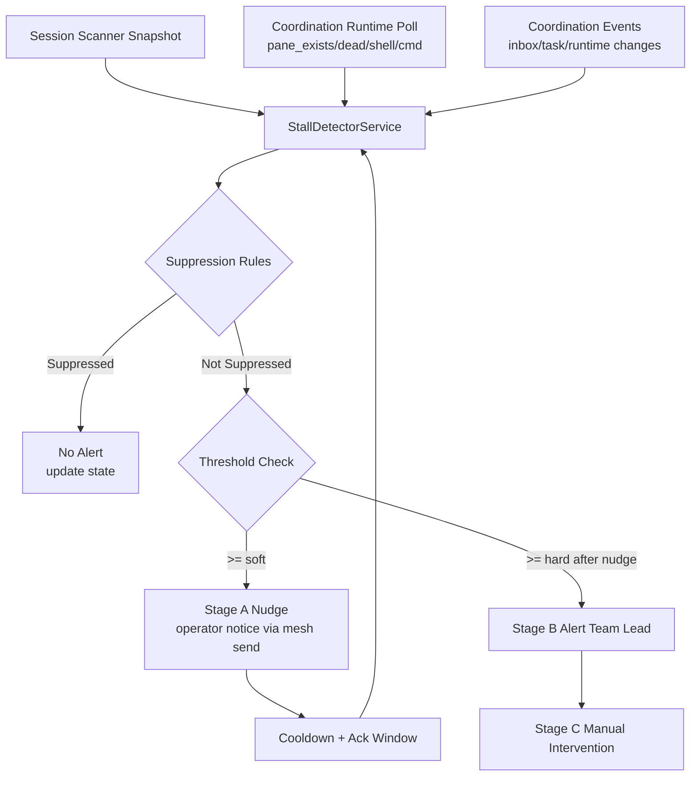

# Design Proposal: Multi-Signal Stall Detection for Mesh Agents

Date: 2026-03-05  
Owner: architect (Task #317)

## 1. Problem Statement

We need reliable stall detection for mesh agents that distinguishes:
- Legitimate quiet work (reading, thinking, waiting on long-running commands)
- True stalls (agent stopped progressing and needs intervention)

User guidance for thresholds:
- Soft nudge around 5 minutes
- Hard escalation around 8-10 minutes

This proposal defines a tunable, staged detector with clear separation between:
- What can be built in taurhaus now
- What requires new mesh capabilities

## 2. Current Capability Inventory

### Observability available in taurhaus today

1. tmux/pane liveness checks via `CoordinationRuntime`:
- `pane_exists`, `pane_is_dead`, `pane_is_shell` (`src-tauri/src/coordination/runtime.rs`)
- Already used by live-status reconciliation (`reconcile_team_liveness`)

2. Per-session activity signal stack in session scanner:
- `SessionState` (`active`/`idle`) with hysteresis
- Activity confidence/attribution fields
- Process IO/network-based activity detection (`proc_io.rs`)

3. Runtime metadata store:
- `MemberRuntimeRecord` with `health`, `attached_at`, `last_seen_at`, `delivery_lease`
- Staleness helper computes latest activity from those timestamps

4. Message delivery path to members:
- `orchestrator.deliver_message(DeliveryRequest::OperatorNotice(...))`
- Mesh-bridged backend sends via `mesh send`

5. Event/reconcile primitives exist in codebase:
- `CoordinationEvent`, `EventProducer`, `EventConsumer`, `Reconciler`
- Important: these are currently not wired into production startup flow (test-only usage)

### What is not observable today (gap)

1. Direct agent tool-call telemetry (per-command heartbeat)
2. Explicit agent-declared status (`blocked`, `investigating`, etc.)
3. Reliable machine-readable nudge acknowledgment signal
4. Per-member attribution for task-file updates and generic file writes

## 3. Signal Reliability Matrix (Q1)

| Signal | Observable now | Attribution quality | Reliability for “active work” | False-positive risk | Notes |
|---|---|---|---|---|---|
| Session scanner `SessionState=Active` + medium/high confidence | Yes | Medium-High (PID/TTY/pane mapped) | High | Low-Medium | Strongest current “agent is doing work” signal |
| Session scanner `SessionState=Idle` | Yes | Medium | Medium (means no current active signal, not necessarily stalled) | High if used alone | Must combine with time and suppression rules |
| `pane_exists` / `pane_is_dead` / `pane_is_shell` | Yes | High (member pane) | High for offline detection only | Low for offline, High for stall | Good for dead/offline, weak for “stuck” |
| `pane_current_command` non-shell and not CLI wrapper | Yes | High | Medium for long-running command suppression | Medium | Use as suppressor, not direct stall proof |
| `mesh send` delivery success to member | Yes | High (target member) | Low (delivery != member activity) | Very High if misused | Do not treat as progress signal |
| `last_seen_at` in runtime record | Yes | Low-ambiguous | Low | High | Currently updated on successful delivery, can mask stalls |
| Inbox/task/runtime file events via `CoordinationEvent` | Partially (primitives only) | Team/member varies | Medium once wired | Medium | Requires production wiring first |
| Project file writes | Not per-member | Low | Low-Medium | High | Background processes/noise; use as weak supporting hint |
| Explicit blocked/investigating status | No | N/A | High (if truthful) | Low-Medium | Requires mesh/agent protocol extension |
| Explicit nudge ack event | No | N/A | High | Low | Requires mesh message IDs/ack API |

### Reliability conclusion

No single current signal can reliably identify a stall. A detector must be multi-signal and stage-based:
- Use strong signals to suppress false alerts
- Treat missing signals as suspicion, not proof
- Require escalation windows and hysteresis

## 4. Detection Architecture (Q2)

### Proposed location

Run detector in taurhaus backend coordination subsystem as a dedicated service:
- `StallDetectorService` (new module under `src-tauri/src/coordination/`)
- Lifetime tied to app process
- Uses existing orchestration/runtime/session-scanner APIs

Why here:
- Already has tmux + runtime + mesh-delivery integration
- Can nudge via existing delivery path
- No mesh changes required for MVP

### Collection model

Hybrid model:
1. Event-driven updates (when available)
- Runtime/inbox/task file events (after wiring existing producer/consumer)
- Explicit API-triggered status updates

2. Periodic polling (required)
- Poll interval default 30s
- Pull session snapshot from session activity hub/scanner
- Pull live team status + pane checks

### Detector state per member

Maintain in memory (with optional persistence extension later):
- `last_strong_signal_at`
- `last_any_signal_at`
- `last_inbound_message_at` (message delivered to member)
- `last_nudge_at`
- `last_escalation_at`
- `pending_nudge_id`
- `suppression_until`
- `stage` (`healthy`, `soft_nudged`, `escalated`)
- `nudge_count_window` (rate limiting)

### Architecture sketch



## 5. Thresholds and Tunability (Q3)

Defaults (configurable):
- `poll_interval_secs`: 30
- `soft_nudge_after_secs`: 300
- `hard_escalate_after_secs`: 540
- `post_message_grace_secs`: 120
- `post_nudge_cooldown_secs`: 240
- `max_nudges_per_hour`: 3

### Config shape (proposed)

Add optional section in team config (or global settings with per-team override):

```json
{
  "stall_detection": {
    "enabled": true,
    "poll_interval_secs": 30,
    "soft_nudge_after_secs": 300,
    "hard_escalate_after_secs": 540,
    "post_message_grace_secs": 120,
    "post_nudge_cooldown_secs": 240,
    "max_nudges_per_hour": 3,
    "require_medium_confidence_for_activity": true
  }
}
```

No thresholds are hardcoded in logic; all defaults are overridable.

## 6. Escalation Stages and Delivery (Q4)

### Stage A: Auto-nudge (member)

Delivery path:
- Use existing `DeliveryRequest::OperatorNotice`
- Backend routes to `mesh send <member> ...`

Message template:
- “Are you still working on Task #N? Reply with status (`working`, `blocked`, `done`) within X min.”

### Stage B: Alert team lead

If no qualifying recovery signal in hard window after Stage A:
- Send structured alert to lead with evidence summary:
  - last strong signal age
  - pane/session state
  - nudge timestamp(s)

### Stage C: Manual intervention

Human action (lead):
- Ping directly
- Reassign/split task
- Restart member session if needed

### Loop prevention (nudge->ack->nudge)

Rules:
1. Never issue a second Stage A nudge while `pending_nudge_id` is active
2. Apply cooldown after any nudge
3. Require new evidence timestamp advancement before re-nudging
4. Hard cap nudges per rolling hour

## 7. Suppression Rules (Q5)

Suppress Stage A/B when any condition is true:

1. Long-running command detected:
- Pane command is non-shell and matches long-running allowlist (`cargo`, `bun`, `vitest`, `wdio`, etc.)

2. Strong activity observed recently:
- Session scanner reports `active` with medium/high confidence in recent window

3. Fresh inbound workload:
- Member just received a message (grace period)

4. Explicit blocked/investigating status:
- Not available in current mesh protocol; planned in mesh extension phase

5. System uncertainty guard:
- Missing scanner data or temporary runtime errors should defer escalation one cycle (hysteresis)

## 8. Mesh vs Taurhaus Scope Split (Q6)

### Taurhaus-only MVP (no mesh changes)

Can implement now:
1. Detector service and per-member state machine
2. Polling + session-scanner + tmux signal fusion
3. Stage A and Stage B message delivery using existing `mesh send` path
4. Tunable thresholds in config
5. Suppression/cooldown/rate limiting
6. Detector metrics logging and false-positive measurement

Limitations of MVP:
- No explicit machine-readable nudge acknowledgment
- No explicit member-declared status
- Attribution gaps for some passive signals

### Mesh-side changes required for full fidelity

1. Activity heartbeat API/event
- Per-agent periodic activity signal with reason (`tool_call`, `reply_sent`, `task_updated`)

2. Explicit status API
- `mesh status set --state blocked|investigating|working --reason ...`
- Query/read path for detector

3. Message ID + acknowledgment semantics
- `mesh send` returns message ID
- `mesh ack <id>` or equivalent read receipt event

4. Member-attributed task update metadata
- Include actor identity in task update events

5. Optional stream endpoint
- Event stream to avoid heavy polling (`mesh watch-events --team ...`)

## 9. Minimum Viable vs Full Implementation

### V1 (taurhaus-only, immediate)

- Goal: practical stall reduction with acceptable false positives
- Core signals: session activity + pane runtime + timing windows
- Escalation: Stage A/B operational

### V2 (mesh-enhanced)

- Goal: high-confidence stall detection with explicit acknowledgments
- Add mesh heartbeats/status/acks
- Reduce false positives and manual override burden

## 10. False-Positive Measurement Plan

For each Stage A/B trigger, log:
- trigger timestamp
- signal snapshot used for decision
- suppression state
- whether activity resumed within 2 minutes without manual intervention
- whether lead confirmed true stall

Weekly metrics:
- Stage A alert count
- Stage B escalation count
- Stage A false-positive rate
- Mean time to recovery after Stage A
- Mean time to lead intervention after Stage B

Target SLOs for tuning:
- Stage A false-positive rate < 20%
- Stage B false-positive rate < 10%

## 11. Risks and Mitigations

1. Risk: Delivery-side timestamps (`last_seen_at`) misread as agent activity
- Mitigation: maintain separate detector-owned activity timestamps; do not use delivery success as proof of progress

2. Risk: Over-nudging during legitimate quiet periods
- Mitigation: confidence gating + suppression + cooldown + rate limiting

3. Risk: Polling overhead
- Mitigation: 30s default cadence, event-driven short-circuit when wiring lands

4. Risk: Shared-worktree/process noise in signals
- Mitigation: prefer per-member pane/session signals over project-global file signals

## 12. Acceptance Criteria Mapping

- Q1 Signal reliability: covered in Sections 2-3 (matrix + false-positive analysis)
- Q2 Architecture: covered in Section 4 (runtime location, collection, state)
- Q3 Thresholds/tunability: covered in Section 5
- Q4 Escalation delivery/loop control: covered in Section 6
- Q5 Suppression rules: covered in Section 7
- Q6 Mesh vs taurhaus split + MVP/full: covered in Sections 8-9
