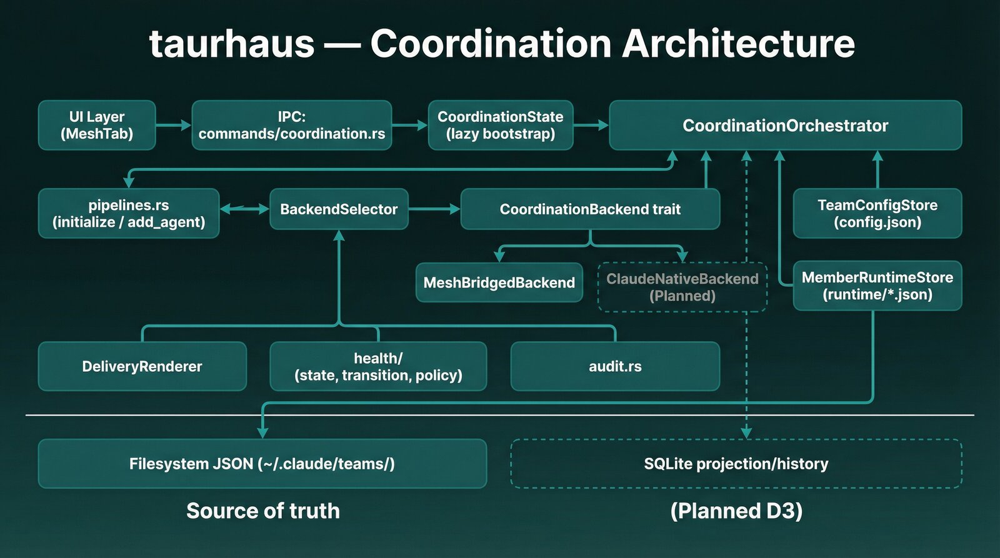

# Coordination Subsystem — Architecture

> Taurhaus + mesh integration for multi-agent team orchestration.
> Designed 2026-03-01. Collaboratively architected by Claude Code + Codex (GPT-5.3).



## Overview

Taurhaus gains the ability to create, monitor, and manage multi-agent teams that collaborate via the filesystem. The integration leverages mesh (a Rust CLI for non-Claude agents) and Claude Code's native team system, with the filesystem (`~/.claude/`) as the shared API surface.

This document is the active coordination design reference for:

- subsystem decisions and invariants
- runtime/recovery semantics
- delivery and orchestration behavior

For the authoritative inventory of coordination files, ownership boundaries, and source-of-truth rules, use [`architecture/data-architecture.md`](architecture/data-architecture.md). [`../ARCHITECTURE.md`](../ARCHITECTURE.md) remains the top-level system overview.

**Core principles:**
- Filesystem IS the API — no code coupling between taurhaus and mesh
- Taurhaus owns orchestration + GUI, mesh owns protocol + CLI
- Either works standalone
- Cleanest solution wins — effort is not a constraint

## Current orchestration direction

This document captures the shipped/active coordination subsystem architecture in taurhaus.

- The practical orchestration direction for auto-idle and communication quality now lives in [`architecture/orchestration-practical-auto-idle-and-communication.md`](architecture/orchestration-practical-auto-idle-and-communication.md).
- The v0.2.0 protocol exploration is archived in [`archive/architecture/orchestration-protocol-design.md`](archive/architecture/orchestration-protocol-design.md) and is not an active implementation target.
- Taurhaus now owns a broader operational context layer under `~/.claude/teams/{team}/state/`, including per-member operational snapshots and per-member compaction delivery state.
- `coordination/stall_detector/` and its `#[path]` shim were deleted. The `state/activity/<member>.json` export now lives in `coordination/activity_export.rs`, which also runs the stale-pane ownership probe and quarantines foreign panes before writing a snapshot. It is not the main reinjection context path.
- Codex compaction reinjection uses its native `SessionStart(source=compact)` hook by default for managed Codex >= 0.147. Startup and terminal-settings reconciliation keep the managed hook installed; unsupported versions log `compaction.codex_hook.unsupported` once and receive no reinjection. The former transcript extractor/watcher/processor, owner selection and setting are retired.
- There is one hook bridge for Claude, Codex and Grok, `coordination/compact_hook.rs` (it replaced `claude_hooks.rs`): one `CompactHookInput` parser for the payload shapes, the tool inferred from grok's reserved hook environment or otherwise from `transcript_path`, one resolver (runtime `session_id`, then normalized `cwd`), and `record_delivery_at(teams_dir, …)` as the only bookkeeping path. It installs runtime-appropriate wrappers (`.sh` for WSL/Linux runtimes, `.cmd` for native Windows runtimes) and logs standalone hook execution into the canonical JSONL sink.

## Design Decision Log

Status labels use current implementation state:
- **Implemented**: shipped and used by current code paths
- **Partial**: scaffolding exists, but behavior is incomplete or not fully wired
- **Planned**: design intent only; not implemented in active path

### D1: Trait, not enum, for backend abstraction

**Status**: Implemented

**Decision**: `CoordinationBackend` is a Rust trait, not an enum with match arms.

**Rationale**: The trait enforces the backend boundary at the type system level. Call sites cannot reach into backend-specific internals. Testable via mock injection. Adding a third backend is additive (new file), not surgical (touch every match block). The effort difference between trait and enum is negligible for AI implementers — only code quality matters.

### D2: Durable config separated from volatile runtime state

**Status**: Implemented

**Decision**: Team configuration and runtime coordination state live in separate files. Durable roster/config state, runtime attachment state, inboxes, and compaction/operational state remain distinct stores rather than collapsing into one mutable blob.

Current file-level inventory, writers/readers, and authority levels are maintained in [`architecture/data-architecture.md`](architecture/data-architecture.md).

**Rationale**: Eliminates config.json write contention. Config is mostly write-once. Runtime files are hot and disposable — delete them and taurhaus rebuilds from live session scanning.

**Invariant**: Runtime state is always reconstructible. It must never silently become durable authority.

### D3: JSON is live truth, SQLite is projection/history

**Status**: Partial

**Decision**: JSON files in `~/.claude/` are the source of truth for live coordination state. SQLite stores projections for history, querying, and UI ergonomics where those projections exist.

**Invariant**: SQLite must never be a competing writable source of truth for live coordination. Edits flow through coordination stores first, then get projected to SQLite.

**Flow**:
1. User action or daemon event
2. Orchestrator mutates coordination source of truth (JSON stores)
3. Taurhaus may record resulting events/snapshots in SQLite or other derived stores when the product surface needs history/query support
4. UI reads a mix of live view + derived persisted data

### D4: Logical team membership separated from session attachment

**Status**: Implemented

**Decision**: A team member is a logical role that persists independently of any specific tmux pane or process.

- **Logical member** (durable, in config.json): name, role, instructions, projectPath, `model`, `reasoningEffort`
- **Attachment** (volatile, in runtime/): pane_id, `pane_pid`, `pane_start_time`, process info, session/jsonl attachment, daemon pid, delivery lease, health state

`config.json` saves take a `TargetFileLock`, and unknown keys written by mesh or Claude Code (`controlAuthTokenHash`, `lastActivity*`, `status*`, `isActive`) survive every save through `#[serde(flatten)] extra` on the team/member wire types and on `domain::Member` — taurhaus patches only its own keys.

Members can be "detached" (pane died) but remain on the team. Rebind via process scanning without re-joining.

### D5: Two-tier launch strategy

**Status**: Partial

**Decision**: Claude Code agents use native CLI flags. Every other harness — Codex, Antigravity, Grok — uses the mesh daemon bridge. The split is capability-driven, not a per-tool branch: `should_use_mesh_sidecar_for_cli_tool` is `!capabilities.native_inbox_poller` (`coordination/pipelines/helpers.rs:363-366`).

| Agent Type | Launch Method | Delivery | Wake | Messaging |
|---|---|---|---|---|
| Claude Code | Native CLI flags (`--model`, `--effort`, `-n <agent_name>`, `--team-name`, `--agent-name`, `--agent-id`) | `MeshInboxStore::append` | Native inbox poller | Native `SendMessage` tool |
| Codex | tmux + `mesh daemon`; `-m` + `-c 'model_reasoning_effort="…"'` (+ `--dangerously-bypass-hook-trust` when native hooks are supported) | `MeshInboxStore::append` | Member `mesh daemon` | `mesh send` / `mesh read` CLI |
| Antigravity (`agy`) | tmux + `mesh daemon`; `--model` + `--effort` (+ `--dangerously-skip-permissions`) | `MeshInboxStore::append` | Member `mesh daemon` | `mesh send` / `mesh read` CLI |
| Grok (`grok`) | tmux + `mesh daemon`; `--model` + `--effort` (+ `--always-approve`) | `MeshInboxStore::append` | Member `mesh daemon` | `mesh send` / `mesh read` CLI. Onboarding adds one line: plain Enter queues a message until the running turn ends, Ctrl+Enter interjects immediately |

Launch flags are rendered by `LaunchSpec::render` in `session_scanner/launch.rs`.

**Operator delivery is one writer for every tool.** Taurhaus appends to `teams/<team>/inboxes/<member>.json` through `MeshInboxStore::append` regardless of backend; the orchestrator ensures the member daemon after every inbox append for non-Claude members. `DeliveryResult` keeps the durable write, wake, and later persistence work as separate facts: `delivered` still means the append happened, `durable` confirms it is on disk, `wake` distinguishes `already_live`, `spawned`, `adopted`, `not_attempted`, and `failed`, and `post_write_warnings` carries operational-snapshot or runtime-state errors verbatim. Wake and post-write failures are best-effort outcomes after the write and never retry the append. `mesh send` / `mesh read` remain agent-originated traffic only. Supported managed Codex additionally receives post-compaction context through the default native `SessionStart(compact)` hook.

**Rationale**: Claude Code is the only registered harness with `native_inbox_poller` (researched 2026-03-01). Codex has a hidden `multi_agent` experimental flag but no public surface. Antigravity and Grok have no local team features either; Grok's ACP/leader surface exists but is deliberately out of scope.

**Which account a team runs on**: team members always launch on the team's config dir, not on a per-project account. For Claude that is `PlatformPaths::claude_dir()` (honouring a `TAURHAUS_CLAUDE_DIR` override via the `CLAUDE_CONFIG_DIR=` prefix), because inboxes live under the single `PlatformPaths::teams_dir()`. Codex is the one harness that declares `managed_home`, so a managed Codex setup pins `CODEX_HOME` through `cli_commands.account_selector_dirs` (`apply_managed_account_selector`, `commands/terminal_settings.rs:101-119`). A launch that names an account anyway is not silently obeyed: it is dropped and logged once per project as `launch.account.ignored_for_team` (warn). `MeshTeamBuilder` says so in one line when more than one **Claude** account is registered — the note reads the first tool declaring `team_config_namespace`, and Claude is the only one that does (`cli_tool.rs:299` — every other entry declares `false`), so extra Codex or Grok accounts are silent.

**Model and effort**: `Member.model` and `Member.reasoning_effort` are persisted separately, surfaced in live status, and passed to `mesh join --model`. The UI model list comes from `ModelCatalog` on `TerminalPlatformContract`. That launch effort is a property of the *member*; the effort a lead attaches to one assignment is a separate number owned by mesh, and the one path mesh cannot take — relaunching a `ResumeWithFlag` harness with the effort flag — lives in `coordination/pipelines/effort.rs` and `coordination/task_effort.rs`. See [harness-model.md](architecture/harness-model.md#task-level-effort).

### D6: Delivery lease for daemon conflict avoidance

**Status**: Partial

**Decision**: Per-member runtime lease file with PID, instance UUID, hostname, and heartbeat timestamp.

- Taurhaus writes its PID when it takes delivery ownership
- Mesh daemon checks lease before starting — backs off if fresh, reclaims if stale
- Atomic create via rename prevents startup races
- PID + instance UUID handles PID-reuse edge case

This lease still exists for daemon ownership coordination, but it is no longer the compaction delivery gate. Codex compaction delivery now validates current managed attachment directly from roster/runtime state and records idempotency separately in per-member compaction state.

### D7: Explicit health state machine

**Status**: Partial

**Decision**: Health monitoring should use explicit states, events, and a deterministic transition function for runtime monitoring and UI state.

**Shipped**: only `HealthState` — Healthy, AwaitingRead, SuspectedStuck, Rebriefed, Suppressed, SessionDead. `health/transition.rs` is an identity placeholder (`transition(current) -> current`), there is no event enum, and `health/policy.rs` is a placeholder `RecoveryPolicy { cooldown_secs }`.

Task deadlines do not extend that placeholder framework. `coordination/task_deadline.rs` is a separate pure policy with an injected timestamp and caller-persisted one-shot markers: it decides `Nothing`, `Nudge`, or `MarkStale`, but reads no clock, performs no I/O, and is not yet called by self-heal. A module-boundary test keeps it fenced from `health/transition.rs` and `RecoveryPolicy`; wiring the policy is an explicit future W4 change.

**The live health mutations** are two, both written by `orchestrator/liveness.rs` during a reconciliation pass — there is no transition function between them:

| Mutation | Trigger | Also writes |
|---|---|---|
| `-> SessionDead` | pane id missing, pane gone, pane dead, pane back to a shell, or the pane is foreign (D17 quarantine, `runtime/mod.rs`); also a vanished daemon pid at startup reconciliation | clears `session_id`/`jsonl_path`; terminates a stale non-Claude mesh daemon |
| `-> Healthy` | the pane is alive and still owned (`PaneOwnership::Owned`), and the record was `SessionDead` or changed during the pass — a dead record recovers as soon as its pane is its own again | refreshes `last_seen_at`, re-detected `session_id`/`jsonl_path`, restarted daemon pid |

Recovery is therefore pane-identity reconciliation, not the evidence tiers below. The event vocabulary and recovery-evidence tiers remain design intent, not code.

**Planned events**: UnreadDetected, IdleThresholdMet, IoResumed, InboxCleared, CooldownExpired, SessionMissing, DeliveryFailed, ManualSuppress, ManualResume

**Planned recovery evidence**:
- Weak: terminal IO resumed after injection → clears toward healthy monitoring
- Strong: inbox unread count decreased or task activity → clears to Healthy

### D8: Typed delivery payloads

**Status**: Implemented

**Decision**: `DeliveryRequest` is a Rust enum with per-variant payload structs.

```rust
enum DeliveryRequest {
    Bootstrap(BootstrapDelivery),
    RecoveryNudge(RecoveryNudgeDelivery),
    OperatorNotice(Box<OperatorNoticeDelivery>),
}
```

Each variant carries structured fields reflecting intent. Both backends produce the same inbox record (`MeshInboxMessage::operator_originated`) via `MeshInboxStore::append` and report `DeliveryMethod::InboxFile` — the audit `DeliveryMethod` reflects what actually happened. `TmuxInjection` and `NativeMessageApi` variants still exist in the enum, but no production backend returns them.

### D9: Closed, taurhaus-centric capability model

**Status**: Implemented

**Decision**: `BackendCapabilities` is a closed struct describing operational semantics, not vendor features.

```rust
struct BackendCapabilities {
    can_launch_with_identity: bool,
    supports_out_of_band_delivery: bool,
    supports_native_peer_messaging: bool,
    supports_native_shared_tasks: bool,
    supports_attachment_rebind: bool,
    requires_sidecar_delivery: bool,
}
```

### D10: Backend selection — route by member CLI tool

**Status**: Implemented

**Decision**: Runtime delivery selects the backend from the target member's configured CLI tool. Claude members use the native inbox-file backend; Codex, Antigravity and Grok members use the mesh-bridged backend and member daemon. `BackendSelector::m0()` remains only as the compatibility constructor for the default external-agent backend, while the orchestrator and initialization pipeline perform per-member routing.

### D11: Channel-based daemon → orchestrator event pipeline

**Status**: Partial

**Decision**: Daemon pushes normalized events onto a bounded channel. Orchestrator consumes, deduplicates, and acts.

- Daemon: detect + normalize + emit (dumb)
- Orchestrator: dedupe/coalesce + decide + execute side effects (smart)
- Safety net: periodic reconcile scan catches dropped/coalesced events

### D12: Module structure — self-contained `coordination/` subsystem

**Status**: Implemented

**Decision**: New top-level module, not flattened into existing structure.

```
src-tauri/src/
  coordination/
    mod.rs              # Public API surface
    domain.rs           # Team, Member, RuntimeState, DeliveryLease, HealthState
    requests.rs         # Typed request/response contracts
    errors.rs  events.rs  consumer.rs  audit.rs
    backend/
      mod.rs            # CoordinationBackend trait + BackendCapabilities
      claude.rs         # ClaudeNativeBackend
      bridged.rs        # MeshBridgedBackend
      fake.rs           # Test backend
      selector.rs       # BackendSelector
    stores/
      mod.rs
      config.rs         # TeamConfigStore (JSON, teams_dir)
      runtime.rs        # MemberRuntimeStore (JSON, runtime/)
      inbox.rs          # MeshInboxStore — the single inbox writer
      lock.rs           # TargetFileLock (flock + inode re-check)
      compaction.rs  operational.rs  active_project.rs
    health/
      mod.rs  state.rs  transition.rs  policy.rs    # placeholders, see D7
    orchestrator/
      mod.rs  audit_logging.rs  delivery.rs  helpers.rs
      lifecycle.rs  liveness.rs  teardown.rs
    pipelines/
      mod.rs  initialize.rs  members.rs  effort.rs  lifecycle.rs  helpers.rs
    runtime/
      mod.rs  process.rs  recording.rs  system.rs  tmux.rs
    compact_hook.rs         # Claude + Codex + Grok hook bridge
    agy_hooks_installer.rs  # Antigravity activity hooks (shared config/hooks.json)
    compaction_events.rs
    activity_export.rs  activity_schema.rs
    delivery.rs             # DeliveryRenderer / onboarding
    member_activation.rs  mesh_cli.rs  operational_context.rs
    task_effort.rs          # assignment-effort policy shared with pipelines/effort.rs
    task_deadline.rs        # pure deadline policy, not yet wired (D7)
    reconcile.rs  reinjection.rs  roster.rs  validation.rs  state.rs
```

### D13: Never modify agent instruction files; hook config is the one managed exception

**Status**: Implemented

**Decision**: Taurhaus never writes to a project's or user's *instruction* files — CLAUDE.md, `.codex-instructions.md`, AGENTS.md. Those stay the user's.

The one configuration taurhaus does own is the compact-hook registration, because a hook is the only way a tool hands its post-compaction turn back to us (`coordination/compact_hook.rs`):

| Tool | Managed files | Condition |
|---|---|---|
| Claude | `<claude_dir>/settings.json` (`SessionStart` matcher `compact`) + `<claude_dir>/hooks/taurhaus-session-start-compact.*` | whenever any team has a managed Claude member — reconciled at startup and after team mutations |
| Codex | `<CODEX_HOME>/hooks.json` + `<CODEX_HOME>/hooks/taurhaus-session-start-compact.*` | by default while a managed Codex member exists and Codex >= 0.147; startup and terminal-settings reconciliation repair the taurhaus entry without replacing foreign hooks |
| Grok | `<GROK_HOME>/hooks/taurhaus.json` (registering both `SessionStart` matcher `compact` and `PostCompact` matcher `manual\|auto`) + `<GROK_HOME>/hooks/taurhaus-session-start-compact.*` | while `harness.grok_hooks` is on (the default) and at least one managed grok member exists; grok registers hooks per home, not per session, so every roster mutation reconciles it, not just startup and a Settings save (`reconcile_grok_hooks_for_roster`, `commands/terminal_settings.rs:413-458`). grok's personal hook dir is always trusted, so no trust grant or bypass flag is involved |

Writes are scoped to the taurhaus hook entry — `remove_source_hook` retains foreign hooks — and settings files are rewritten atomically.

**Two delivery channels, not one**, and compaction picks by path:

| Path | Channel |
|---|---|
| hook path, `HookStdout` — Claude and supported managed Codex | the hook process returns the rendered card as `hookSpecificOutput.additionalContext` on `SessionStart` and the tool folds it into the resumed context. No inbox write (`compact_hook.rs`) |
| hook path, `MeshInbox` — Grok | grok's session-start source never reports `compact`, so the bridge answers grok's own `PostCompact` event; passive-hook stdout is documented as ignored, so the card is queued in the member's mesh inbox instead of returned. A `PostCompact` from a stdout-answered harness is skipped as `post_compact_signal_only` (`compact_hook.rs:453-456`). grok also loads `~/.claude/settings.json` hooks, so one compaction can reach the bridge twice: the registry sets `compaction_hook_compat_import` and the bridge drops the second within the dedupe window (`compact_hook.rs:468-481`, `compaction.hook.compat_import`) |

Everything else — queued messages, operator notices — is an inbox write. Inbox files stay external and ephemeral.

tmux is used to launch panes, and by the member `mesh daemon` to wake the agent; it is not a content channel. The bridged backend's sender-candidate chain and self-send were removed, so no sender is ever the recipient.

### D14: Team visibility scoped to managed teams

**Status**: Partial

**Decision**: Taurhaus team discovery currently comes from filesystem config (`TeamConfigStore::discover` under `~/.claude/teams`), then the Mesh tab scopes active restoration by lead project path.

This means teams are not sourced from SQLite ownership records; visibility is project-context aware but still driven by `config.json` discovery.

### D15: Structured member removal with guarded teardown + lead notice

**Status**: Implemented

**Decision**: Runtime member removal is a multi-step operation with explicit diagnostics and safety guards.

- IPC contract: `coordination_remove_member` returns `RemoveAgentReport` (not `()`), including `steps[]` and `warnings[]`.
- Lead protection: team lead entries are non-removable through this path.
- Pane safety: pane teardown requires pre-checking pane ownership against the member project path before killing tmux panes.
- Operator visibility: after removal, taurhaus sends a removal notice to the team lead summarizing whether cleanup was full or partial.

**Rationale**: Removal is an operational workflow, not a simple config mutation. Structured reporting and ownership checks prevent silent failures and reduce accidental pane/process termination risk.

### D16: Resume lifecycle is a first-class member and team operation

**Status**: Implemented

**Decision**: Offline recovery is handled through dedicated resume pipelines and IPC surfaces, not by remove/re-add.

- IPC:
  - `coordination_resume_member`
  - `coordination_resume_team`
- Types:
  - `ResumeMemberRequest { team_name, member_name }` / `ResumeAgentReport`
  - `ResumeTeamRequest` / `ResumeTeamReport`
  - (`ResumeContextMode` was removed — resume always starts a fresh session)
- Runtime behavior:
  - member resume resolves/reuses a pane when possible, always launches a fresh session, re-hydrates `model`/`reasoning_effort` from the persisted member, then the role template, then the catalog (never an empty string), restores mesh membership + per-agent daemon state for non-Claude members, and persists runtime attachment
  - team resume loads the persisted roster, resumes the lead first, then resumes the remaining members sequentially through the existing member-resume pipeline
  - partial success is preserved; already resumed members stay up while failed members remain retryable
- Snapshot/UI contract:
  - project mesh snapshot returns `teamRuntimeState` with `none | active | degraded | cold_resume`
  - runtime header/UI maps that into `none | active | degraded | coldResume`
  - cold restart recovery is surfaced in the runtime header (`MeshRuntimeBar`) with `Resume Team`
  - degraded teams surface `Resume Offline (n)` plus per-member retry from node detail
  - in-flight team resume shows per-member progress rows and disables conflicting runtime actions until completion

**Rationale**: Resume preserves team identity and historical context while minimizing operator friction and avoiding destructive config churn. Team-level resume gives cold-restart recovery a single explicit action without inventing a second launch pipeline.

### D17: Snapshot reads stay fast; liveness repair is explicit or background

**Status**: Implemented

**Decision**: UI snapshot reads are disk-first and avoid runtime probing. Liveness repair runs only in explicit recovery flows and the background self-heal loop.

- Fast-path reads:
  - `coordination_get_project_mesh_snapshot`
  - `coordination_get_live_team_status`
  - both read persisted config/runtime via `get_team_status_fast(...)`
  - no tmux probing, process scans, or WSL interop on the snapshot IPC path
- Repair paths:
  - `coordination_resume_member`
  - `coordination_resume_team`
  - background `run_background_self_heal_pass()`
- Repair conditions:
  - missing `pane_id`
  - `pane_exists == false`
  - `pane_is_dead == true`
  - pane command resolves to shell (`pane_is_shell == true`)
  - daemon pid missing/dead/drifted from current mesh binary
  - team-daemon pid drifted from current mesh binary
  - pane identity no longer matches the member (stale-pane guard, below)
- Repair mutation:
  - `health -> SessionDead` when panes are gone/dead/shell/foreign
  - `session_id -> None` when drift is confirmed
  - non-Claude member daemons are adopted/restarted/terminated as needed
  - team daemon is best-effort stopped/restarted when binary drift is detected

**Stale-pane guard.** `MemberRuntimeRecord` (schema v3) carries `pane_pid` and `pane_start_time`, captured at launch — tmux 3.4 has no `pane_start_time`, so it is filled from `/proc` on Linux and left PID-only elsewhere. `pane_belongs_to_member` compares pane_id, pane_pid, pane_start_time, `#{pane_current_command}` against the member's `cli_tool`, and `#{pane_current_path}`. `PaneOwnership::Foreign { reason }` — `pane_id_mismatch`, `pane_pid_mismatch`, `pane_start_time_mismatch`, `cli_tool_mismatch: expected=… found=…`, `project_path_mismatch` — quarantines the member (`SessionDead`, no daemon restart, one foreign snapshot written) and emits `coordination.pane.foreign`. The check runs in liveness, activity export, and delivery; the frontend maps `pane_foreign` to offline.
- Concurrency rule:
  - background self-heal runs on a dedicated orchestrator instance, not the app-owned cached orchestrator
  - tmux, WSL, and process probes run before any filesystem lock is acquired, so the dedicated background instance keeps probe latency off the app-owned coordination mutex and off the team lock
  - each individual runtime-record decision commits inside a per-team critical section: acquire the team lock, re-read under the target-file lock, compare `pane_id`, `pane_pid`, `pane_start_time`, `session_id`, `daemon_pid`, `health`, and `appliedEffort`, then apply the patch through the locked save only when those dependencies are unchanged; a pass over several members releases the lock between records and is not atomic as a whole
  - a stale decision is dropped and logs `coordination.runtime.commit_skipped` with `member` and `changed_fields`; the array contains dependency field names, or the sentinel `record` when the runtime record itself appeared, disappeared, or would not parse — one member's unreadable record skips its own commit and leaves the file to the next `load_all` sweep rather than aborting the pass. The command and background orchestrators therefore cannot interleave a write to the same runtime record even though they remain separate instances

**Rationale**: This keeps first-render and polling snapshots cheap and predictable while still giving taurhaus a bounded repair path for stale panes/daemons and cold-restart recovery.

### D20: Display and runtime session views are explicitly split

**Status**: Implemented

**Decision**: Session scanning and daemon RPC expose two distinct views:

- `DisplaySession` / `list_display_sessions` for UI consumers
- `RuntimeSession` / `list_runtime_sessions` for transcript-aware coordination and native-hook member resolution

`DisplaySession` intentionally strips transcript metadata such as `session_id` and `jsonl_path`. Runtime correlation, task sync, and native-hook member resolution must use `RuntimeSession`.

**Rationale**: This prevents UI-safe data stripping from silently leaking into runtime logic when Windows/daemon and native/local session paths diverge.

### D21: Codex compaction uses the native hook by default

**Status**: Implemented

**Decision**: Managed Codex >= 0.147 installs and reconciles the native `SessionStart(source=compact)` hook by default. The hook invokes `compact_hook.rs`, which resolves the managed member from runtime context, loads the operational snapshot, renders a bounded reinjection card, returns it as `hookSpecificOutput.additionalContext`, and records the delivery result in per-member compaction state.

**Current delivery semantics**:
- The legacy poller and the later transcript extractor/signal-log/watcher/processor pipeline are gone.
- There is no daemon/app owner election and no `harness.codex_compaction` setting. Old persisted JSON containing the retired field still loads because unknown fields are ignored.
- Idempotency is recorded in `MemberCompactionStore` by `session_id` + compaction timestamp.
- Delivery is suppressed when the operational snapshot no longer contains a resumable task (for example, the last task was already `completed` or `deleted`), so finished work does not generate stale resume cards.
- Hook delivery emits `compaction.<tool>_hook.<action>` events for transport diagnostics, where `<tool>` is `claude`, `codex`, `grok`, or `compact` when the tool cannot be inferred, and `<action>` is `received`, `resolved`, `delivered`, `skipped`, or `failed`.
- Codex versions below 0.147 log `compaction.codex_hook.unsupported` once and receive no compaction reinjection.

**End-to-end path**:
1. Startup or terminal-settings reconciliation installs the managed Codex hook for supported managed members.
2. Codex automatic compaction emits `SessionStart(source=compact)` and invokes the wrapper appropriate to its runtime (`.sh` on Linux/WSL, `.cmd` on native Windows).
3. `compact_hook.rs` resolves the target member, validates current attachment and resumable context, composes the reinjection card, and returns it on hook stdout.
4. Codex folds `hookSpecificOutput.additionalContext` into the resumed context; taurhaus records the terminal result.

**Rationale**: Codex 0.147 made native compaction hooks a stable harness capability. Using that boundary removes duplicate detection and ownership machinery while delivering context on Codex's own resume path.

### D18: Implementation tasks require a Rust quality gate before completion

**Status**: Implemented

**Decision**: Implementation tasks must pass `just check-quick` before being reported complete.

- Runs `cargo fmt`, `cargo check --tests`, frontend typecheck, and frontend unit tests
- Captures compile/type/test regressions for routine iteration
- Ensures integration shim breakages are caught when included source files gain new imports

**Rationale**: Coordination changes span runtime, orchestrator, IPC, and integration shims. A strict pre-completion gate prevents partially validated changes from being reported as done while keeping iteration fast. The full `just check` gate is reserved for serialized team-lead/pre-release runs.

### D19: Team template composition feeds the existing initialize pipeline

**Status**: Implemented

**Decision**: Template-driven team setup remains an adapter layer above coordination initialization, not a second orchestration path.

- Backend template IPC (`templates_*`) handles role/preset storage, composition, history, diff, and revert.
- Frontend template flow now centers on `MeshTeamBuilder` inside `MeshSetupView`, while `TemplateBrowserPanel` and `TeamCustomizerPanel` remain advanced catalog/history/edit surfaces. All of them still resolve to the same `InitializeTeamRequest` shape used by manual setup.
- Coordination runtime continues to start teams only through `coordination_initialize_team`. Preset application resolves earlier, in `commands/coordination/request_normalization.rs` (`compose_team` with `CompositionOverrides { lead: preset.lead_overrides }`), and then enters that same pipeline — there is no `templates_apply_composition` command.
- Registered template commands (17): `templates_list_roles_full`, `templates_get_role`, `templates_upsert_role`, `templates_delete_role`, `import_role_from_file`, `templates_list_presets_full`, `templates_get_preset`, `templates_upsert_preset`, `templates_delete_preset`, `templates_compose_team`, `templates_get_storage_status`, `templates_get_history`, `templates_get_diff`, `templates_revert`, `templates_flush_pending`, `export_role_to_file`, `export_agent_definitions`.

**Integration points**:
- `src-tauri/src/templates/storage/`: git-backed template persistence and pending-action state
- `src-tauri/src/templates/composition.rs`: deterministic roster composition + validation
- `src-tauri/src/commands/templates.rs`: template command surface (`templates_get_history`, `templates_get_diff`, `templates_revert`, etc.)
- `src/lib/components/MeshSetupView.svelte`: setup shell that hosts `MeshTeamBuilder` and the init-progress/runtime handoff
- `src/lib/components/MeshTeamBuilder.svelte`: primary quick-preset, filter, and drag/drop team builder

**Rationale**: This preserves one runtime lifecycle for team launch/resume/remove while enabling reusable template authoring and auditability through git-backed history.

### D22: Claude leads join mesh; the team daemon is gated on their credential

**Status**: Implemented

**Decision**: A Claude *lead* is joined to mesh (`mesh join --team T --name <lead> --type lead --model <slug> --claude-dir <dir>`); non-lead Claude members are never joined.

- The join is deferred until after `commit_runtime` — the last config save — so the credential exists by the time `mesh team-daemon start` authenticates.
- Three separate gates are checked before `mesh team-daemon start`, in order. The first one that fails skips the daemon and emits `coordination.team_daemon.skipped { team_name, operator_name, reason, credential_path }`:

| Condition | `reason` |
|---|---|
| `state/control_auth/<lead>.json` is not a file | `missing_lead_control_credential` |
| the lead's `config.json` entry has no non-empty `controlAuthTokenHash` | `missing_lead_control_auth_token_hash` |
| the lead's `config.json` entry has `isActive: false` | `inactive_lead_control_identity` |

- The event is deduplicated per credential path *and* reason, so a team that moves from one failing gate to another logs both, and a repeated identical skip logs once. The skip state is cleared when all three gates pass.

**Rationale**: The lead is the only Claude member that participates in mesh-level team control. Deferring the join is load-bearing: an earlier join wrote a credential that the final config save then clobbered, leaving the team daemon unable to authenticate.

**Integration points**:
- `coordination/pipelines/helpers.rs`: `join_mesh_if_required`
- `coordination/pipelines/members.rs`: `deferred_claude_lead_join`
- `coordination/orchestrator/teardown.rs`: credential check and skip event

## Historical Planning

The older milestone-plan snapshot that used to live in this file is now archived in [`archive/architecture/architecture-doc-reconciliation-notes-2026-03-19.md`](archive/architecture/architecture-doc-reconciliation-notes-2026-03-19.md). Active implementation state should be read from the decision log above, the codebase, and the current changelog/task history rather than from historical milestone buckets.

## Research Sources

- Integration proposal: `mesh/docs/taurhaus-integration-proposal.md`
- Architecture diagram: `mesh/docs/taurhaus-integration-architecture-v2.jpg`
- Practical orchestration direction: [`architecture/orchestration-practical-auto-idle-and-communication.md`](architecture/orchestration-practical-auto-idle-and-communication.md)
- Archived protocol exploration: [`archive/architecture/orchestration-protocol-design.md`](archive/architecture/orchestration-protocol-design.md)
