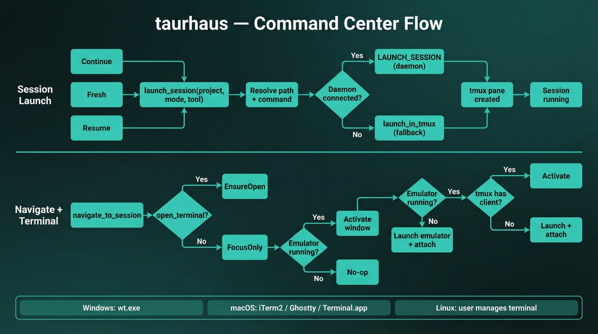

# Command center

The command center is taurhaus's session control layer for launching, stopping, and navigating CLI tool sessions inside tmux. It connects sidebar/context-menu actions to backend orchestration and platform-specific terminal behavior.

## Overview

Command center responsibilities:
- launch tool sessions for a selected project
- stop running sessions gracefully
- navigate to a specific tmux pane/window/session
- ensure terminal visibility/focus based on user intent
- expose configurable per-tool launch commands and tmux layout settings

## Launch modes

Supported launch modes:
- `Continue` — continue work in existing context
- `Fresh` — start a new session
- `Resume` — resume prior session context

Mode handling:
- Frontend uses compatibility helpers such as `launchClaudeSession(...)`, which call backend `launch_cli_session`.
- Backend resolves project path, then resolves command from settings per `(tool, mode)`.
- Session launches in tmux using selected layout strategy.
- In the current UI, `Continue` is hard-coded to Claude and Grok (`Sidebar.svelte:533-536`). Antigravity's continue command also differs from its fresh one (`agy --dangerously-skip-permissions --continue` vs `agy --dangerously-skip-permissions`, `cli_tool.rs:367-370`), so it would qualify by the same rule but has no menu item; only Codex's continue and fresh commands are identical. `New <Tool> Session` and `Resume <Tool>` are available for all four harnesses (Claude, Codex, Antigravity, Grok). See `src/lib/Sidebar.svelte`.

## Per-tool launch commands

Default commands (configurable in Settings):

| Tool | Continue | Fresh | Resume |
|------|----------|-------|--------|
| Claude | `claude --dangerously-skip-permissions --continue` | `claude --dangerously-skip-permissions` | `claude --dangerously-skip-permissions --resume` |
| Codex | `codex --yolo` | `codex --yolo` | `codex resume --last --yolo` |
| Antigravity | `agy --dangerously-skip-permissions --continue` | `agy --dangerously-skip-permissions` | `agy --dangerously-skip-permissions --conversation {session_id}` |
| Grok | `grok --always-approve --continue` | `grok --always-approve` | `grok --always-approve --resume {session_id}` |

Notes:
- Commands are editable per tool/mode in `Settings -> Terminal & Sessions / CLI Tools`.
- `{session_id}` is a tool-agnostic Settings token, used by the Antigravity and Grok resume commands above. Taurhaus replaces it with the project's last conversation/session id for that tool, resolved through the tool's own session resolver against the account home the launch selected (`command_center/launching.rs:476-507`); a launch with no resumable conversation fails with an explicit error instead of running the literal token.
- Override commands are validated for safety before execution.

## Stop behavior

Stopping is pane-targeted (`stop_claude_session(tmux_pane, cli_tool)`), then backend sends exit input to the tool process and cleans up the pane.

Current tool behavior:
- Claude: sends `/exit` to tmux pane
- Antigravity: sends `/exit` to tmux pane, then waits for the presence lock to clear
- Codex: sends `Ctrl+C` (key signal)

After exit signal:
- backend polls pane command until shell is detected (or timeout)
- pane is killed to clean up (window closes automatically if last pane)

This launch/resume/stop behavior is covered by the command-center E2E lane and mirrored in the project context menu.

## tmux integration

All sessions run inside tmux, which taurhaus manages automatically.

Launch workflow:
- ensure dedicated tmux session exists (`taurhaus`)
- choose layout strategy (`new_window`, `split`, `per_project`)
- create/split pane and run command in project directory
- return tmux coordinates (`tmux_session`, `tmux_window`, `tmux_pane`)

Navigation workflow:
- select tmux window
- select tmux pane
- optionally trigger terminal focus/open behavior

## Terminal decision tree

Terminal handling uses two intents:
- `FocusOnly` — focus an already-running preferred terminal
- `EnsureOpen` — if terminal is running, focus; otherwise launch and attach tmux

Unified flow:
1. Resolve emulator preference from settings
2. If `FocusOnly`: activate if running
3. If `EnsureOpen`:
   - if running and tmux has client: activate
   - else: launch with `tmux attach-session -t <session>`
4. `custom` emulator runs user command template with placeholders

Foreground detection is also part of command-center state now:
- backend reads tmux focus state and resolves the currently foregrounded registered project with `get_foreground_project`
- frontend uses that project id to highlight the active project row while focus is inside a managed tmux pane

## Platform support

| Platform | Emulator options | Default | Behavior |
|----------|------------------|---------|----------|
| Windows | `windows_terminal`, `custom` | `windows_terminal` | 3-state WT detection (`Focused`/`Running`/`NotRunning`), launch via `wt.exe` + `wsl.exe ... tmux attach` |
| macOS | `iterm2`, `ghostty`, `terminal_app`, `custom` | `iterm2` | Resolve preferred app, activate existing or launch with tmux attach |
| Linux | `manual` | `manual` | no built-in terminal activator; tmux still backs session control and taurhaus keeps terminal navigation/manual attach explicit |

Windows-specific detail:
- Windows Terminal detection handles WinUI window-handle quirks with process + window-enumeration fallback.

## Context-menu integration

Right-click project menu exposes command-center actions (`Sidebar.svelte:521-568`):
- `Continue Claude`, `Continue Grok` — hard-coded to these two; Antigravity's continue command differs from its fresh one too but has no item
- `New Claude Session`, `New Codex Session`, `New Antigravity Session`, `New Grok Session`
- `Resume Claude`, `Resume Codex`, `Resume Antigravity`, `Resume Grok`
- `Open in Terminal` when a live session has tmux metadata
- Per-running-session Restart/Stop actions
- An account submenu on a launch item of a tool that has an account selector **and** at least two signed-in accounts, plus a `<Tool> account` submenu that pins or clears the project's choice

Interaction model:
- Stop action includes confirmation timeout
- Restart does stop then continue launch for that tool
- Session badges in sidebar support click-to-navigate to tmux pane
- If terminal navigation is attempted without a valid live tmux target, taurhaus shows a sidebar notice instead of failing silently

## Settings integration

Settings provides user control for command-center behavior:
- terminal emulator selection
- custom terminal command template
- tmux layout strategy
- per-tool per-mode launch commands

This allows consistent command-center UX with environment-specific tooling without changing backend code.

## Daemon vs fallback path

Command center prefers daemon-backed execution when connected:
- daemon handles launch/stop/navigate requests
- results are normalized to tmux metadata for frontend use

If daemon is unavailable:
- backend falls back to direct in-process tmux control
- behavior remains functionally equivalent for launch/stop/navigation

## Key files

| File | Purpose |
|------|---------|
| `src/lib/Sidebar.svelte` | Project context-menu actions that trigger launch/stop/restart/navigation |
| `src/lib/ContextMenu.svelte` | Menu interaction component used by command-center entry points |
| `src/lib/Settings.svelte` | Emulator, tmux layout, and per-tool command configuration UI |
| `src-tauri/src/commands/command_center/mod.rs` | IPC commands for list/launch/stop/navigate, activity metrics, and foreground project lookup |
| `src-tauri/src/commands/command_center/session_listing.rs` | Session listing bridge and daemon/display-session decoding |
| `src-tauri/src/commands/command_center/navigation.rs` | Stop and navigate implementations |
| `src-tauri/src/commands/command_center/launching.rs` | Launch implementation and resume delegation logic |
| `src-tauri/src/session_scanner/control.rs` | tmux launch/stop/navigation core logic + command resolution |
| `src-tauri/src/terminal.rs` | Cross-platform terminal focus/open decision tree |
| `src-tauri/src/session_scanner/cli_tool.rs` | Tool config (`exit_command`, tool identity) |
| `src-tauri/src/claude_code/mod.rs` | Claude Code integration module root referenced by command-center flows |

## Related documents

- [Platform abstraction](../platform-abstraction.md) — cross-platform runtime and terminal integration strategy
- [Session management](./session-management.md) — session detection and live-state model consumed by command-center actions
- [Project management](./project-management.md) — where users trigger command-center actions in the main UI
