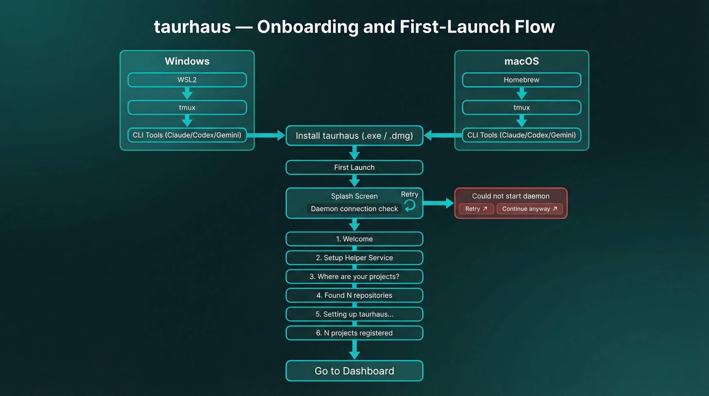

# First run and settings

The first-run wizard onboards new users, the splash screen gates the UI during startup, and the settings panel exposes all configurable preferences.

## Overview

Three components handle the initial user experience: a splash screen shows progress while the app starts up, a wizard guides first-time users through helper-service setup and project discovery, and a settings panel exposes all configurable preferences.

## Splash screen

On every launch, a splash screen displays while the backend bootstraps. It uses a progressive reveal animation driven by actual backend state (not timers).

**Phases:**

1. **Checking helper service** — checks whether the helper service is connected
2. **Connecting** — waiting for the helper-service health check to succeed
3. **Ready** — all systems initialized, UI unlocked

**Fast path**: If the helper service is already connected (or not needed), phases complete in quick succession (~250ms transitions). The slow path waits for the helper-service health check event (~500ms transitions).

**Minimum display**: 800ms + 300ms hold — prevents the splash from flashing too quickly on fast machines.

The splash screen tracks connection progress in real time and completes when the helper service connects or is confirmed unnecessary.

## First-run wizard

Triggered when `is_first_run()` returns true (no projects registered). Guides the user through helper-service setup and project discovery.

### Steps

| Step | Name | What happens |
|------|------|-------------|
| 1 | Welcome | Brief introduction, platform detection |
| 2 | Helper service setup | Check helper-service install status, offer install/update if needed |
| 3 | Browse | Enter a directory path to scan for projects |
| 4 | Selection | Review discovered projects, toggle selection |
| 5 | Progress | Batch registration with per-project progress |
| 6 | Complete | Summary of registered projects, transition to main UI |

### Helper service setup (step 2)

Checks whether the helper service is installed and up to date:
- **Installed and current** — auto-proceeds to step 3 after 800ms
- **Not installed or needs update** — shows install button, calls `installDaemon()`
- Platform detection runs in parallel with the install-status check

### Project discovery (steps 3–4)

The user enters a directory path (e.g., `~/projects`). The wizard calls `scanDirectory()` which returns discovered projects with metadata:
- `path` — absolute project path
- `has_git` — whether the directory contains a `.git` folder

By default, all git-backed projects are pre-selected. The user can toggle individual projects, select all, or deselect all.

### Batch registration (step 5)

Selected projects are registered via `registerProjectsBatch()`. Progress is shown per-project (name and index/total). Failed registrations are collected and reported in the completion summary.

## Settings

The settings panel is a scrollable form accessible from the sidebar. Opens with a "Back to projects" link at the top. Closes on Escape.

### General

| Setting | Type | Default | Description |
|---------|------|---------|-------------|
| Scan directories | Text list | `['~/projects']` | Directories scanned for project discovery |
| Ignore patterns | Text list | `['node_modules', '.git', 'target', 'dist']` | Patterns excluded from scanning and indexing |
| Active threshold | Number | 7 days | Projects with activity within this period are "Active" |
| Recent threshold | Number | 30 days | Projects within this period are "Recent" |
| Stale threshold | Number | 90 days | Projects within this period are "Stale"; beyond is "Dormant" |

Scan directories and ignore patterns are edited as multi-line text (one entry per line). Thresholds are numeric inputs that save on blur.

These settings are active now:
- background scanning uses the saved scan-directory list
- ignore patterns are skipped during scanning and search indexing

### Display

| Setting | Type | Default | Description |
|---------|------|---------|-------------|
| Light code theme | Select | Varies | Shiki syntax highlighting theme for light mode |
| Dark code theme | Select | Varies | Shiki syntax highlighting theme for dark mode |

Theme options include all VS Code-compatible Shiki themes, with separate selections for light and dark mode.

**Theme toggle** (light/dark mode) lives in the titlebar, not in settings — always accessible.

### Terminal and sessions

| Setting | Type | Default | Description |
|---------|------|---------|-------------|
| Emulator | Select | Platform-dependent | Terminal behavior resolved from the backend terminal contract |
| Custom command | Text | — | Custom launch command (when emulator is "Custom") |
| Tmux layout | Select | `new_window` | How new sessions are arranged in tmux |
| CLI commands | Per-tool text fields | See below | Launch commands for each CLI tool and mode |

**Emulator options** come from the backend terminal contract, so the UI only shows values supported on the current platform:

| Platform | Options |
|----------|---------|
| macOS | iTerm2, Ghostty, Terminal.app, Custom |
| Windows | Windows Terminal, Custom |
| Linux | Manual |

When the active platform does not support custom launch commands, the custom-command field is hidden instead of showing unusable controls.

**Default CLI commands:**

| Tool | Continue | Fresh | Resume |
|------|----------|-------|--------|
| Claude | `claude --dangerously-skip-permissions --continue` | `claude --dangerously-skip-permissions` | `claude --dangerously-skip-permissions --resume` |
| Codex | `codex --yolo` | `codex --yolo` | `codex resume --last --yolo` |
| Antigravity | `agy --dangerously-skip-permissions --continue` | `agy --dangerously-skip-permissions` | `agy --dangerously-skip-permissions --conversation {session_id}` |
| Grok | `grok --always-approve --continue` | `grok --always-approve` | `grok --always-approve --resume {session_id}` |

Each tool has a "Reset to defaults" button. Commands are editable per-mode (continue, fresh, resume).
For Antigravity and Grok resume commands, `{session_id}` is replaced with the project's last session id before launch.

These fields are free-form: there is no backend allowlist on the command text.

### Accounts

A per-tool section appears for every harness that has an account selector **and** at least two accounts detected — Claude Code (`CLAUDE_CONFIG_DIR`), Codex (`CODEX_HOME`) and Grok (`GROK_HOME`). Antigravity has one implicit account and never appears here.

| Element | What it shows |
|---------|---------------|
| Account radio list | Every detected account of that tool, labelled from its own identity; picking one sets the tool's **global default** (`terminal.default_account_ids[tool]`) |
| Compact usage meter | The account's weekly buckets, in the titles the tool itself uses |
| Usage note | For a tool with `usage: false` the registry's sentence stands where a meter would be — Grok's is "Grok shows credits in its own /usage" |
| Effective default line | The default candidate Settings displays for that tool, and **why**. Settings computes the line itself (`Settings.svelte:196-211`) and reports one of three origins: `default` (the global default set here), `from your launch command "<command>"` (a CLI command that already sets the selector), or `default config directory`. It is not the launch result: it does not check `logged_in`, so a signed-out account can appear here, while the authoritative resolver takes only usable accounts (`accounts/mod.rs:263-266`) and falls back from a signed-out default to another signed-in one (`accounts/mod.rs:168-179, 221-234`). The fuller launch-time order — request, session, pin, last used, global default, base command, default dir — lives in `accounts.svelte.js:89-121` and drives launches, not this line |

Usage snapshots are fetched at request time from the tool's own endpoint or command and kept in memory only; Settings refreshes them on open (`Settings.svelte:157`) and the daemon's `usage_poller` refreshes them on its own schedule. Credentials and tokens are what taurhaus never logs, persists or refreshes — an expired or rejected credential shows as "sign in again" until the CLI itself refreshes it.

### Search index

| Setting | Type | Description |
|---------|------|-------------|
| Document count | Read-only | Number of documents in the search index |
| Rebuild index | Button | Triggers a full re-index from filesystem |

### Persistence

Settings save automatically — changes take effect immediately without a manual save step. Individual sections save on blur or selection change.

## Key files

| File | Purpose |
|------|---------|
| `src/lib/SplashScreen.svelte` | Startup splash with helper-service/bootstrap progress |
| `src/lib/FirstRunWizard.svelte` | Onboarding wizard (6 steps) |
| `src/lib/Settings.svelte` | Settings panel with all preferences |
| `src/lib/DirectoryBrowser.svelte` | Directory picker used by wizard |
| `src/lib/shikiThemes.js` | Code theme definitions (light + dark) |
| `src-tauri/src/commands/settings.rs` | Settings get/update IPC handlers |
| `src-tauri/src/commands/projects.rs` | `is_first_run`, `scan_directory`, `register_projects_batch` |
| `src-tauri/src/startup/mod.rs` | Backend startup bootstrap and path/log/database setup |
| `src-tauri/src/daemon_lifecycle.rs` | Frontend-facing helper-service status and reconnect events |

## Related documents

- [Project management](project-management.md) — project registration and sidebar
- [Command center](command-center.md) — CLI tool launch using terminal settings
- [Data model](../architecture/data-model.md) — settings table schema
