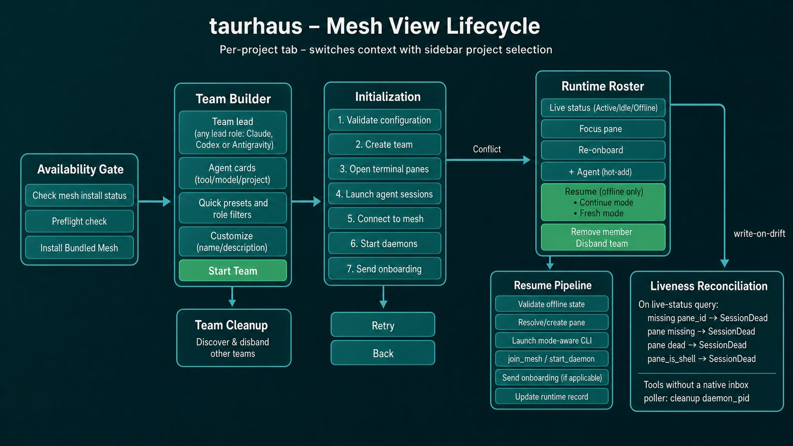

# Mesh view

The Mesh tab lets you set up, monitor, and manage multi-agent teams for a project. It centers on template-driven team composition, a live runtime canvas, resumable lifecycle management, and context-recovery visibility.

> Stale render: the setup block says the team lead is fixed to Claude. Lead roles ship for Claude, Codex and Antigravity, and the team builder filters the catalog by role kind, not by tool.

## Overview

Mesh view responsibilities:
- check mesh CLI and tool availability before enabling coordination
- compose teams from built-in or custom role/preset templates
- launch teams with lead/agent project bindings and role metadata
- show a live canvas of members, status, and cross-project placement
- hot-add, resume, focus, or remove members from running teams
- capture runtime members back into reusable role templates
- surface compaction reinjection audit data in the runtime header
- disband or recover previously created teams for the current project

## Prerequisites

Mesh requires two external tools:

| Tool | Purpose | Install location |
|------|---------|-----------------|
| mesh CLI | Agent coordination protocol | `~/.local/bin/mesh` |
| tmux | Terminal multiplexer for agent sessions | System package manager |

The availability check blocks setup until:

1. `check_mesh_install_status` verifies the bundled mesh binary is installed and current.
2. `coordination_preflight_check` validates required CLI tools for the selected roster.

Missing or outdated mesh can be fixed inline with the bundled installer. Per-tool warnings remain non-blocking so users can still compose teams while seeing degraded runtime risk up front.

## Project scoping and restore

Mesh is a top-level tab alongside Overview, Files, Tasks, and Git, but it is still project-scoped. The current project path is the lookup key for:

- `coordination_get_project_mesh_snapshot` during tab hydration
- runtime cache reuse while switching projects
- matching existing team configs by lead project path

The tab moves through five modes:

- `gate` - prerequisite checks are running
- `empty` - no team yet; quick presets and template actions are shown
- `setup` - a draft team exists and can be edited or initialized
- `initializing` - backend pipeline is running with streamed progress
- `runtime` - a live or resumable team snapshot exists

## Setup flow

When no team exists for the current project, Mesh opens in the empty/setup path instead of a fixed roster form.

### Primary setup surface

The setup view offers:

- quick presets such as Pair, Dev Team, Full Team, and Research Team
- searchable role filters by tool and kind
- drag-and-drop lead and agent composition
- inline editing for team name, description, member names, tool/model defaults, and project binding
- `Browse catalog`, which opens the advanced template catalog
- reset, initialize, and save-as-preset actions

Quick presets are resolved through `composeTeam(...)`, so the initial draft already includes role-driven tool, model, and naming defaults.

### Advanced template catalog

`TemplateBrowserPanel.svelte` remains the advanced catalog and has three tabs:

- `Roles` - inspect, create, edit, delete, import, and export role templates
- `Presets` - inspect, create, edit, clone, and delete team presets
- `History` - view template git-backed history and diffs

Role import/export details:

- import accepts markdown role files and preserves provenance metadata
- supported imported formats include Claude Code, Copilot custom-agent markdown, `AGENTS.md`, and `GEMINI.md`
- export writes current taurhaus roles back out to Claude Code or Copilot markdown
- Taurhaus-authored Claude/Copilot exports preserve the extended role fields through compiled Markdown sections, while instruction-only formats remain intentionally lossy
- imported roles are visibly marked with provenance badges in the catalog

Role authoring now supports a richer schema than the original focus/context/behavior trio. In addition to `focus_area`, `context_summary`, and `behavior_summary`, roles can carry:

- `communication_style`
- `quality_gates`
- `definition_of_done`
- `phase_scope`
- `mode`
- `inherits_from`
- `required_artifacts`

Use those fields to express how a role should communicate, what checks it must satisfy, which delivery phases it belongs in, whether it is a specialized variant of another role, and what artifacts it is expected to produce.

### Team customizer

`TeamCustomizerPanel.svelte` edits the actual team draft:

- team name and description
- lead member
- agent members
- project assignment per member
- role binding per member

Role metadata remains visible through setup and runtime so the lead can route work with more than just a name and tool. The richer schema makes it possible to tell, for example, whether a role is meant for planning vs review, what kind of evidence it should return, and what a successful handoff should include.

The lead is no longer fixed to Claude. The selected lead role determines tool/model defaults, and the built-in lead roles cover Claude, Codex and Antigravity (`claude-orchestrator`, `codex-orchestrator`, `antigravity-orchestrator`, plus the `v2`/`v3` lead roles). The shipped Grok roles are agent roles — `v4-developer-grok`, which the `Grok Pair` preset staffs, and the superseded `grok-developer` — so a Grok lead needs a user template.

Lead-mode rule:

- Claude leads may use the existing attach-existing flow
- Codex, Antigravity and Grok leads are currently launch-new only — the rule is capability-driven (`should_use_mesh_sidecar`, i.e. any harness without the native inbox poller), not a per-tool list

Users can still save the current draft back into the preset catalog from the advanced customizer flow.

## Initialization

Initialization shows a 7-step progress view:

| Step | Label | Description |
|------|-------|-------------|
| `validate_configuration` | Validating configuration | Checks team name, tools, and project assignments |
| `create_team` | Creating team | Writes team config to `~/.claude/teams/` |
| `create_panes` | Opening terminal panes | Creates tmux panes where needed |
| `launch_sessions` | Launching agent sessions | Starts CLI sessions |
| `join_mesh` | Connecting agents to mesh | Registers agents with the mesh protocol |
| `start_daemons` | Starting coordination daemons | Starts mesh sidecars where required |
| `send_onboarding` | Sending agent instructions | Delivers onboarding to members |

Progress events are streamed over `coordination-step-progress` while the frontend is waiting on `coordination_initialize_team`.

Conflict and failure handling still includes:

- retry from the beginning
- go back to setup
- open/disband existing team when initialization collides with a pre-existing config

## Runtime view

The runtime view is a live canvas plus runtime header and node detail panels.

### Runtime bar

`MeshRuntimeBar.svelte` shows:

- team name and member counts
- runtime state summary (`active`, `degraded`, or `coldResume`)
- honest runtime copy such as `Team running normally`, `1 member stopped`, or `All members stopped`
- primary action that flips between `Add Agent`, `Resume Team`, and `Resume Stopped (n)` based on runtime state
- overflow actions such as disband
- context-recovery status for members whose sessions were interrupted and automatically restored
- optional diagnostic details when available

The compaction audit surface shows the last known member, tool, session id, compaction timestamp, and delivery result (`injected`, `skipped`, `stale`, or `failed`).

### Canvas and node detail

`MeshCanvas.svelte` renders lead and agent nodes directly from explicit layout geometry. Selecting a node opens `MeshNodeDetail.svelte`, which shows:

- tool/model and project placement
- the launch effort the session was started at and, beside it, the effort the lead attached to the current assignment (hovering gives the lead's stated reason) — a task asking for more than the session runs at is the case worth seeing
- a warning where taurhaus could not guarantee account selection, because the member's launch command runs a wrapper it will not execute to identify
- cross-project placement details
- role details (name, focus area, context, behavior guidance, communication style, quality gates, definition of done, phase scope, mode, inheritance, and required artifacts when present)
- runtime details like terminal pane, session ID, and current state

Runtime node actions include:

- focus pane
- resume member
- remove member
- capture member as a reusable role template
- close detail

Captured runtime roles keep the evolved role-schema fields so reviewed runtime members can be promoted back into the catalog without flattening them into generic instructions.

### Resume flows

Resume is now a first-class runtime action:

- `coordination_resume_team` resumes the lead first, then same-project and cross-project members
- `coordination_resume_member` resumes a single selected member
- runtime UI shows live resume progress and the latest per-member resume result

This is the main recovery path for `coldResume` and `degraded` teams after sessions stop or the app reopens against persisted team state.

Recovery caveats:
- cold-resume and pane-loss reconciliation are still being hardened
- known gaps in recovery edge cases are tracked internally and being addressed
- until that work lands, the runtime header is intentionally conservative and surfaces degraded/stopped states honestly instead of implying the team is fully healthy

### Hot-add and removal

Hot-add uses a slide-over form rather than a separate page. The form supports:

- optional role selection from the role catalog
- per-field unlock when a role pre-fills tool/model metadata
- project assignment per new member

Removal remains guarded:

- non-lead members only
- confirmation required
- backend returns teardown steps and warnings
- lead receives a removal notice when teardown completes or partially completes

## Team cleanup and disband

Existing teams anchored to the current project can be surfaced during hydration and setup recovery. Disbanding:

1. confirms intent
2. calls `coordination_disband_team`
3. tears down panes, daemons, and mesh membership as applicable
4. removes persisted runtime/config state
5. returns the tab to the setup flow

The disband path is idempotent and keeps attach-existing Claude leads from having their external session forcibly torn down.

## IPC commands

Mesh view uses these backend commands:

| Command | Purpose |
|---------|---------|
| `check_mesh_install_status` | Detect bundled mesh installation/version |
| `install_mesh` | Install bundled mesh binary |
| `coordination_preflight_check` | Validate tool availability before initialization |
| `coordination_get_project_mesh_snapshot` | Restore project-scoped setup/runtime state |
| `coordination_initialize_team` | Execute full team bootstrap pipeline |
| `coordination_get_live_team_status` | Refresh live team/runtime state |
| `coordination_get_compaction_audit` | Fetch reinjection audit entries and diagnostics |
| `coordination_resume_team` | Resume an existing degraded or cold team |
| `coordination_resume_member` | Resume one selected member |
| `coordination_add_agent` | Hot-add a member to a running team |
| `coordination_remove_member` | Remove a non-lead member with teardown diagnostics |
| `coordination_reonboard` | Re-send onboarding to a member |
| `coordination_disband_team` | Disband the team and clean up resources |

## Key files

| File | Purpose |
|------|---------|
| `src/lib/components/MeshTab.svelte` | Top-level mesh mode switcher and dialog host |
| `src/lib/components/meshTabController.svelte.js` | Project snapshot hydration, runtime polling, composition, resume, and mutation controller |
| `src/lib/components/MeshSetupView.svelte` | Gate/empty/setup/initializing stage UI |
| `src/lib/components/MeshTeamBuilder.svelte` | Primary quick-preset, filter, and drag/drop setup surface |
| `src/lib/components/TemplateBrowserPanel.svelte` | Role/preset catalog, import/export, and template history |
| `src/lib/components/TeamCustomizerPanel.svelte` | Advanced draft editing and save-as-preset flow |
| `src/lib/components/MeshRuntimeView.svelte` | Runtime canvas, resume progress, hot-add, and capture-role UI |
| `src/lib/components/MeshRuntimeBar.svelte` | Runtime summary, resume actions, and compaction audit surface |
| `src/lib/components/MeshNodeDetail.svelte` | Node detail panel for setup/runtime actions and diagnostics |
| `src-tauri/src/commands/coordination.rs` | Coordination IPC handlers including snapshot, resume, and compaction audit |
| `src-tauri/src/commands/mesh.rs` | Mesh install status and installer commands |
| `src-tauri/src/coordination/orchestrator.rs` | Team lifecycle orchestration and guarded teardown |
| `src-tauri/src/coordination/pipelines/` | Initialize and resume pipeline stages |

## Related documents

- [Team templates guide](../team-templates.md) — role, preset, provenance, and composition model
- [Session management](session-management.md) — runtime session data that feeds mesh status
