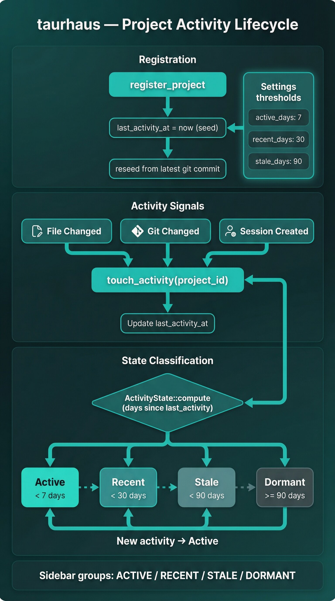

# Project management

Project management is the core workflow for adding repositories to taurhaus, organizing them by activity, and navigating from a per-project overview.

## Overview

taurhaus treats each registered repository as a project with persisted metadata, computed activity state, and optional relationships to other projects. Users manage projects from the sidebar and Manage Projects modal, then work from the Overview tab and project context menu.

At runtime, project state is a combination of:
- Persisted metadata (name, path, timestamps, cached git data)
- Computed activity grouping (Active, Recent, Stale, Dormant)
- Live context (sessions, git status, README, relationships)

## Project registration

Users can add projects in three ways:

| Flow | User experience | Backend behavior |
|------|------------------|------------------|
| Manage Projects quick scan | In `Manage Projects`, clicking `Add projects` scans `~/projects` and pre-selects unregistered git repos | `scan_directory` (depth 2) + `register_projects_batch` |
| Manual add in Manage Projects | In `Manage Projects`, users can `Enter path manually`, browse folders, validate path, then add one project | `validate_project_path` + `register_projects_batch([path])` |
| First-run wizard batch import | On first launch, `FirstRunWizard` scans a user-selected folder and bulk-registers selected repos with progress feedback | `scan_directory` + `register_projects_batch` with progress events |

Registration rules and behavior:
- Paths are expanded from `~` and must exist as directories.
- A project path must be a git repository for manual registration validation.
- Duplicate paths are rejected.
- Batch registration returns per-path success/error so partial success is supported.
- After registration, taurhaus refreshes project list and reseeds git branch/dirty status plus `last_activity_at` from latest commit when available.

## Sidebar project list

The sidebar is grouped by activity state headers:
- `ACTIVE`
- `RECENT`
- `STALE`
- `DORMANT`

What users see:
- Projects listed under group headers (headers only appear when group has items)
- Filter input to narrow by project name
- Per-project row indicators: session tool badges, cached branch badge, dirty indicator, and foreground-project emphasis when tmux focus resolves to that project
- Footer controls: Manage Projects button and daemon status

Ordering behavior:
- Backend returns projects sorted by `last_activity_at DESC`.
- Frontend groups that ordered list by `activity_state`, preserving relative order within each group.

## Activity groups and movement

Activity state is computed from `last_activity_at` using configurable thresholds (defaults shown):

| State | Rule (days since last activity) | Default threshold |
|------|----------------------------------|-------------------|
| Active | `< active_days` | 7 days |
| Recent | `< recent_days` (and not Active) | 30 days |
| Stale | `< stale_days` (and not Active/Recent) | 90 days |
| Dormant | `>= stale_days` or missing timestamp | 90+ days |

How projects move between groups:
- Time passing moves projects from Active -> Recent -> Stale -> Dormant automatically (state is recomputed on reads).
- File-change, git-change, and session-import watcher events bump `last_activity_at` to now, promoting a project back toward `Active`.
- Registration seeds activity time, then startup/per-project reseed can replace it with latest commit time.

Thresholds are user-configurable in Settings (`active_days`, `recent_days`, `stale_days`).

## Project metadata

Per-project metadata includes:

| Field | Meaning |
|------|---------|
| `id` | Stable UUID for project identity |
| `name` | Display name in sidebar and headers |
| `path` | Filesystem path to repository root |
| `description` | Optional project description |
| `last_activity_at` | Timestamp used for activity grouping |
| `activity_state` | Computed state (not stored) |
| `created_at` / `updated_at` | Persistence timestamps |
| `branch` / `is_dirty` | Cached git status for quick UI display |

For user-facing behavior, the key fields are `name`, `path`, `activity_state`, and `last_activity_at`.

## Relationships

Overview can show relationships between the selected project and others.

Detection model:
- Auto-detected relationships come from repository/session signals in backend services:
  - Cargo path dependencies (`Cargo.toml`) -> `depends_on`
  - `CLAUDE.md` project-name references -> `references`
  - Session-summary mentions -> `mentioned_in_session`
- Manual relationships can be created through relationship IPC (`detection_source = manual`).

Opt-out model (`dismiss`):
- `Dismiss` hides non-manual relationships from normal listing (`dismissed = true`).
- If an auto relationship is detected again later, upsert reactivates it (`dismissed` reset).
- Manual relationships are not dismissed from the Overview inline action.

## Overview tab (project-level summary)

The Overview tab shows a consolidated project snapshot in this order:
1. `README` preview (rendered markdown)
2. `Recent activity` commit list (with `View all`)
3. `Sessions` (latest summary, next steps, open questions, history)
4. `Relationships` (direction, related project link, relationship type, detection source, dismiss action for auto)
5. `Project info` (path, created date)

Overview header actions:
- Launch new session per tool (Claude, Codex, Antigravity, Grok)
- An account chip per tool that has more than one account to choose between, showing the effective account, why it was chosen, and its usage meters
- Open terminal for active tmux session
- Display branch, dirty indicator, and current activity state

## Project context menu

Right-clicking a project in the sidebar opens a per-project context menu.

Core actions:
- `Copy Path`
- Launch tool sessions by mode:
  - Continue (`Continue Claude`, `Continue Grok` — only the harnesses whose continue command differs from a fresh start)
  - Fresh (`New ... Session`)
  - Resume (`Resume ...`)
- `Open in Terminal` (when live session metadata is available)
- Per-running-session actions: `Restart <Tool>`, `Stop <Tool>` (confirm step)
- An `Account` submenu on every launch item of a tool with an account selector (Claude, Codex, Grok), plus a `<Tool> account` submenu that pins or clears the project's choice
- `Remove from taurhaus` (confirm step)

Safety/confirmation behavior:
- Stop and Remove require a second confirmation click and auto-reset after 3 seconds.

## Key files

| File | Purpose |
|------|---------|
| `src/lib/AddProjectModal.svelte` | Manage Projects modal: quick scan, manual add, remove |
| `src/lib/FirstRunWizard.svelte` | First-run batch scan and registration flow |
| `src/lib/Sidebar.svelte` | Project grouping, listing, filter, right-click context menu |
| `src/lib/ContextMenu.svelte` | Reusable context menu component with keyboard support |
| `src/lib/OverviewTab.svelte` | README/commits/sessions/relationships overview UI |
| `src-tauri/src/commands/projects.rs` | Project/list/register/batch/scan/validate IPC commands |
| `src-tauri/src/commands/relationships.rs` | Relationship list/dismiss/create/remove IPC commands |
| `src-tauri/src/services/project.rs` | Project registration/listing/touch-activity behavior |
| `src-tauri/src/services/relationships.rs` | Relationship detection and sync logic |
| `src-tauri/src/services/scanner.rs` | Directory scanning rules and exclusions |
| `src-tauri/src/models/mod.rs` | Activity state thresholds and project DTOs |
| `src-tauri/src/event_processor.rs` | Watch-event batching and activity timestamp bumps |

## Related documents

- [ARCHITECTURE.md](../../ARCHITECTURE.md) — system overview and backend modules
- [Session management](./session-management.md) — live session detection surfaced in sidebar
- [Command center](./command-center.md) — CLI tool launch actions from context menu
