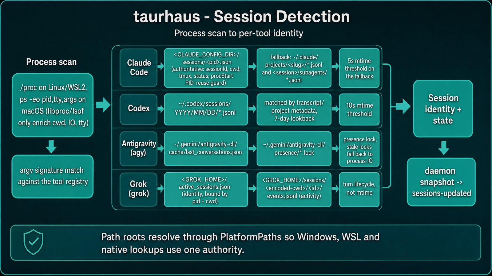
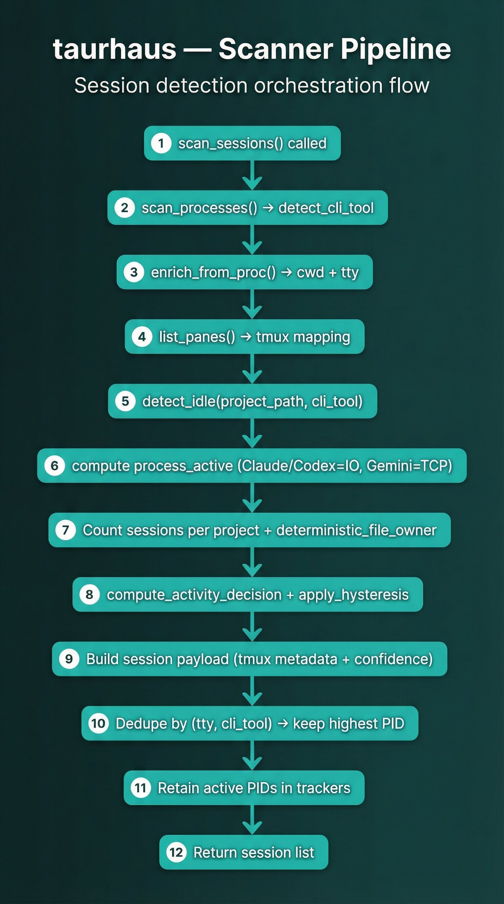
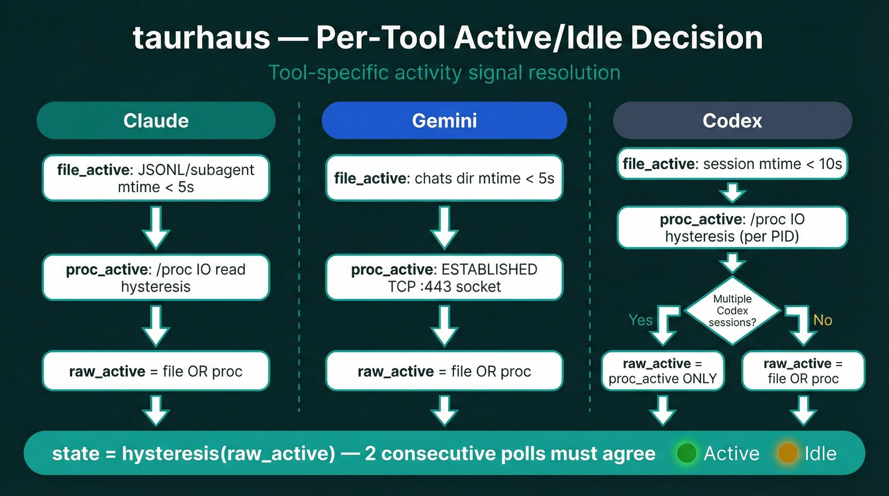

# Session management

Session management detects live AI CLI tool sessions, maps them to projects, and surfaces real-time and historical session context in the UI.

## Overview

taurhaus automatically detects running AI sessions (Claude Code, Codex, Antigravity CLI, Grok CLI), shows their status in the sidebar, and preserves session history for later context.

When a session is actively working, you see a green indicator. When it's waiting for input, it turns amber. Hover over a project to see session details; click a tool icon to jump to that terminal.

Session management has three layers:
- Runtime detection of active/idle CLI sessions
- UI surfacing in sidebar indicators, hover cards, and overview/session history views
- Handoff and activity persistence for historical context

## Supported tools

Supported CLI tools:
- Claude Code (`claude`)
- Codex CLI (`codex`)
- Antigravity CLI (`agy`)
- Grok CLI (`grok`)

Each tool has:
- its own process signature matcher
- tool-specific session file layout resolver
- tool-specific activity signal strategy

## Session identity persistence for task history

Task history groups archived work by session. Each tool's sessions are tracked using stable identifiers so that history grouping stays consistent even when sessions are resumed or renamed.

## Session detection

taurhaus scans for running tool processes and matches them to your registered projects. Detection is automatic — you don't need to configure anything.

> Stale render: this diagram and the two below still show the retired Gemini TCP-port heuristic and omit Antigravity and Grok. The tables in this page are authoritative; the corrected prompts are in [`docs/images/infographics.manifest.yaml`](../images/infographics.manifest.yaml).

## Diagrams

### 1) Scanner pipeline (all tools)

### 2) Per-tool active/idle decision

## Platform process inspection

Process inspection uses platform-specific implementations:

| Platform | Process CWD/TTY/IO strategy |
|------|------------------------------|
| Linux | `/proc` (`/proc/<pid>/cwd`, `/proc/<pid>/fd/0`, `/proc/<pid>/io`) |
| macOS | `libproc` + `lsof` fallback (CWD/TTY checks) |
| Windows | Native scan is no-op; session detection is handled by WSL daemon path |

## Per-tool idle/activity detection

SessionResolver-based file detection:

| Tool | Session file source | Activity threshold | Extra notes |
|------|---------------------|--------------------|------------|
| Claude | `~/.claude/projects/<slug>/*.jsonl` + `<session>/subagents/*.jsonl` | 5s mtime | Subagent mtime keeps compaction work marked active |
| Codex | `~/.codex/sessions/YYYY/MM/DD/*.jsonl` matched by transcript/project metadata | 10s mtime | 7-day lookback supports resumed sessions stored in older date dirs |
| Antigravity | `~/.gemini/antigravity-cli/cache/last_conversations.json` plus `~/.gemini/antigravity-cli/presence/*.lock` | presence lock | Conversation id is selected by canonical project path; stale locks fall back to process IO |
| Grok | `<GROK_HOME>/active_sessions.json` (identity, bound by pid and cwd) plus `<GROK_HOME>/sessions/<encoded-cwd>/<session-id>/events.jsonl` (activity) | turn lifecycle, not mtime | Busy unless the newest lifecycle line is `turn_ended`; the registry row appears at the member's first prompt, not at process start, so identity can be backfilled by liveness |

Path roots for these tool-specific locations are centralized behind backend `PlatformPaths` and shared path-normalization helpers so Windows, WSL, and native lookups use one authority.

Process-level supplemental signals:
- Claude: `/proc` IO (`rchar` delta threshold) with consecutive-poll hysteresis
- Antigravity: `/proc` IO (`rchar` delta threshold) unless the hooks sink supplies an authoritative state (on by default; needs a trusted workspace and agy 1.1.10)
- Codex: `/proc` IO (`rchar` delta threshold) with consecutive-poll hysteresis; file mtime is kept as fallback only when the project has a single Codex session
- Grok: `events.jsonl` is authoritative (`authoritative_idle: true`), and the rchar heuristic and hysteresis are skipped **for that poll only when it yields a lifecycle state**. A missing, unreadable, empty or unrecognised `events.jsonl` returns no state (`idle/grok.rs:474-478`), and classification then falls back to `/proc` IO with hysteresis like the other tools (`classification.rs:173-178`, `:200-207`)

## Bidirectional hysteresis

Two hysteresis layers reduce state flicker:
- IO hysteresis (Claude/Codex process signals): requires two consecutive above-threshold polls for active confirmation
- Session state hysteresis (all tools): reported state changes only after two consecutive raw polls agree on the new state

Polling cadence:
- Daemon scanner cadence is `500ms` while activity is changing or any session is active.
- After 30 stable all-idle cycles, daemon cadence backs off to `1500ms`.
- Tauri UI path is event-driven (daemon long-poll -> `sessions-updated`), not frontend IPC polling.
- Frontend-only mock mode still uses a `500ms` polling loop for local development.
- State transition confirmation requires sustained agreement across consecutive scanner polls.

Snapshot fanout is also diff-based now:
- the daemon publishes a new UI snapshot only when the display-session signature changes
- activity export work runs off the same changed/not-changed boundary instead of unconditional fanout

## Sidebar indicators and hover details

Sidebar behavior:
- Live sessions are shown as tool-specific status pills/icons on project rows.
- State colors: green for active, amber for idle.
- Indicators are clickable when tmux metadata exists, enabling jump-to-session navigation.

HoverCard behavior:
- On row hover, card shows:
  - project status (activity state, dirty flag)
  - recent commits
  - per-tool live session summary (working vs waiting)
  - duration and active-time percentages
  - technical metadata (session id, tmux target, pid)
  - historical aggregated activity stats

## Session handoffs and import flow

Handoff format:
- Markdown handoff file with YAML frontmatter (`date`, `summary`, `next_steps`, `open_questions`, etc.)
- Optional `.meta.json` sidecar for structured metadata

Import behavior:
- File watcher classifies `docs/sessions/session-*.md` create/modify events as session files.
- Event processor imports via `services::session_import::import_handoff`.
- Dedup is file-path based (already-imported files are skipped).
- Session ID precedence: frontmatter `session_id` -> sidecar `session_id` -> generated UUID.
- Successful import emits `session-imported` and updates search index.

Authoring model:
- Session handoffs are expected from Claude Code `SessionEnd` hook output.
- `/handoff` skill is documented as a manual fallback path.

## Session history and summaries

Overview tab session summary:
- Uses `get_latest_session` and `list_sessions`.
- Shows latest summary, next steps, open questions, and timeline-style recent summaries.

Session History timeline view:
- Uses `get_archived_sessions` grouped by session id.
- Shows tasks, commit counts, file counts, source tools, and expandable lazy-loaded commit/file detail.
- Supports navigation to commit, file, or commit-range filtered Git view.
- Uses transcript-derived time windows when possible:
  - Claude: `~/.claude/projects/<slug>/<session>.jsonl`
  - Codex: matched JSONL in `~/.codex/sessions/YYYY/MM/DD/`
  - Antigravity: no transcript parser; persisted task timestamps are used as the floor
- Falls back to persisted task timestamps (`first_seen_at`/`updated_at`) when transcript range cannot be resolved.
- Includes structured per-session warnings (`enrichment_warnings`) in API responses when fallback is used or enrichment partially fails.
- For team-scoped Claude task groups (where `session_id` is a team name), transcript lookup is skipped intentionally and timestamp fallback is used silently.

Activity statistics:
- Frontend tracks per-session active/total ticks per session-store update tick.
- In Tauri, update ticks are event-driven daemon snapshots; in mock mode, ticks come from frontend polling.
- Persisted activity durations use the active update interval in force for that tracker, so active/total time stays accurate across both mock-mode polling and slower Tauri fallback polling.
- On session disappearance, it persists session activity metrics.
- HoverCard reads aggregated project activity stats for historical context.

Indicator visibility is conditional:
- sidebar tool indicators render only when a tool has a live session for that project
- indicator click-to-navigate is enabled only when tmux metadata is available
- stale-presence sessions use a distinct stale treatment instead of pretending the session is currently live

## Key files

| File | Purpose |
|------|---------|
| `src/lib/sessionStore.svelte.js` | Session snapshot store, event-apply path, mock-mode polling, per-session runtime metrics, activity persistence trigger |
| `src/lib/sessionIndicator.js` | Tool indicator semantics, active/idle coloring, row tinting |
| `src/lib/toolLogos.js` | Shared SVG logos + sidebar variants for Claude/Codex/Antigravity/Grok, with an `unknown` fallback |
| `src/lib/Sidebar.svelte` | Session badges in project list, tmux jump interactions, hover-card entry point |
| `src/lib/HoverCard.svelte` | Live session detail card + historical activity preview |
| `src/lib/SessionHistory.svelte` | Archived session timeline with task/commit/file drill-down |
| `src-tauri/src/session_scanner/mod.rs` | Scanner orchestration, dedup logic, global bidirectional hysteresis |
| `src-tauri/src/daemon/session_activity.rs` | Daemon-owned `DisplaySession` hub, adaptive cadence, and long-poll snapshots |
| `src-tauri/src/provider/platform_paths.rs` | Authoritative platform-sensitive path roots for CLI/session locations |
| `src-tauri/src/session_scanner/process.rs` | Process discovery and CLI tool detection from `ps` output |
| `src-tauri/src/session_scanner/proc_io.rs` | Shared process-IO activity heuristic |
| `src-tauri/src/session_scanner/idle/mod.rs` | SessionResolver abstraction and shared detection helpers |
| `src-tauri/src/session_scanner/idle/claude.rs` | Claude session file + subagent mtime logic |
| `src-tauri/src/session_scanner/idle/codex.rs` | Codex date-tree lookup + CWD matching + 7-day lookback |
| `src-tauri/src/session_scanner/idle/agy.rs` | Antigravity conversation identity + presence-lock resolution |
| `src-tauri/src/daemon/session_listener.rs` | App-side daemon long-poll client for `wait_session_updates` |
| `src-tauri/src/daemon_lifecycle.rs` | Session updates bridge (`sessions-updated`) and daemon reconnect flow |
| `src-tauri/src/platform/linux.rs` | Linux `/proc` process/IO inspection |
| `src-tauri/src/platform/darwin.rs` | macOS `libproc` + `lsof` process inspection |
| `src-tauri/src/session/parser.rs` | Handoff markdown/frontmatter + sidecar parser |
| `src-tauri/src/services/session_import.rs` | Handoff import and dedup into sessions table |
| `src-tauri/src/commands/sessions.rs` | Session summary/list/detail IPC for overview |

## Technical details

For implementation-level detail on the session detection pipeline, runtime delivery model (DisplaySession vs RuntimeSession), daemon long-poll bridge, process dedup, and session identity extraction from JSONL metadata, see the [Session Scanner section in ARCHITECTURE.md](../../ARCHITECTURE.md#session-scanner).

## Related documents

- [Command center](./command-center.md) — session launch/stop/navigation controls
- [Git integration](./git-integration.md) — commit-range integration used by session history
- [Project management](./project-management.md) — where session context is surfaced in sidebar/overview
