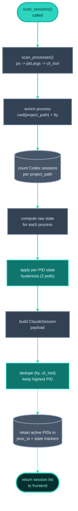
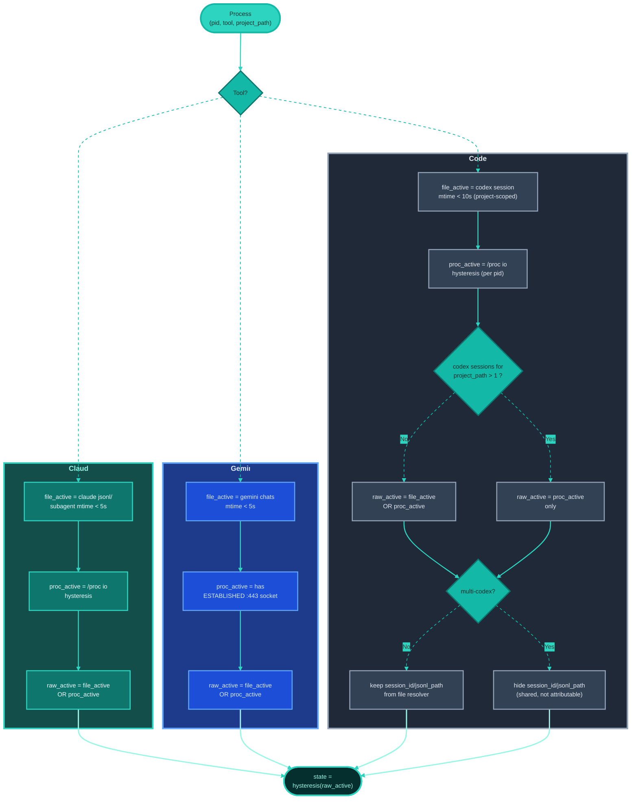

# Session management

Session management detects live AI CLI tool sessions, maps them to projects, and surfaces real-time and historical session context in the UI.

## Overview

taurhaus session management has three layers:
- Runtime detection of active/idle CLI sessions (Claude, Codex, Gemini)
- UI surfacing in sidebar indicators, hover cards, and overview/session history views
- Handoff and activity persistence for historical context

The runtime scanner is process-based and tool-aware, with explicit hysteresis to avoid flickering state changes.

## Runtime delivery model

Session state delivery is event-driven above the daemon:
- Daemon scanner polls and classifies sessions every 500ms.
- Daemon serves versioned snapshots via `wait_session_updates` long-poll.
- App backend bridge (`start_session_updates_bridge`) long-polls daemon updates and emits frontend `sessions-updated` events.
- Frontend session store applies those events and drives sidebar/hover indicators reactively.
- On startup, frontend runs a one-shot `list_claude_sessions` hydrate to avoid waiting for first delta event.

## Supported tools

Supported CLI tools:
- Claude Code (`claude`)
- Codex CLI (`codex`)
- Gemini CLI (`gemini`)

Each tool has:
- its own process signature matcher
- tool-specific session file layout resolver
- tool-specific activity signal strategy

## Session detection pipeline

Detection sequence:
1. Scan processes (`ps -eo pid,args`) and detect known tool command signatures.
2. Enrich each process with CWD and TTY via platform APIs.
3. Resolve tool-specific idle/activity signals.
4. Merge with process-level activity signals (tool-dependent).
5. Apply bidirectional hysteresis before reporting state.
6. Deduplicate duplicate shim/native process pairs per `(tty, cli_tool)`.

CWD matching and project association:
- Scanner records each process `project_path` from process CWD.
- Frontend session state is keyed by normalized `project_path`.
- Sidebar rows query sessions by each registered project path, effectively associating sessions to registered projects by path match.

Process dedup behavior:
- Sessions are sorted by PID descending.
- For duplicate `(tty, cli_tool)` entries, taurhaus keeps the highest PID (typically the native child process, not launcher shim).

## Mermaid flow

### 1) Scanner pipeline (all tools)

### 2) Per-tool active/idle decision

## Platform process inspection

Process inspection uses platform-specific implementations:

| Platform | Process CWD/TTY/IO strategy |
|------|------------------------------|
| Linux | `/proc` (`/proc/<pid>/cwd`, `/proc/<pid>/fd/0`, `/proc/<pid>/io`, `/proc/<pid>/net/tcp*`) |
| macOS | `libproc` + `lsof` fallback (CWD/TTY/socket checks) |
| Windows | Native scan is no-op; session detection is handled by WSL daemon path |

## Per-tool idle/activity detection

SessionResolver-based file detection:

| Tool | Session file source | Activity threshold | Extra notes |
|------|---------------------|--------------------|------------|
| Claude | `~/.claude/projects/<slug>/*.jsonl` + `<session>/subagents/*.jsonl` | 5s mtime | Subagent mtime keeps compaction work marked active |
| Codex | `~/.codex/sessions/YYYY/MM/DD/*.jsonl` matched by `session_meta.payload.cwd` | 10s mtime | 7-day lookback supports resumed sessions stored in older date dirs |
| Gemini | `~/.gemini/tmp/<dir-or-hash>/chats/*.json` | 5s mtime | Supports both newer directory-name layout and older path-hash layout |

Process-level supplemental signals:
- Claude: `/proc` IO (`rchar` delta threshold) with consecutive-poll hysteresis
- Gemini: ESTABLISHED TCP socket to remote `:443` indicates active API call
- Codex: `/proc` IO (`rchar` delta threshold) with consecutive-poll hysteresis; file mtime is kept as fallback only when the project has a single Codex session

## Bidirectional hysteresis

Two hysteresis layers reduce state flicker:
- IO hysteresis (Claude/Codex process signals): requires two consecutive above-threshold polls for active confirmation
- Session state hysteresis (all tools): reported state changes only after two consecutive raw polls agree on the new state

Polling cadence:
- Daemon scanner cadence is `500ms` (`SessionActivityHub`).
- Tauri UI path is event-driven (daemon long-poll -> `sessions-updated`), not frontend IPC polling.
- Frontend-only mock mode still uses a `500ms` polling loop for local development.
- State transition confirmation requires sustained agreement across consecutive scanner polls.

## Sidebar indicators and hover details

Sidebar behavior:
- Live sessions are shown as tool-specific status pills/icons on project rows.
- State colors: green for active, amber for idle.
- Indicators are clickable when tmux metadata exists, enabling jump-to-session navigation.

HoverCard behavior:
- On row hover, card shows:
  - project status (activity state, dirty flag)
  - recent commits
  - per-tool live session summary (working vs waiting)
  - duration and active-time percentages
  - technical metadata (session id, tmux target, pid)
  - historical aggregated activity stats

## Session handoffs and import flow

Handoff format:
- Markdown handoff file with YAML frontmatter (`date`, `summary`, `next_steps`, `open_questions`, etc.)
- Optional `.meta.json` sidecar for structured metadata

Import behavior:
- File watcher classifies `docs/sessions/session-*.md` create/modify events as session files.
- Event processor imports via `services::session_import::import_handoff`.
- Dedup is file-path based (already-imported files are skipped).
- Session ID precedence: frontmatter `session_id` -> sidecar `session_id` -> generated UUID.
- Successful import emits `session-imported` and updates search index.

Authoring model:
- Session handoffs are expected from Claude Code `SessionEnd` hook output.
- `/handoff` skill is documented as a manual fallback path.

## Session history and summaries

Overview tab session summary:
- Uses `get_latest_session` and `list_sessions`.
- Shows latest summary, next steps, open questions, and timeline-style recent summaries.

Session History timeline view:
- Uses `get_archived_sessions` grouped by session id.
- Shows tasks, commit counts, file counts, source tools, and expandable lazy-loaded commit/file detail.
- Supports navigation to commit, file, or commit-range filtered Git view.

Activity statistics:
- Frontend tracks per-session active/total ticks per session-store update tick.
- In Tauri, update ticks are event-driven daemon snapshots; in mock mode, ticks come from frontend polling.
- On session disappearance, it persists session activity metrics.
- HoverCard reads aggregated project activity stats for historical context.

## Key files

| File | Purpose |
|------|---------|
| `src/lib/sessionStore.svelte.js` | Session snapshot store, event-apply path, mock-mode polling, per-session runtime metrics, activity persistence trigger |
| `src/lib/sessionIndicator.js` | Tool indicator semantics, active/idle coloring, row tinting |
| `src/lib/toolLogos.js` | Shared SVG logos + display names for Claude/Codex/Gemini |
| `src/lib/Sidebar.svelte` | Session badges in project list, tmux jump interactions, hover-card entry point |
| `src/lib/HoverCard.svelte` | Live session detail card + historical activity preview |
| `src/lib/SessionHistory.svelte` | Archived session timeline with task/commit/file drill-down |
| `src-tauri/src/session_scanner/mod.rs` | Scanner orchestration, dedup logic, global bidirectional hysteresis |
| `src-tauri/src/session_scanner/process.rs` | Process discovery and CLI tool detection from `ps` output |
| `src-tauri/src/session_scanner/proc_io.rs` | Claude/Codex IO activity heuristic + Gemini TCP activity checks |
| `src-tauri/src/session_scanner/idle/mod.rs` | SessionResolver abstraction and shared detection helpers |
| `src-tauri/src/session_scanner/idle/claude.rs` | Claude session file + subagent mtime logic |
| `src-tauri/src/session_scanner/idle/codex.rs` | Codex date-tree lookup + CWD matching + 7-day lookback |
| `src-tauri/src/session_scanner/idle/gemini.rs` | Gemini chats directory/hash resolution + mtime logic |
| `src-tauri/src/daemon/session_activity.rs` | Daemon-owned global scanner hub, versioned snapshots, long-poll waiters |
| `src-tauri/src/daemon/session_listener.rs` | App-side daemon long-poll client for `wait_session_updates` |
| `src-tauri/src/daemon_lifecycle.rs` | Session updates bridge (`sessions-updated`) and daemon reconnect flow |
| `src-tauri/src/platform/linux.rs` | Linux `/proc` process/IO/socket inspection |
| `src-tauri/src/platform/darwin.rs` | macOS `libproc` + `lsof` process/socket inspection |
| `src-tauri/src/session/parser.rs` | Handoff markdown/frontmatter + sidecar parser |
| `src-tauri/src/services/session_import.rs` | Handoff import and dedup into sessions table |
| `src-tauri/src/commands/sessions.rs` | Session summary/list/detail IPC for overview |

## Related documents

- [Command center](./command-center.md) — session launch/stop/navigation controls
- [Git integration](./git-integration.md) — commit-range integration used by session history
- [Project management](./project-management.md) — where session context is surfaced in sidebar/overview
