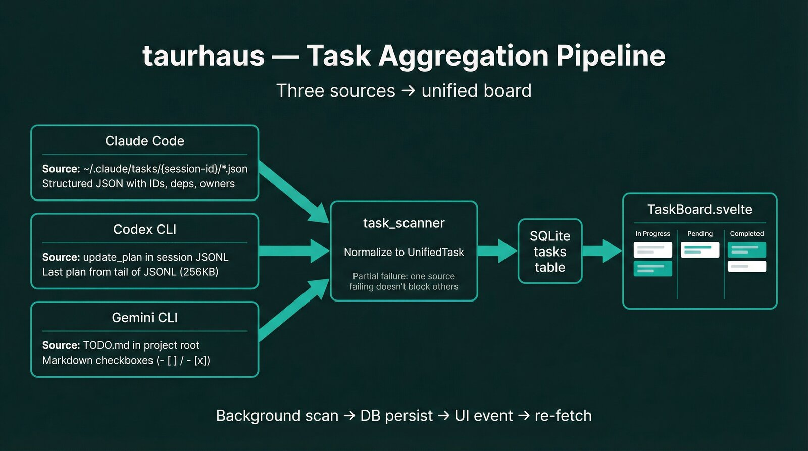

# Task board

The task board aggregates transcript-backed work items from Claude Code and Codex CLI into one per-project view. It provides a Kanban-style active board, task detail enrichment, and a history view grouped by archived sessions.

## Overview

Task board data is normalized into `UnifiedTask` records in the backend (`task_scanner/types.rs`) and surfaced through task IPC commands in `commands/tasks.rs`.

Frontend layout (`TaskBoard.svelte`) has two sub-tabs:

- `Active`: three status columns (`In Progress`, `Pending`, `Completed`)
- `History`: session-grouped archived work (`SessionHistory.svelte`)

## Task identity model (`source_key`)

Task identity is not just `source + task_id`. taurhaus persists tasks with a source-scoped key:

- `source`: `claude` or `codex`
- `source_key`: per-source directory/session identity
- `source_task_id`: task ID inside that source key

This corresponds to the DB uniqueness model (`project_path`, `source`, `source_key`, `source_task_id`), which prevents collisions when different source directories reuse task IDs (for example, Claude session directories vs team-name directories both containing `1.json`).

## Task sources

> Stale render: the diagram shows a third source (Gemini `TODO.md`). There are exactly two task sources — Claude Code and Codex — as the sections below describe.

Each CLI tool uses a different source format, and the scanner unifies them.

### Claude Code

Source:

- `~/.claude/tasks/{source-key}/*.json` (structured task files)

Parsing (`task_scanner/claude.rs`):

- Uses a unified scan-all approach: scans all subdirectories under `~/.claude/tasks/`.
- Classifies each directory through `ClaudeSourceIndex` (`task_scanner/claude_index.rs`), which maps both:
  - session IDs -> project paths
  - team names -> project paths (from `~/.claude/teams/*/config.json`)
- Keeps only directories that map to the active project path.
- Preserves rich fields: `description`, `activeForm`, `blocks`, `blockedBy`, `owner`, `session_id`.
- Excludes `status: deleted` tasks.

### Codex CLI

Source:

- `update_plan` function-call entries in session JSONL

Parsing (`task_scanner/codex.rs`):

- Uses live `jsonl_path` when available.
- Falls back offline by scanning `~/.codex/sessions/YYYY/MM/DD/` (7-day lookback) and matching `session_meta.payload.cwd` to project path.
- Reads only tail of large JSONL files (256 KB) and parses the last `update_plan` call.
- Maps plan step statuses to unified task status and emits synthetic IDs (`codex-0`, `codex-1`, ...).

## Aggregation and normalization

`task_scanner::get_tasks_for_project` orchestrates the registered transcript parsers and returns:

- `tasks: Vec<UnifiedTask>`
- `errors: Vec<(source, message)>`
- `source_outcomes: Vec<SourceScanOutcome>`

Behavior:

- One source failing does not block other sources.
- Status values are normalized to `pending`, `in_progress`, `completed`.
- Source is normalized to `claude` or `codex`.
- Scan outcome is tri-state per source:
  - `Data(tasks)` means usable source data was read
  - `DefinitivelyEmpty` means source scanned successfully and had no tasks
  - `Unavailable(reason)` means degraded I/O/parse path, so stale pruning is skipped for that source in this cycle

## Persistence and refresh pipeline

Task board reads persisted tasks from SQLite; scanning is background/event-driven.

Flow:

1. Scanner collects current tasks from source files.
2. `persist_task_scan` upserts into DB (`task_queries::upsert_tasks`).
3. `prune_stale_tasks` reconciles DB snapshot against current scan on every cycle (including empty scans), scoped by `source + source_key`.
4. Completed tasks missing from current scan are archived; non-completed stale tasks are deleted.
5. Archive metadata is preserved for history UX:
  - `state_changed_at` tracks the last status transition boundary
  - `last_status` preserves status at archive time
  - `archived_reason` records why archival happened (for example `completed_and_removed`)
6. Backend emits `project-tasks-changed`.
7. `TaskBoard.svelte` listens and re-fetches via `get_project_tasks(projectPath)`.

`get_project_tasks` itself is a DB read and does not re-scan files in request path.

## Kanban display

`TaskBoard.svelte` groups tasks by status and renders three columns:

- In Progress
- Pending
- Completed

Card content includes:

- Source icon (Claude/Codex)
- Subject (+ line-through when completed)
- Optional description preview
- Optional dependency/owner metadata
- `active_form` as secondary in-progress text when present

Column ordering is deterministic and stable:

- `In Progress`: newest activity first (`state_changed_at`/`updated_at`/`archived_at` recency), then stable identity tiebreak
- `Pending`: highest dependency count first, then recency, then stable identity tiebreak
- `Completed`: newest `updated_at` first, then stable identity tiebreak

Stable tiebreak identity is `source/source_key/id`, which prevents visual jitter when primary sort keys tie.

Current interaction model is click-select rather than drag-and-drop reorder/move; there are no drag handlers in `TaskBoard.svelte`.

## Task detail panel

Selecting a task opens `TaskDetailPanel.svelte` with enriched data from `get_task_detail`:

- Source/tool indicator + status badge
- Full markdown-rendered description
- Session metadata (if task has `session_id`)
- Commits and files changed during inferred session time window
- Dependencies (`blocked_by`, `blocks`) with click-to-navigate chips
- Owner (when present)

Backend enrichment (`commands/tasks.rs`):

- Resolves task from DB by `source + task_id`.
- If `session_id` exists, derives session time range and queries commits/files changed in that window.

## History view

`SessionHistory.svelte` uses `get_archived_sessions(projectPath)`:

- Groups completed work by `session_id` (or `ungrouped`).
- Sorts reverse-chronological by session start.
- Shows task counts, commit/file counts, and contributing source tools.
- Surfaces archive metadata (`archived_reason`, `last_status`, `state_changed_at`) in expanded task rows/detail.
- Shows per-session enrichment warning badges when commit-window enrichment falls back or partially fails (`enrichment_warnings`).
- Lazily loads commit/file details for expanded sessions via `get_commits_in_range`.
- Live-refreshes while active by listening for `project-tasks-changed` events.

## Per-project scoping

All board queries are scoped by the active project's path:

- `get_project_tasks(projectPath)`
- `get_task_detail(projectPath, taskId, source)`
- `get_archived_sessions(projectPath)`

`Shell.svelte` changes project context first, then loads scoped task data for that project.

## Position memory (`$bindable` pattern)

Task board state persists across project switches through bound position props.

Mechanism:

- `TaskBoard` exports `position = $bindable(null)` and writes active sub-tab + selected task ID + selected task source.
- `Shell.svelte` stores this in per-project memory (`projectPositions`).
- On project reselect, Shell passes restore target via `navTarget`.
- `TaskBoard` applies restore once tasks finish loading (`pendingRestore`).

Result: users return to the same sub-tab/task context when moving between projects.

## Key files

| File | Purpose |
|---|---|
| `src/lib/TaskBoard.svelte` | Main task board UI, active/history sub-tabs, status columns, selection, restore handling. |
| `src/lib/TaskDetailPanel.svelte` | Task detail side panel with metadata, dependencies, and enriched context sections. |
| `src/lib/SessionHistory.svelte` | Archived-session accordion and lazy commit/file drill-down. |
| `src/lib/taskHelpers.js` | Shared task status labels/badge style mapping. |
| `src-tauri/src/commands/tasks.rs` | Task IPC commands, detail/session enrichment, persistence helpers, scanner integration. |
| `src-tauri/src/task_scanner/mod.rs` | Aggregates registered transcript scanners with partial-failure handling. |
| `src-tauri/src/task_scanner/claude.rs` | Claude unified scan-all parser with source-index project classification. |
| `src-tauri/src/task_scanner/claude_index.rs` | Session/team source-key index used to map Claude task directories to projects. |
| `src-tauri/src/task_scanner/codex.rs` | Codex `update_plan` JSONL parser + offline session matching. |
| `src-tauri/src/task_scanner/types.rs` | Unified task DTOs and task board response types. |

## Related documents

- [IPC command reference](../architecture/ipc-reference.md) — task command signatures and return types
- [Session management](./session-management.md) — session detection that feeds task scanner
