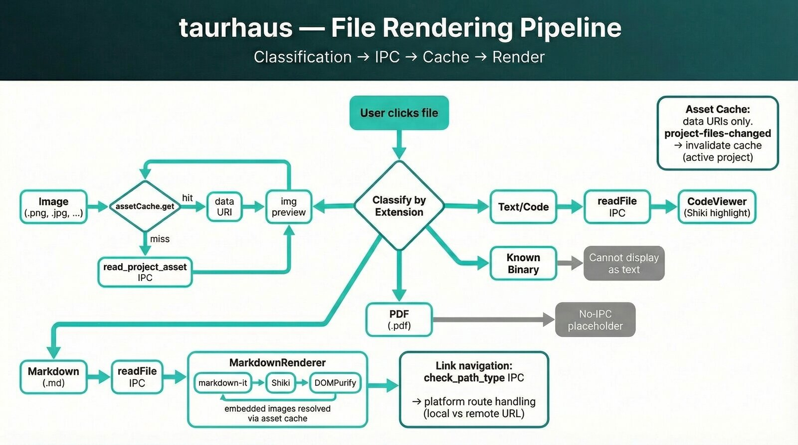

# File Rendering Pipeline

> How taurhaus classifies, loads, caches, and renders project files across the Overview and Files tabs.



---

## Pipeline Overview

Every file interaction flows through a single classification step before any IPC call is made. The classifier runs in the frontend based on file extension, determining which rendering path to use.

```
User clicks file (or README loads)
        │
        ▼
  Classify by extension (frontend)
        │
        ├── Image → read_project_asset IPC → asset cache →  preview
        ├── Markdown → readFile IPC → MarkdownRenderer (markdown-it + Shiki + DOMPurify + Mermaid)
        ├── Known binary → "Binary file" message (no IPC call)
        ├── PDF → "PDF viewer coming soon" message (no IPC call)
        └── Text/Code → readFile IPC → CodeViewer (Shiki highlighting or plaintext)
```

---

## File Categories

### 1. Images

**Extensions**: `.png`, `.jpg`, `.jpeg`, `.gif`, `.svg`, `.webp`, `.ico`, `.bmp`

**IPC command**: `read_project_asset` — reads binary file, returns base64 data URI.

**Rendering**: `` element with the data URI as `src`.

**Caching**: Yes — cached in `assetCache` by `projectId/relativePath`. Cache hit is synchronous, avoiding any flicker on re-visit.

**Used in two places**:
- **Files tab**: Direct image preview when an image file is selected.
- **Markdown embeds**: MarkdownRenderer resolves relative `` after HTML render via DOM manipulation.

### 2. Markdown

**Extensions**: `.md`, `.markdown`

**IPC command**: `readFile` — reads as text, returns `FileContent { path, content, language }`.

**Rendering**: `MarkdownRenderer` component:
1. `markdown-it` parses markdown (with `html: true` for README HTML blocks like `<div>`, ``)
2. `@shikijs/markdown-it` plugin highlights fenced code blocks via Shiki
3. `DOMPurify` sanitizes output (strips `<script>`, `onclick`, etc.)
4. Post-render `$effect` resolves relative image `src` via `read_project_asset` + asset cache
5. Mermaid fenced blocks are rendered to sanitized SVG after the HTML pass

**Navigation**:
- relative markdown links call back into the file viewer so cross-file README navigation stays in-app
- external `http`, `https`, and `mailto` links open via the shell bridge

**Caching**: Images within markdown are cached. The markdown text itself is not cached (fast to read, small files).

### 3. Known Binary Files

**Extensions**: `.glb`, `.gltf`, `.wasm`, `.exe`, `.dll`, `.so`, `.dylib`, `.zip`, `.tar`, `.gz`, `.7z`, `.rar`, `.bin`, `.dat`, `.db`, `.sqlite`, `.o`, `.a`, `.class`, `.pyc`

**IPC command**: None — classified upfront, no IPC call made.

**Rendering**: Centered icon with "Binary file — cannot display as text".

**Rationale**: Attempting to read these as text wastes an IPC roundtrip and always fails. Classify first, fail fast.

### 4. PDF (Future)

**Extensions**: `.pdf`

**Current behavior**: Classified separately from other binaries and shows "PDF viewer coming soon". No IPC file read happens yet.

**Planned**: Dedicated PDF viewer component. Will likely need its own rendering approach (pdf.js or similar) and potentially its own cache strategy for rendered pages.

### 5. Text / Code (Everything Else)

**Extensions**: All files not matched by categories 1–4.

**IPC command**: `readFile` — reads as text. Returns error if file is actually binary (detected by Rust via `read_to_string` failure) or exceeds 5 MB.

**Rendering**: `CodeViewer` component:
1. Shiki highlighter checks if the detected language is loaded
2. If loaded → syntax-highlighted HTML with themed colors
3. If not loaded → plaintext rendering
4. CSS counter-based line numbers on Shiki's `.line` spans

**Error recovery**: If `readFile` returns a binary error (e.g., a `.ron` file that's actually binary, or an unclassified binary format), the Files tab shows "Binary file — cannot display as text" instead of crashing.

---

## Asset Cache

**Module**: `src/lib/assetCache.js`

A shared, module-level `Map<string, string>` keyed by `${projectId}/${relativePath}`.

Current behavior:
- only image data URIs are cached in practice
- reads are LRU-capped to 100 entries
- `get()` refreshes recency so recently-viewed assets stay warm

### API

| Method | Purpose |
|--------|---------|
| `get(projectId, path)` | Synchronous cache lookup. Returns cached data or `null`. |
| `set(projectId, path, data)` | Store a value after IPC fetch. |
| `invalidate(projectId, path)` | Clear one entry (called by file watcher on change). |
| `invalidateProject(projectId)` | Clear all entries for a project (project removed/re-registered). |
| `clear()` | Clear entire cache (app reset). |
| `size()` | Expose cache size for tests/diagnostics. |

### What Gets Cached

| Data type | Cached? | Rationale |
|-----------|---------|-----------|
| Image data URIs | Yes | Base64 encoding + IPC serialization is expensive. Instant on re-visit. |
| Text/code content | No (for now) | Small files, fast reads. Could add if project switching feels slow. |
| Rendered markdown HTML | No (for now) | Rendering is fast. Raw text is small. |

### Invalidation Strategy

**Current**: Session-lifetime. Cache clears on app restart.

**Future**: File watcher integration. When `notify` detects a file change on disk:
1. File watcher emits event to frontend with project ID and changed path
2. Frontend calls `assetCache.invalidate(projectId, changedPath)`
3. Next access triggers a fresh IPC read

This same invalidation pattern extends to any future cached content (text files, rendered HTML, PDF pages).

### Extending the Cache

To cache a new file type:
1. Add caching calls in the component that loads the data (check `get()` before IPC, call `set()` after)
2. File watcher invalidation works automatically — it invalidates by path, regardless of content type
3. No changes needed to the cache module itself

---

## Rendering Components

### MarkdownRenderer (`src/lib/MarkdownRenderer.svelte`)

**Props**: `source`, `dark`, `codeTheme`, `projectId`, `filePath`, `scrollToAnchor`, `onNavigate`

**Pipeline**:
```
source → markdown-it (html: true, linkify: true)
       → @shikijs/markdown-it (fenced code blocks)
       → DOMPurify (sanitize)
       → {@html} render
       → $effect: resolve relative  via asset cache / IPC
       → $effect: render Mermaid blocks to sanitized SVG
       → click interception: relative links route inside taurhaus, external links open via shell
```

**Typography**: Aligned with UI type scale (not reading-optimized). Body 14px/1.5, H1 20px/600, H2 16px/600, code 13px mono. Full styles in component's `<style>` block.

**Security**: DOMPurify strips `<script>`, event handlers (`onclick`, etc.), and other dangerous elements. Safe HTML like `<div>`, ``, `<strong>` passes through for README compatibility.

### CodeViewer (`src/lib/CodeViewer.svelte`)

**Props**: `code`, `language`, `dark`, `codeTheme`, `scrollToLine`

**Pipeline**:
```
code → Shiki highlighter
     → load language on demand when possible
     → language unavailable or Shiki fails → plaintext
     → DOMPurify (sanitize)
     → {@html} render with CSS counter line numbers
```

### Shiki Highlighter (`src/lib/markdown.js`)

**Singleton**: Lazy-loaded, shared between MarkdownRenderer and CodeViewer.

**Themes**: `github-light` (light mode), `github-dark-dimmed` (dark mode).

**Languages**: Core languages are loaded eagerly, everything else is loaded on demand. Unknown or unsupported languages fall back to plaintext instead of failing the render.

**Fallback**: If a language identifier isn't recognized by Shiki (extremely rare), it falls back to plaintext. The markdown-it plugin uses `defaultLanguage: 'text'` for the same graceful degradation.

---

## Rust Backend

### `readFile` (`src-tauri/src/commands/files.rs` → `src-tauri/src/fs/reader.rs`)

- Reads text files from project directories
- Max file size: 5 MB
- Security: rejects path traversal (`..`), absolute paths, symlink escapes (canonicalization)
- Binary detection: `read_to_string` returns `InvalidData` for non-UTF8 files → error
- Language detection: maps known aliases (e.g., `.rs` → "rust", `.py` → "python") and passes unknown extensions as-is to the frontend. Shiki loads grammars on demand — no need to maintain a complete list.

### `read_project_asset` (`src-tauri/src/commands/files.rs`)

- Reads binary files as base64 data URIs
- MIME type detection from extension (jpg, png, gif, svg, webp, ico, bmp)
- Same path traversal security as `readFile`
- No file size limit (images are typically small; could add one if needed)

---

## Extension Points

| Feature | How to add |
|---------|------------|
| New image format | Add extension to image classifier (frontend) + MIME type to `mime_from_extension` (Rust) |
| New syntax language | Usually automatic — Shiki loads grammars on demand. Only add to `detect_language` if the extension differs from Shiki's language ID (e.g., `.rs` → "rust"). |
| PDF viewer | New component, new file category in classifier, potentially new IPC command for page rendering |
| File content caching | Add `assetCache.get/set` calls around `readFile` in the loading function |
| File watcher invalidation | Call `assetCache.invalidate()` from the event listener (Phase 5C) |
