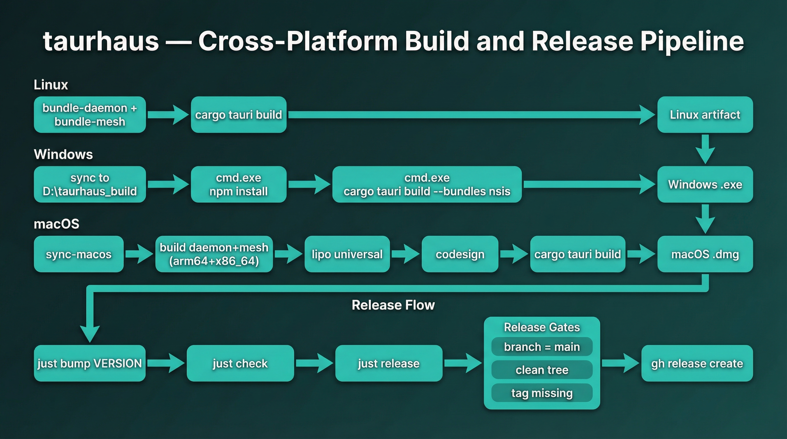

# Build and release

End-to-end build and release procedures for taurhaus across Linux, Windows, and macOS. This document expands on the quick-reference tables in [CLAUDE.md](../../CLAUDE.md#build--development), with detailed steps, constraints, and troubleshooting.



## Overview

Build and release operations are standardized in `justfile`. Use `just` recipes only.

Core rules:

- Do not run ad-hoc cross-compilation for Windows or macOS from WSL/Linux.
- Build artifacts on their native target platforms (Windows via WSL -> native PowerShell/build tools, macOS via remote Mac SSH).
- Use `just release` to publish; do not create/edit GitHub releases manually.

## Prerequisites

| Dependency | Why it is required |
|---|---|
| `just` | Entry point for all supported build/release workflows. |
| Rust toolchain (`cargo`, `rustc`, `clippy`, `rustfmt`) | Backend build, tests, lint, and packaging. |
| Bun | Frontend install/build pipeline on local, Windows, and macOS hosts. |
| Tauri CLI | App bundling through the supported `just` recipes. |
| `rsync` + `ssh` | Remote sync/build on macOS host. |
| Windows shell interop from WSL | Native Windows NSIS build from the synced workspace. |
| `gh` CLI (authenticated) | `just release` creates GitHub releases and uploads artifacts. |
| macOS `codesign` + `lipo` (on remote Mac) | Daemon signing and universal binary assembly. |

Project-specific environment assumptions from `justfile`:

- Windows sync/build directory defaults to `C:\taurhaus_build` (WSL path `/mnt/c/taurhaus_build`)
- Override the Windows sync/build directory by setting `TAURHAUS_WINDOWS_BUILD_DIR` to a WSL path such as `/mnt/e/taurhaus_build`
- macOS build host: `m1@62.210.195.235`
- macOS remote project path: `~/projects/taurhaus`

## Development commands

| Recipe | Purpose |
|---|---|
| `just dev` | Full Tauri development mode (frontend + backend hot-reload). |
| `just dev-frontend` | Frontend-only development server. |
| `just test-fast` | Fast Rust compile + frontend unit lane. |
| `just test-visual` | Browser-mode visual screenshot lane. |
| `just check-quick` | Standard iteration gate (`cargo check --tests`, typecheck, frontend tests). |
| `just check` | Full quality gate (`fmt`, lint, typecheck, tests) for team-lead serialized runs or release validation. |
| `just build-daemon` | Build the WSL/native daemon binary only. |
| `just install-daemon` | Install/update the daemon in `~/.local/bin/`. |
| `just build-mesh` | Build the mesh CLI from the local mesh workspace. |
| `just install-mesh` | Install/update mesh in `~/.local/bin/`. |
| `just check-windows-build-prereqs` | Verify that the native Windows Bun/Rust/Build Tools/NSIS toolchain is ready before a Windows build. |
| `just install-windows-build-prereqs` | Install the native Windows build prerequisites via WSL interop and an elevated PowerShell runner. |
| `just build-windows-sccache` | Run the native Windows NSIS build with optional Windows-side `sccache` auto-detection enabled. |
| `just install-windows` | Run the latest Windows NSIS installer silently and verify the installed exe hash against the built payload. |
| `just analyze-compaction --team <team> --last <window>` | Analyze recent compaction detection/reinjection events from current and rotated logs. |
| `just capture-readme-screenshots` | Export the curated README screenshot set. |

Use the quick-reference table in [CLAUDE.md](../../CLAUDE.md#build--development) for the full dev/test matrix.

## Platform build procedures

### Linux build

Use when validating Linux packaging artifacts.

```bash
just build-linux
```

What it runs:

- `bundle-daemon`
- `bundle-mesh`
- `bun run tauri build`

### Windows build (native via WSL interop)

Use this for production Windows installers.

```bash
just build-windows
```

Pipeline summary:

1. `build-daemon` rebuilds the WSL daemon.
2. `_install-daemon-from-build` refreshes the installed WSL daemon in `~/.local/bin/`.
3. `_bundle-daemon-from-build` copies the daemon binary into `src-tauri/resources/`.
4. `mesh-verify-lock` + `bundle-mesh` verify the pinned mesh build and copy binary/version/manifest into `src-tauri/resources/`.
5. `check-windows-build-prereqs` fails fast if the Windows Bun/Rust/MSVC/NSIS toolchain is missing.
6. `sync-windows` mirrors the workspace to the configured Windows build directory (default `C:\taurhaus_build`) while preserving Windows `target/`, `node_modules/`, and `dist/`.
7. `scripts/build-windows.sh` invokes `scripts/build-windows.ps1` via `powershell.exe -File`.
8. `build-windows.ps1` runs Windows-native `bun install --frozen-lockfile` and `bun run tauri build --bundles nsis`, then prints a per-step timing summary. `just build-windows-sccache` enables the same path with Windows-side `sccache` auto-detection.

Expected artifact location:

- `${TAURHAUS_WINDOWS_BUILD_DIR:-/mnt/c/taurhaus_build}/src-tauri/target/release/bundle/nsis/*.exe`

Troubleshooting:

- `UNC paths are not supported`: occasionally printed by the Windows-side shell/toolchain during WSL interop; safe to ignore.
- `Access is denied` during `.exe` output: the app is still running on Windows. Close it and rebuild.
- To install the latest built Windows package silently and verify the installed binary really matches the build payload, run `just install-windows`.
- Do not use `cargo xwin` or `--target x86_64-pc-windows-msvc` from WSL for release builds.

### macOS build (arm64 on remote Mac)

Use for native arm64 `.dmg` output.

```bash
just build-macos
```

Pipeline summary:

1. `sync-macos` via rsync.
2. Sync mesh source separately from `$MESH_PROJECT`.
3. Remote `bun install --frozen-lockfile` using `zsh -ilc` login shell.
4. Remote daemon release build (`cargo build --release --bin taurhaus-daemon`).
5. Remote mesh release build (`cargo build --release --bin mesh`) and lock-version verification.
6. Copy daemon and mesh into `~/.local/bin/` and `src-tauri/resources/`.
7. Re-sign copied daemon and mesh binaries (`codesign --force --sign - ...`).
8. Write `mesh.version` and `mesh.manifest.json` into bundled resources.
9. Remote app build (`cargo tauri build`).
10. Copy artifacts back to `builds/macos-aarch64/`.

Why login shell matters:

- The recipe intentionally uses `zsh -ilc` so PATH includes `bun`, `cargo`, Homebrew tools, and expected environment vars.

Expected artifact location:

- `builds/macos-aarch64/*.dmg`
- `builds/macos-aarch64/taurhaus-daemon-aarch64`

### macOS universal build (arm64 + x86_64)

Use for one universal release artifact.

```bash
just build-macos-universal
```

Pipeline summary:

1. Sync app + mesh source to the remote Mac.
2. Build daemon for `aarch64-apple-darwin` and `x86_64-apple-darwin`.
3. Build mesh for both macOS architectures and verify the universal output against `src-tauri/resources/mesh.lock.json`.
4. Combine daemon and mesh with `lipo -create` into universal binaries.
5. Copy the universal daemon + mesh into bundled resources, re-sign them, and write `mesh.version` plus `mesh.manifest.json`.
6. Build app with `cargo tauri build --target universal-apple-darwin`.
7. Copy `.dmg` to `builds/macos-universal/`.

Expected artifact location:

- `builds/macos-universal/*.dmg`

### macOS Intel build (x86_64)

Use when you need a standalone Intel macOS DMG instead of the universal artifact.

```bash
just build-macos-intel
```

Pipeline summary:

1. Sync app + mesh source to the remote Mac.
2. Build the daemon natively on the Mac host.
3. Build mesh for `x86_64-apple-darwin` and verify it matches `src-tauri/resources/mesh.lock.json`.
4. Bundle daemon + mesh into app resources and re-sign them.
5. Build the app with `cargo tauri build --target x86_64-apple-darwin`.
6. Copy artifacts back to `builds/macos-x86_64/`.

Daemon signing note:

- Re-signing after copy is required for modern macOS compatibility (Sequoia linker-signature behavior).

## Mesh CLI build and bundle

The mesh binary is built from a separate project and bundled into `src-tauri/resources/` alongside a version file.

```bash
just build-mesh       # Build mesh release binary from $MESH_PROJECT (default: ~/projects/mesh)
just bundle-mesh      # Build + copy binary and version to src-tauri/resources/
```

`bundle-mesh` writes three files:
- `src-tauri/resources/mesh` — the mesh binary
- `src-tauri/resources/mesh.version` — pinned version string (read at runtime by `check_mesh_install_status`)
- `src-tauri/resources/mesh.manifest.json` — version/protocol/schema metadata stamped at bundle time

The `build-linux`, `build-windows`, and `build-macos` recipes automatically include `bundle-mesh` as a dependency.

## Daemon build and install

Use daemon recipes when validating daemon runtime independently or before app builds.

```bash
just build-daemon
just install-daemon
```

`install-daemon` behavior:

- Stops running daemon if present.
- Builds release daemon binary.
- Atomically installs to `~/.local/bin/taurhaus-daemon`.
- Restarts daemon if it had been running.

App/runtime lifecycle notes:

- `check_daemon_install_status` compares the installed daemon version against the bundled app version.
- If the installed daemon version is older, unknown, or fails `--version`, the UI surfaces an update banner instead of assuming the binary is healthy.
- On Windows, `install_daemon` installs inside the default WSL distro, verifies `--version`, and restarts the daemon automatically if it had been running before the swap.
- On native macOS/Linux, copied daemon binaries are verified immediately after install; macOS builds are re-signed after copy.

## Compaction operations

The current compaction pipeline is event-driven. Detection and reinjection no longer depend on a periodic scan loop to notice Codex transcript boundaries.

Use this when validating or debugging recent compaction handling:

```bash
just analyze-compaction --team taurhaus-team --last 30m
```

This summarizes recent `compaction.detected`, `compaction.injected`, `compaction.skipped`, `compaction.stale`, and `compaction.failed` events from the structured JSONL logs.

## Release workflow

Canonical release flow:

1. `just bump <VERSION>`
2. Edit `CHANGELOG.md` entry for that version.
3. Commit the version/changelog changes.
4. `just check` (team-lead serialized full gate)
5. Build release artifacts (`just build-windows` and macOS target recipe).
6. `just release`

`just release` enforcement checks:

- Current branch must be `main`.
- Working tree must be clean.
- Tag `v<VERSION>` must not already exist.
- At least one version-matching artifact must be found.

Artifact upload sources:

- `builds/macos-universal/*.dmg`
- `builds/macos-aarch64/*.dmg`
- `builds/macos-x86_64/*.dmg`
- `${TAURHAUS_WINDOWS_BUILD_DIR:-/mnt/c/taurhaus_build}/src-tauri/target/release/bundle/nsis/*.exe`

Notes:

- `just release` pushes `main` before creating the GitHub release.
- Release notes are extracted from the matching `CHANGELOG.md` section.
- Never replace assets on an existing release; bump and release a new version instead.

## Version management (`just bump`)

`just bump <VERSION>` updates:

- `src-tauri/tauri.conf.json`
- `src-tauri/Cargo.toml`
- `package.json`
- `src-tauri/Cargo.lock` (regenerated via `cargo check`)
- `CHANGELOG.md` (adds `## [VERSION] - YYYY-MM-DD` under `[Unreleased]` if missing)

After bumping:

- Fill in changelog content.
- Commit before building/releasing.

## Troubleshooting quick reference

| Symptom | Likely cause | Fix |
|---|---|---|
| `Access is denied` in Windows build | Existing app process has installer/exe locked | Close running app/processes, rerun `just build-windows` |
| macOS build cannot find `cargo`/`bun`/Homebrew tools | Non-login shell environment on remote Mac | Use recipes as-is (`zsh -ilc`); avoid manual non-login SSH commands |
| macOS app/daemon blocked after copy | Unsigned copied daemon binary | Ensure `codesign --force --sign -` runs on daemon install/resource copy |
| `just release` refuses due to dirty tree | Uncommitted changes | Commit or stash, then rerun |
| `just release` says tag exists | Version already released/tagged | Bump to a new version and run release again |
| `just release` finds no artifacts | Build recipes not run for current version | Run build recipes first, then rerun release |

## Key files

| File | Purpose |
|---|---|
| `justfile` | Source of truth for build, daemon, version, and release automation. |
| `src-tauri/resources/mesh.lock.json` | Pinned mesh version/protocol/schema manifest verified before bundling. |
| `CLAUDE.md` | Quick-reference build/development tables and release policy constraints. |
| `src-tauri/tauri.conf.json` | App version source used by release tagging (`v<version>`). |
| `CHANGELOG.md` | Release notes source section consumed by `just release`. |
| `docs/architecture/daemon-protocol.md` | Daemon runtime/signing context for macOS packaging. |

## Related documents

- [CLAUDE.md Build & Development](../../CLAUDE.md#build--development) — quick recipe table.
- [CLAUDE.md Release Workflow](../../CLAUDE.md#release-workflow) — policy-level release rules.
- [Testing guide](testing-guide.md) — validation lanes that pair with build/release gates.
