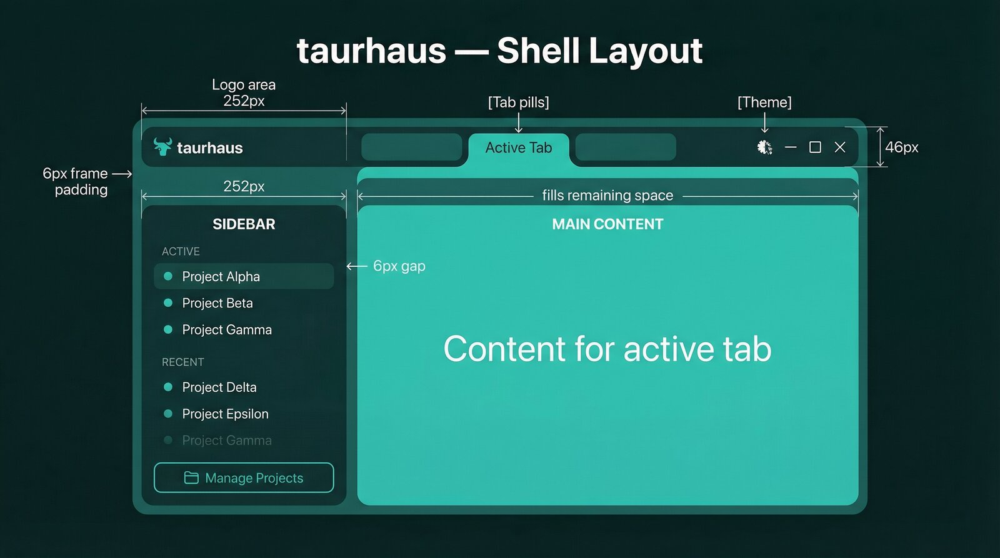

# Layout and navigation

How the application is structured visually and how users move between views.

## Overview

The application window is a custom-decorated dark teal frame containing floating panels. Navigation uses tab pills in the titlebar, a sidebar project list, and a stack-based history system. Each project remembers its tab state across switches.

## Shell layout

The entire window is a dark teal frame (`bg-brand-950`) containing floating panels. No OS window decorations — the titlebar is part of the UI.

### Titlebar (46px)

| Region | Contents |
|--------|----------|
| Logo area (252px) | App logo, aligned with sidebar width |
| Tab pills | Active tab indicator using manila folder pattern |
| Right controls | Theme toggle (light/dark), window minimize/maximize/close |

All non-interactive titlebar space is draggable (`data-tauri-drag-region`).

**Manila folder tabs**: The active tab pill uses the same background color as the main content panel, creating visual continuity — the tab "belongs" to the panel. An inverse scoop (CSS inverse border-radius) creates a smooth concave transition where the pill meets the dark frame.

### Sidebar (252px)

Project list organized by activity groups (Active, Recent, Stale, Dormant). Each project row shows:
- Project name (14px, white/75 opacity)
- Git branch as a rounded pill
- CLI tool session logos (up to 3: Claude, Codex, Gemini) color-coded by state
- Row tint (`bg-white/[0.03]`) when any session exists
- Active item: 3px left border accent

**Group headers**: Whitespace-separated (pt-8 pb-1.5), no rules or bars. Row height: 36px.

Interactions:
- **Click** — select project, load its data
- **Right-click** — context menu with per-tool launch/stop/restart
- **Hover** — HoverCard popup showing full session details per tool

### Main content panel

Rounded panel floating inside the frame. Contains the active tab's content. Background matches the active tab pill for visual continuity.

## Tab system

Tabs are rendered as pills in the titlebar. Available tabs:

| Tab | Component | When shown |
|-----|-----------|-----------|
| Overview | `OverviewTab.svelte` | Always (default) |
| Files | `FilesTab.svelte` | Always |
| Git | `GitTab.svelte` | Always |
| Tasks | `TaskBoard.svelte` | Always |
| Sessions | `SessionHistory.svelte` | Always |
| Mesh | `MeshTab.svelte` | When mesh feature is available |
| Settings | `Settings.svelte` | Via gear icon (replaces tab content) |

Tabs are tracked in a `visitedTabs` set — only tabs that have been visited render their component (lazy initialization).

## Navigation

### Project switching

Clicking a project in the sidebar:
1. Saves the current project's position (tab, visited tabs, per-tab state)
2. Loads the new project's data (parallel IPC calls for project detail, commits, readme, sessions, relationships)
3. Restores the saved position for the new project (if previously visited) or defaults to the Overview tab
4. Resets navigation history

### Tab switching

Clicking a tab pill in the titlebar:
1. Records the navigation action in history
2. Switches `activeTab` to the target tab
3. Marks the tab as visited (triggers component mount if first visit)

### Navigation history

A stack-based history system (`navHistory.svelte.js`) enables back/forward navigation:

- **Stack**: Up to 50 entries, each recording `{ tab, file?, lineNumber?, commit?, rangeFilter?, subTab? }`
- **Push**: Records on tab switch, file open, commit select, range filter change
- **Dedup**: Identical consecutive entries are skipped
- **Back/Forward**: Returns the entry to restore; Shell replays the state change
- **Suppression**: During replay (`withSuppressed()`), pushes are suppressed to avoid recording the replay itself
- **Reset**: Cleared on project switch; initial position pushed as first entry

### Cross-tab navigation

Several interactions jump between tabs with a target:

| From | To | Example |
|------|----|---------|
| Overview (commit list) | Git tab | `navigateToCommit(hash)` — opens Git tab scrolled to that commit |
| Session history | Git tab | `navigateToCommitRange(after, before)` — opens Git tab with date range filter |
| Any tab | Files tab | `navigateToFile(path, lineNumber)` — opens file at specific line |

Cross-tab navigation sets a `navTarget` prop on the target component, which handles the scroll/select behavior on mount or update.

### Per-project position memory

Each tab component exposes view state via `position = $bindable(null)`. Shell saves opaque snapshots per project in a `Map<projectId, snapshot>` and restores on return.

**Saved per project:**
- Active tab and visited tabs set
- Files tab: selected file path
- Git tab: selected commit hash, range filter
- Task board: selected task, column scroll positions

**Restore channel**: Separate props (e.g., `gitNavTarget`, `taskNavTarget`) — not through the bindable. This avoids a race condition where the outward-sync `$effect` overwrites the restore signal on mount.

## Overlays

### Search overlay (Ctrl+K)

A modal that overlays the entire view. Triggered by Ctrl+K or Cmd+K. Searches across all registered projects via tantivy full-text search. Selecting a result navigates to the relevant project, tab, and file.

### Context menu

Right-click on sidebar project items. Provides per-tool actions:
- Launch Claude/Codex/Gemini session (continue, fresh, resume)
- Stop/restart running sessions
- Navigate to running session in terminal
- Remove project

### HoverCard

Hover popup on sidebar items showing session details per running CLI tool:
- Tool logo and name
- Activity state (active/idle) with dot indicator
- Session duration

## Key files

| File | Purpose |
|------|---------|
| `src/Shell.svelte` | Main layout: titlebar, sidebar, tab routing, position memory, theme |
| `src/lib/Sidebar.svelte` | Project list, activity groups, session indicators |
| `src/lib/navHistory.svelte.js` | Back/forward navigation history stack |
| `src/lib/HoverCard.svelte` | Session detail popup on sidebar hover |
| `src/lib/ContextMenu.svelte` | Right-click menu for project actions |
| `src/lib/SearchOverlay.svelte` | Full-text search modal (Ctrl+K) |
| `src/lib/themeTokens.js` | Derived color tokens for dark/light mode |

## Related documents

- [Design system](design-system.md) — colors, typography, tokens
- [CLAUDE.md](../../CLAUDE.md) — layout dimensions, design paradigms
- [Project management](../features/project-management.md) — sidebar project list behavior
